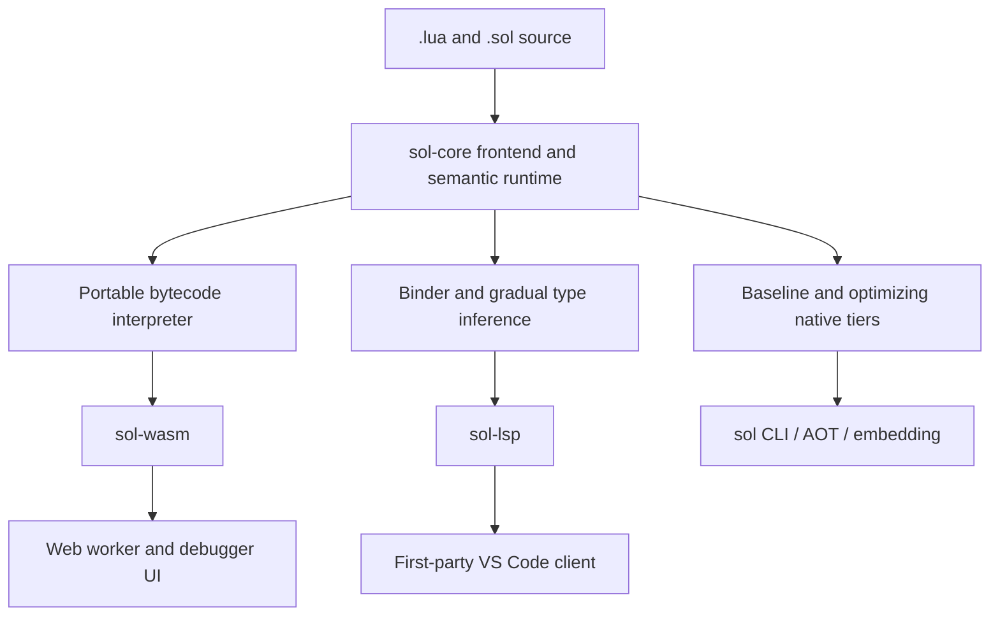
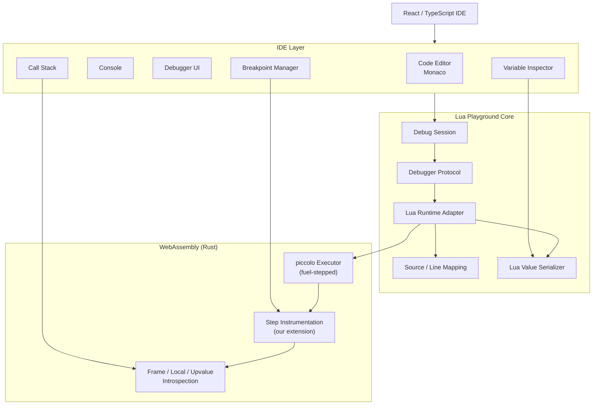
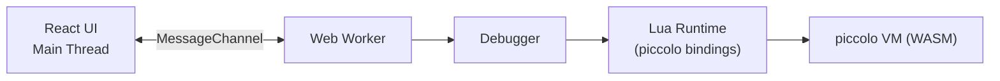

# Architecture

See [product-brief.md](./product-brief.md) for the product contract and the
[unified runtime plan](./features/unified-sol-runtime-plan.md) for milestone
ordering and release gates.

> **Accepted direction (U0):** `crates/sol` becomes the canonical Lua
> 5.5-compatible semantic runtime for native execution, WebAssembly, debugging,
> and tooling. The existing Piccolo runtime remains the current browser engine
> and a migration oracle until U12 reaches parity; it is not the final product
> architecture. The historical Piccolo decisions below explain the currently
> shipped playground and must not be read as overriding the unified direction.

## Target layers



All paths share Lua semantics, runtime object identity, modules, and GC. Typed
and dynamic values may use different physical representations inside optimized
frames; checked adapters and one semantic ABI connect them. The detailed crate
boundaries are recorded in [ADR 0004](decisions/0004-runtime-boundary-and-abi.md).

U2 has established this model in the portable `crates/sol-core` foundation,
including canonical handles, precise roots, stack maps, and tracing-GC rules.
Production execution has not migrated yet: `crates/sol` still uses its legacy
dynamic and typed ownership models, connected only by a deliberately limited
snapshot adapter. Consequently the repository does not yet satisfy the
one-identity-domain exit gate.

## Current browser layers



Five layers, kept strictly separated so stepping/async/coroutine support
doesn't require touching the UI:

1. **Editor** - Monaco, breakpoint gutter, execution-line decoration, hover.
2. **Execution runtime** - the Lua VM adapter (Rust/piccolo today; see
   below).
3. **Debug engine** - breakpoints, stepping, call stack, state machine. Full
   spec in [debug-protocol.md](./debug-protocol.md).
4. **Inspection/value model** - reference-aware serialization of Lua values.
   Also specified in
   [debug-protocol.md](./debug-protocol.md#value--inspector-model).
5. **UI** - React. **React must not know anything about Lua internals** - it
   only talks to `DebugSession`.

## Target language and transitional browser dialect

The target language is the pinned Lua 5.5 revision plus contextual Sol type and
extension syntax. `.lua` and annotation-free `.sol` must have identical
semantics and use the same runtime. PUC Lua is the compatibility oracle;
LuaJIT is a performance comparator.

The current browser still executes Piccolo's Lua-like language, which tracks
Lua 5.4 syntax and core semantics but is not certified conformant. Its known
deviations remain tracked in [conformance.md](./conformance.md) while U12
migrates the existing debugger UI to the portable Sol runtime:

```text
Lua Debugger
     │
     ├── piccolo adapter (current production, migration oracle)
     └── sol-wasm adapter (target production runtime)
```

## Historical/current browser runtime: Rust + Piccolo

**piccolo** (`kyren/piccolo`) is a Lua-like VM implemented in pure Rust,
using the `gc-arena` crate for an arena-based, generational GC designed so
that execution can be safely interrupted at any point without leaving GC
state inconsistent. Compiled to WebAssembly via `wasm-bindgen`/`wasm-pack`.

**Why this over Wasmoon (official C Lua via WASM):** piccolo's execution
model is **fuel-driven** - the host repeatedly calls something like
`executor.step(&mut ctx, &mut fuel)`, each call doing a bounded unit of work
and returning control. This means pause/resume/step are native to how the
VM is driven, not something bolted on:

- No `Atomics.wait`/`SharedArrayBuffer` blocking trick needed to pause mid-execution.
- No `Cross-Origin-Opener-Policy`/`Cross-Origin-Embedder-Policy` hosting
  requirement as a result.
- "Pause" is simply "stop calling `step()`"; "step one line" is "call
  `step()` until the instrumentation layer reports a line boundary was
  crossed."

This directly eliminates what were risks §1 and §2 against the Wasmoon
design (see [risks.md](./risks.md) - both marked resolved/superseded there).

**What it costs:** piccolo is not a certified-conformant Lua implementation
and is not primarily built as a debugging target - it's aimed at embedding
Lua-like scripting in Rust game engines. Two consequences, both tracked as
the new central risk:

- **Semantic conformance** is now something we validate ourselves rather
  than inherit for free from the reference implementation. Mitigated by
  [conformance.md](./conformance.md).
- **Debug introspection surface** (current source line, call stack, named
  locals, upvalues) is not piccolo's design focus the way `lua_sethook`/
  `lua_getlocal`/`lua_getinfo` are for official Lua's C debug API. Getting
  from "fuel-stepped executor" to "line/call/return events with locals
  attached" likely means extending piccolo (a fork or an upstream
  contribution), not just calling documented functions. Full writeup in
  [risks.md §1](./risks.md#1-piccolo-debug-introspection-surface-the-central-risk).

**Rejected alternatives**, kept here for the record:

- **Wasmoon** (official C Lua 5.4 via Emscripten) - real, conformant Lua,
  but the debug API isn't exposed by its public TS bindings (would need the
  same kind of custom binding work) *and* still requires the
  Atomics/SharedArrayBuffer pause mechanism piccolo avoids.
- **Rust + `mlua`** (vendored C Lua, custom `wasm-bindgen` wrapper) - same
  conformance benefit as Wasmoon, full control over the exposed debug
  surface (fixes the binding-gap problem), but still compiled C on a
  synchronous call stack - the Atomics/SharedArrayBuffer requirement
  persists.
- **Go + `gopher-lua`** - mature pure-Go implementation, but Lua
  5.1-flavored, Go→wasm binaries run large (fights the load-time budget in
  risks.md), and its dispatch loop isn't designed for external single-step
  control any more than Wasmoon's is.
- **TypeScript-native tree-walking interpreter** (generator-based) - same
  "own your own conformance" tradeoff as piccolo, and the same
  natively-interruptible benefit (generators pause for free), but slower
  than compiled Rust and a larger standard-library implementation burden
  landing entirely on this team instead of partly on piccolo's.
- **A from-scratch bytecode VM** - out of scope; that's a different
  (interpreter-implementation) project regardless of language.

## Web Worker architecture

Lua execution still runs in a Web Worker, not the UI thread - but the
justification changed with the runtime:



Under Wasmoon, the worker was *required* for the Atomics-based pause
mechanism. Under piccolo, pausing doesn't need a worker at all - it's just
not calling `step()` again. The worker is kept anyway for a simpler reason:
it isolates a `while true do end` and other expensive computation from the
UI thread, and it lets the driver chunk `step()` calls (e.g. a bounded fuel
budget per `postMessage` turn) without fighting the main thread's render
loop for CPU. No `SharedArrayBuffer` or cross-origin-isolation headers are
required by this design.

The worker request/event message shapes are specified in
[debug-protocol.md](./debug-protocol.md#worker-message-protocol).

## Editor (Monaco)

Responsibilities:

- Lua syntax highlighting, autocomplete, error markers.
- Breakpoint gutter (click to toggle).
- Current-execution-line decoration while paused, via `editor.deltaDecorations`.
- Hover evaluation (hover a variable while paused → show its value from the
  current frame).

## Project structure

Monorepo, now with a Rust crate for the VM binding alongside the TS
packages:

```text
lua-playground/
│
├── apps/
│   └── web/
│       ├── src/
│       │   ├── editor/
│       │   ├── debugger/
│       │   ├── inspector/
│       │   ├── console/
│       │   └── app/
│       └── vite.config.ts
│
├── packages/
│   ├── lua-runtime/       # TS wrapper around the wasm-bindgen output
│   ├── lua-debugger/
│   ├── lua-inspector/
│   ├── lua-protocol/
│   ├── lua-source/
│   └── lua-types/
│
├── crates/
│   └── lua-vm/             # Rust: piccolo + our step-instrumentation layer,
│                            # compiled to WASM via wasm-bindgen/wasm-pack
│
├── conformance/             # Lua conformance fixtures - see conformance.md
│
└── tests/
```

## Package architecture

```text
@lua-playground/types
        │
        ▼
@lua-playground/runtime          crates/lua-vm (Rust/piccolo, via wasm-bindgen)
        │                                │
        ├── LuaEngine  ───────────────── ┘
        ├── VirtualFS
        └── Sandbox
        │
        ▼
@lua-playground/debugger
        │
        ├── DebugSession
        ├── BreakpointManager
        ├── StepManager
        ├── StackManager
        └── EvaluationManager
        │
        ▼
@lua-playground/inspector
        │
        ├── ValueSerializer
        ├── ObjectRegistry
        ├── TableInspector
        └── ReferenceManager
        │
        ▼
@lua-playground/web
        │
        ├── Monaco
        ├── Debug UI
        ├── Inspector
        └── Console
```

`@lua-playground/runtime`'s `LuaEngine` is a thin TS layer over the
`wasm-bindgen`-generated bindings for `crates/lua-vm`. All Lua-value
marshaling between Rust and TS happens at that boundary.

## Virtual filesystem

The playground doesn't depend on the real browser filesystem:

```typescript
interface VirtualFileSystem {
  read(path: string): Promise<string>;
  write(path: string, content: string): Promise<void>;
  exists(path: string): Promise<boolean>;
  list(path: string): Promise<string[]>;
}
```

`require("lib.utils")` resolves through this virtual FS. See
[risks.md §5](./risks.md#5-source-mapping-for-multi-file-projects) for how
chunk names map to virtual paths so stack traces show the right file -
piccolo's chunk-loading/naming API needs to be checked against the
`load(content, "@path")` convention official Lua uses, since it isn't
guaranteed to match.

## Sandbox

User code must not get unrestricted `io`, `os`, `package`, or `debug`.
Under piccolo this is largely the *default* rather than something to strip
away: unlike embedding official Lua (which ships `io`/`os` and needs them
explicitly disabled), piccolo's standard library is opt-in - the host
registers only the functions/globals it chooses to expose. So the sandbox
policy below describes what we deliberately register, not what we block.

```typescript
interface SandboxPolicy {
  allowFileSystem: boolean;
  allowNetwork: boolean;
  allowProcess: boolean;
  allowDebug: boolean;
  maxInstructions: number;
  maxMemory?: number;
}
```

Default policy for the browser playground: `io`, `os`, network, and process
access all disabled (simply never registered); the debugger's own
introspection (frame/local/line access) is a host-side Rust API, never
exposed to user scripts as Lua's `debug` library.

## UI layout

VS Code–style:

```text
┌──────────────────────────────────────────────────────────────┐
│ Lua Playground              ▶ Run  ⏸  ↻  Step                 │
├──────────────┬───────────────────────────────┬───────────────┤
│ Files        │          main.lua             │ VARIABLES     │
│ ▼ project    │  1 local function foo(x)     │ ▼ Locals      │
│   main.lua   │  2     local y = x * 2       │   x     10    │
│   utils.lua  │  3     return y              │   y     20    │
│              │  4 end                        │ ▼ Globals     │
├──────────────┴───────────────────────────────┤               │
│ CALL STACK                                   │               │
│ ▼ foo          main.lua:2                    │               │
│   main        main.lua:10                    │               │
├──────────────────────────────────────────────┴───────────────┤
│ CONSOLE / REPL                                                │
│ > x                                                            │
│ 10                                                             │
└───────────────────────────────────────────────────────────────┘
```
