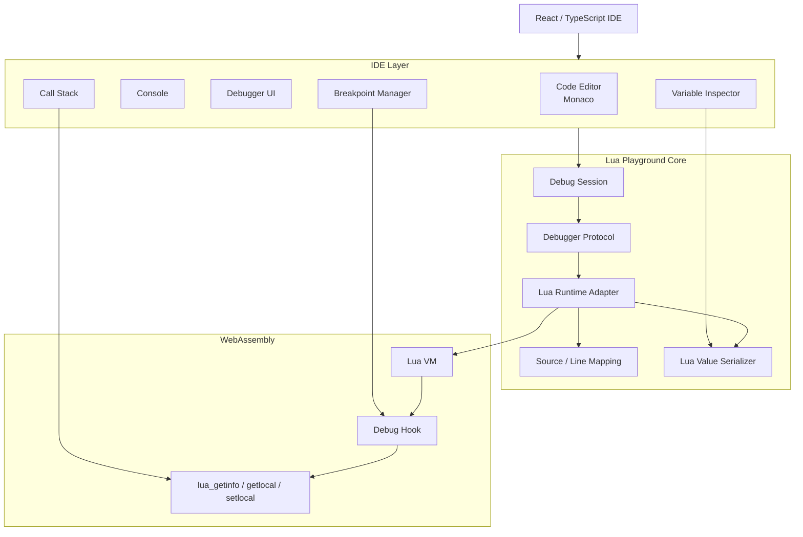
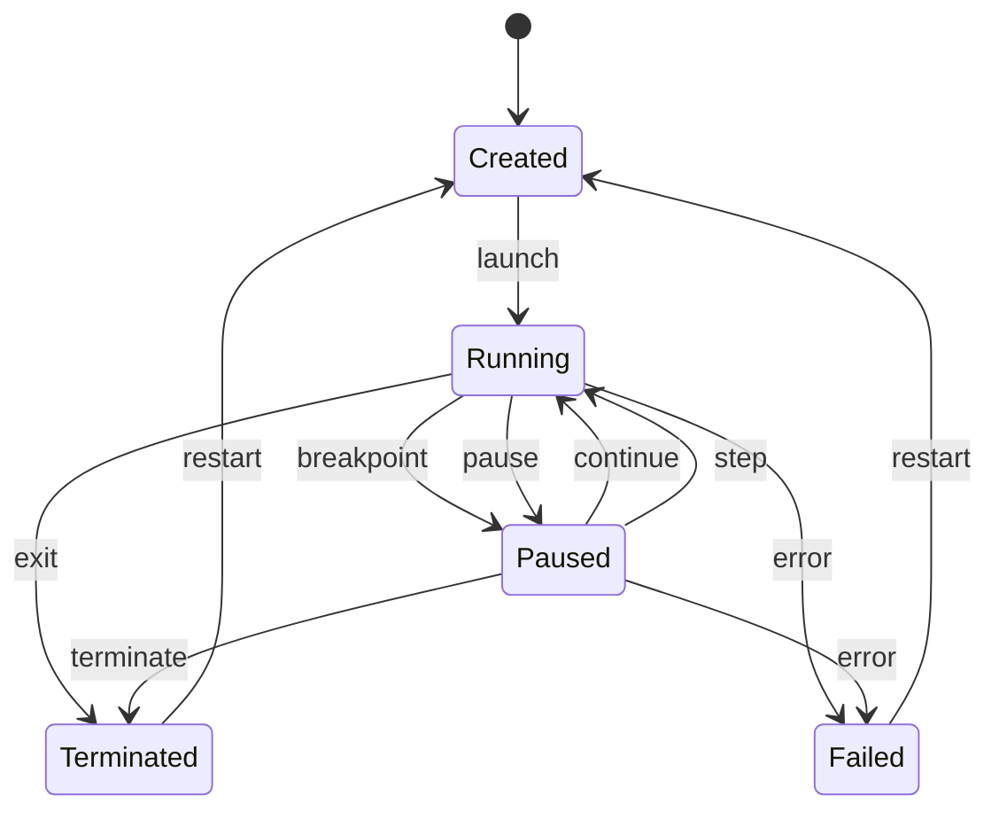
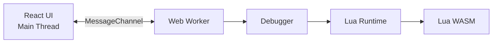

Your goal is a **browser-based Lua playground written primarily in TypeScript**,
with a real debugger and object inspector—not just a text editor + `eval()`—I
would design it as a small IDE/runtime platform.

The key architectural decision is:

> **Do not implement Lua execution/debugging in TypeScript itself initially.
> Embed a real Lua VM compiled to WebAssembly, and build the debugger/inspector
> protocol around it.**

Wasmoon is a good starting point because it embeds the real Lua VM through
WebAssembly and exposes TypeScript/JavaScript bindings. ([npm][1]) Lua itself
exposes the primitives needed for debugging—hooks, stack inspection, locals,
upvalues, etc.—through its debug API. ([Lua][2])

---

# 1. Target architecture

I would structure the project like this:



I'd separate the system into **five major layers**:

1. **Editor**
2. **Execution runtime**
3. **Debug engine**
4. **Inspection/value model**
5. **UI**

This separation will matter enormously once you add stepping, async execution,
coroutines, watches, etc.

---

# 2. First decide your Lua version

I recommend starting with:

**Lua 5.4**

The official Lua 5.4 API gives you:

- call hooks
- return hooks
- line hooks
- instruction-count hooks
- stack inspection
- locals
- upvalues
- function metadata
- coroutine/thread inspection

These are precisely the primitives needed for a debugger. ([Lua][2])

The current Lua reference manuals also list Lua 5.5 as the latest series, but
5.4 has a mature ecosystem and is a good initial target. ([Lua][3])

I'd make the architecture version-independent:

```text
Lua Debugger
     │
     ├── Lua 5.4 adapter
     │
     ├── Lua 5.5 adapter       future
     │
     └── LuaJIT adapter        future
```

---

# 3. Runtime choice

There are three broad approaches.

## Option A — Wasmoon

```text
TypeScript
   ↓
Wasmoon
   ↓
WASM
   ↓
Lua VM
```

This is my recommended MVP.

Wasmoon compiles the official Lua implementation to WebAssembly and provides
JS/TS bindings. ([npm][1])

Advantages:

- real Lua
- browser compatible
- Node compatible
- TypeScript declarations
- good performance
- relatively small integration surface

---

## Option B — Fengari

```text
TypeScript
   ↓
Fengari
   ↓
Lua VM implemented in JS
```

Advantages:

- easier to hack/debug
- pure JS

Disadvantage:

- more work to get excellent runtime performance.

Wasmoon's documentation specifically positions Wasmoon as the faster WebAssembly
approach versus Fengari, while Fengari has the smaller payload. ([GitHub][4])

---

## Option C — Write your own Lua VM

Don't do this initially.

If your objective is to learn interpreter implementation, that's a different
project.

For a playground:

```text
❌ TypeScript Lua interpreter
❌ TypeScript bytecode VM
❌ TypeScript debugger implementation tied directly to AST

✅ Real Lua VM + TypeScript debugger
```

---

# 4. Project structure

I'd start with a monorepo:

```text
lua-playground/
│
├── apps/
│   └── web/
│       ├── src/
│       │   ├── editor/
│       │   ├── debugger/
│       │   ├── inspector/
│       │   ├── console/
│       │   └── app/
│       │
│       └── vite.config.ts
│
├── packages/
│   │
│   ├── lua-runtime/
│   │
│   ├── lua-debugger/
│   │
│   ├── lua-inspector/
│   │
│   ├── lua-protocol/
│   │
│   ├── lua-source/
│   │
│   └── lua-types/
│
├── wasm/
│   └── lua/
│
└── tests/
```

The important thing is that **React should not know anything about Lua
internals**.

---

# 5. Define your own debugger protocol

This is probably the most important design decision.

Don't couple the UI directly to Wasmoon.

Create something similar to DAP internally.

For example:

```typescript
interface DebugSession {
  launch(source: string): Promise<void>;

  continue(): Promise<void>;

  pause(): Promise<void>;

  stepOver(): Promise<void>;

  stepInto(): Promise<void>;

  stepOut(): Promise<void>;

  setBreakpoint(source: string, line: number): Promise<Breakpoint>;

  removeBreakpoint(source: string, line: number): Promise<void>;

  getThreads(): Promise<Thread[]>;

  getStackTrace(threadId: number): Promise<StackFrame[]>;

  getScopes(frameId: number): Promise<Scope[]>;

  getVariables(reference: number): Promise<Variable[]>;

  evaluate(expression: string, frameId: number): Promise<Value>;

  setVariable(frameId: number, name: string, value: Value): Promise<void>;
}
```

Then:

```text
React
  ↓
DebugSession
  ↓
LuaDebugger
  ↓
LuaRuntime
  ↓
WASM Lua
```

This also makes it possible to later support:

```text
Browser runtime
       │
       ├── WASM
       ├── Native Lua
       ├── LuaJIT
       └── Remote Lua process
```

---

# 6. Debugger state machine

You should explicitly model debugger state.



TypeScript:

```typescript
type DebugState = "created" | "running" | "paused" | "terminated" | "failed";
```

Do not scatter state management throughout React components.

Have one source of truth:

```typescript
class DebugSessionManager {
  state: DebugState;

  threads: Map<number, Thread>;
  breakpoints: Map<string, Breakpoint[]>;
  currentThread?: number;
  currentFrame?: number;
}
```

---

# 7. Breakpoints

Basic breakpoint:

```typescript
interface Breakpoint {
  id: number;
  sourceId: string;
  line: number;

  verified: boolean;

  condition?: string;
  hitCondition?: number;
  logMessage?: string;
}
```

Start with:

```text
set breakpoint
remove breakpoint
hit breakpoint
```

Then implement:

```text
conditional breakpoint
hit count
logpoint
```

---

# 8. How line debugging actually works

Lua provides a line hook.

Conceptually:

```text
Lua VM
  │
  │ executes line
  ▼
debug hook
  │
  ▼
current source
current line
  │
  ▼
breakpoint lookup
  │
  ├── no breakpoint → continue
  │
  └── breakpoint → pause
```

Lua's `lua_sethook()` supports `LUA_MASKLINE`, `LUA_MASKCALL`, `LUA_MASKRET`,
and instruction-count hooks. The line hook fires when Lua is about to execute a
new line. ([Lua][2])

Your internal representation can therefore be:

```typescript
interface DebugEvent {
  type: "line" | "call" | "return" | "exception" | "terminated";

  threadId: number;

  source?: string;
  line?: number;
}
```

---

# 9. Important: don't use only line hooks

For an actual debugger you want:

```text
LINE
CALL
RETURN
COUNT
```

Why?

### Line

Needed for:

```text
breakpoints
step over
step into
```

### CALL

Needed for:

```text
call stack
step into
function tracing
```

### RETURN

Needed for:

```text
step out
call stack updates
```

### COUNT

Useful for:

```text
pause
infinite loop detection
instruction limits
profiling
```

Lua explicitly supports count hooks that fire after a specified number of
instructions. ([Lua][2])

---

# 10. Step-over implementation

This is more subtle than it looks.

Suppose:

```lua
foo()

print("hello")
```

You are here:

```text
line 1
```

and press:

```text
Step Over
```

You need:

```text
current stack depth = 3
current line = 1
```

Then continue execution until:

```text
stack depth <= 3
AND
line != 1
```

Conceptually:

```typescript
interface StepOperation {
  type: "over";

  threadId: number;

  initialDepth: number;
  initialSource: string;
  initialLine: number;
}
```

---

# 11. Step-in

At:

```lua
foo()
```

Step In should enter:

```lua
function foo()
```

Algorithm:

```text
capture current frame
↓
continue
↓
wait for CALL event
↓
pause
```

---

# 12. Step-out

At:

```lua
function foo()
    bar()
end
```

If you're inside `foo()`:

```text
current depth = 5
```

Step Out:

```text
continue
↓
wait until stack depth < 5
↓
pause
```

---

# 13. Call stack

Your debugger should expose:

```typescript
interface StackFrame {
  id: number;

  threadId: number;

  name: string;

  source?: SourceLocation;

  line: number;
  column: number;

  functionType: "lua" | "c" | "main";

  scopes: Scope[];
}
```

Example:

```text
Call Stack

▼ main
    main.lua:20

▼ calculate
    main.lua:14

▼ factorial
    main.lua:8
```

Lua's debug API provides stack/frame information through `lua_getstack()` and
`lua_getinfo()`. ([Lua][2])

---

# 14. Inspector architecture

This deserves its own subsystem.

Don't simply do:

```typescript
JSON.stringify(luaValue);
```

because Lua values are not JSON values.

You have:

```text
nil
boolean
number
string
table
function
thread
userdata
```

Lua 5.4 exposes these value categories directly. ([Lua][5])

Create:

```typescript
type LuaValueType =
  | "nil"
  | "boolean"
  | "number"
  | "string"
  | "table"
  | "function"
  | "thread"
  | "userdata";
```

Then:

```typescript
interface LuaValue {
  type: LuaValueType;

  display: string;

  expandable: boolean;

  reference?: number;
}
```

---

# 15. Why references are necessary

Consider:

```lua
local a = {}
local b = a
```

You don't want:

```text
a
 └── {}
b
 └── {}
```

because these are the same object.

Instead:

```text
a → #1
b → #1

#1
 └── table
```

So maintain:

```typescript
class ObjectRegistry {
  private objects = new Map<number, LuaObject>();

  private nextId = 1;

  register(value: LuaObject): number {
    const id = this.nextId++;
    this.objects.set(id, value);
    return id;
  }
}
```

This also solves recursive tables:

```lua
local t = {}
t.self = t
```

---

# 16. Inspector UI

Something like Chrome DevTools:

```text
Locals
────────────────────────────

▼ user
    name       "John"
    age        30

▼ config
    ▼ database
        host   "localhost"
        port   5432

    ▼ features
        logging  true
        cache    false

Globals
────────────────────────────

_G
package
string
table
math
...
```

Use lazy loading.

Don't enumerate a 100,000-entry table immediately.

Instead:

```typescript
getVariables(reference, {
  start: 0,
  count: 100,
});
```

---

# 17. Table inspector

For Lua:

```lua
local t = {
    name = "hello",
    count = 10,
    nested = {
        x = 1
    }
}
```

Return:

```typescript
interface LuaTableEntry {
  key: LuaValue;
  value: LuaValue;
}
```

UI:

```text
table

┌──────────┬──────────────┐
│ Key      │ Value        │
├──────────┼──────────────┤
│ "name"   │ "hello"      │
│ "count"  │ 10           │
│ "nested" │ ▸ table      │
└──────────┴──────────────┘
```

---

# 18. Metatables

Eventually your inspector needs:

```text
▼ table
   fields
   metatable
```

For example:

```lua
local t = {}

setmetatable(t, {
    __index = ...
})
```

Inspector:

```text
▼ t
   fields
   ▼ metatable
       __index
       __newindex
```

This is important if you want the inspector to behave like a real Lua debugger.

---

# 19. Functions

For functions:

```text
function foo(a, b)
```

show:

```text
foo
────────────────────

Type       function
Source     main.lua:10
Parameters a, b
```

Potentially:

```text
upvalues
```

Lua exposes upvalues through its debug API. ([Lua][2])

---

# 20. Locals

At a breakpoint:

```lua
function calculate(x)
    local a = 10
    local b = x * 2

    breakpoint()
end
```

Inspector:

```text
Locals

x     50
a     10
b     100
```

Internally:

```typescript
interface Scope {
  name: string;

  type: "local" | "global" | "upvalue" | "register";

  variablesReference: number;
}
```

---

# 21. Evaluate expressions

This is where your playground becomes much more powerful.

When paused:

```text
Expression:
    user.name
```

returns:

```text
"John"
```

Or:

```text
user.items[3]
```

Or:

```text
x + y
```

Architecture:

```text
UI
 ↓
evaluate(expression, frameId)
 ↓
Debugger
 ↓
evaluation environment
 ↓
Lua VM
```

The important issue is **evaluation must occur in the selected stack frame**.

Otherwise:

```lua
function foo()
    local secret = 123
end
```

and:

```text
evaluate("secret")
```

would fail even though you're currently stopped inside `foo`.

---

# 22. Watch expressions

Once `evaluate()` works:

```text
WATCH

user.name
user.items.length
x + y
player.position.x
```

Every breakpoint stop:

```text
for watch in watches:
    evaluate(watch.expression)
```

---

# 23. Console / REPL

Add:

```text
┌─────────────────────────────┐
│ Lua Console                 │
├─────────────────────────────┤
│ > x + 10                    │
│ 110                         │
│                             │
│ > user.name                 │
│ "John"                      │
│                             │
│ > print("hello")            │
│ hello                       │
│ nil                         │
│                             │
│ >                           │
└─────────────────────────────┘
```

Two modes are useful:

```text
Global REPL
Debug-frame REPL
```

When paused:

```text
REPL context = current stack frame
```

---

# 24. Source model

Don't assume one Lua file.

Create:

```typescript
interface LuaSource {
  id: string;

  name: string;

  path?: string;

  content: string;

  lines: number;
}
```

Eventually:

```text
main.lua
utils.lua
math.lua
```

Then:

```text
require("utils")
```

should resolve to your virtual filesystem.

---

# 25. Virtual filesystem

A playground shouldn't depend on the real browser filesystem.

Create:

```typescript
interface VirtualFileSystem {
  read(path: string): Promise<string>;

  write(path: string, content: string): Promise<void>;

  exists(path: string): Promise<boolean>;

  list(path: string): Promise<string[]>;
}
```

Example:

```text
/
├── main.lua
├── lib/
│   ├── math.lua
│   └── utils.lua
└── data/
    └── config.lua
```

Then implement Lua:

```lua
require("lib.utils")
```

through the virtual filesystem.

---

# 26. Sandbox

This is **critical** if the playground executes user code.

Don't expose unrestricted:

```lua
io
os
package
debug
```

by default.

Lua's own manual warns that the debug library can violate normal assumptions and
can compromise the security of Lua code. ([Lua][2])

Create capability profiles:

```typescript
interface SandboxPolicy {
  allowFileSystem: boolean;
  allowNetwork: boolean;
  allowProcess: boolean;
  allowDebug: boolean;
  maxInstructions: number;
  maxMemory?: number;
}
```

For browser playground:

```text
io       ❌
os       ❌
network  ❌
process  ❌
debug    internal only
```

Your debugger should access VM internals **without exposing the Lua `debug`
library to the user**.

That distinction is important.

---

# 27. Infinite loop protection

This:

```lua
while true do
end
```

must not freeze your browser.

Use instruction-count hooks:

```text
Lua VM
 ↓
COUNT hook
 ↓
instruction counter
 ↓
limit reached
 ↓
interrupt
```

Example:

```typescript
const MAX_INSTRUCTIONS = 10_000_000;
```

Then:

```text
Execution exceeded instruction limit
```

The count hook is specifically provided by Lua for this sort of instrumentation.
([Lua][2])

---

# 28. Web Worker architecture

I strongly recommend **not running Lua directly on the browser UI thread**.

Use:



This protects the UI from:

```lua
while true do end
```

and expensive computations.

---

# 29. Worker protocol

Use structured messages:

```typescript
type WorkerRequest =
  | {
      type: "launch";
      source: string;
    }
  | {
      type: "continue";
    }
  | {
      type: "pause";
    }
  | {
      type: "stepOver";
    }
  | {
      type: "stepInto";
    }
  | {
      type: "stepOut";
    }
  | {
      type: "variables";
      reference: number;
    }
  | {
      type: "evaluate";
      expression: string;
      frameId: number;
    };
```

Events:

```typescript
type WorkerEvent =
  | {
      type: "stopped";
      reason: "breakpoint" | "step" | "exception";
    }
  | {
      type: "output";
      text: string;
    }
  | {
      type: "terminated";
    }
  | {
      type: "error";
      message: string;
    };
```

---

# 30. Editor

For the editor:

```text
Monaco
```

is a natural choice.

Implement:

```text
Lua syntax highlighting
autocomplete
error markers
breakpoints
current execution line
hover evaluation
```

Debugger integration:

```text
Editor
   │
   ├── breakpoint gutter
   ├── current line decoration
   ├── inline values
   └── hover
```

For example:

```lua
local x = calculate(user)
             ^^^^^^^^^^^
             hover:
             number = 42
```

---

# 31. Execution marker

When stopped:

```text
10 │ local x = 10
11 │ local y = 20
12 │ print(x + y)
        ▲
```

Use Monaco's decorations:

```typescript
editor.deltaDecorations(
  [],
  [
    {
      range,
      options: {
        isWholeLine: true,
        glyphMarginClassName: "debug-current-line",
      },
    },
  ]
);
```

---

# 32. Full UI layout

I'd use a VS Code-style layout:

```text
┌──────────────────────────────────────────────────────────────┐
│ Lua Playground              ▶ Run  ⏸  ↻  Step                 │
├──────────────┬───────────────────────────────┬───────────────┤
│              │                               │               │
│ Files        │          main.lua             │ VARIABLES     │
│              │                               │               │
│ ▼ project    │  1 local function foo(x)     │ ▼ Locals      │
│   main.lua   │  2     local y = x * 2       │   x     10    │
│   utils.lua  │  3     return y              │   y     20    │
│              │  4 end                        │               │
│              │                               │ ▼ Globals     │
│              │                               │               │
├──────────────┴───────────────────────────────┤               │
│ CALL STACK                                   │               │
│ ▼ foo          main.lua:2                    │               │
│   main        main.lua:10                    │               │
├──────────────────────────────────────────────┴───────────────┤
│ CONSOLE / REPL                                                │
│ > x                                                            │
│ 10                                                             │
└───────────────────────────────────────────────────────────────┘
```

---

# 33. Development roadmap

I would implement this in **8 phases**.

## Phase 1 — Lua runtime

Goal:

```text
TypeScript
   ↓
WASM Lua
   ↓
execute code
```

Implement:

- Wasmoon
- Lua engine lifecycle
- `execute()`
- stdout capture
- errors
- virtual files

Deliverable:

```typescript
await runtime.execute(`
    print("Hello Lua")
`);
```

---

# Phase 2 — Playground

Implement:

```text
Monaco
+
Run button
+
Console
+
File tree
```

Features:

- editor
- syntax highlighting
- run
- output
- runtime errors
- multiple files
- save/load project

At this point you have a usable Lua playground.

---

# Phase 3 — Debug instrumentation

Modify/integrate the Lua runtime so you can receive:

```text
CALL
RETURN
LINE
COUNT
```

Create:

```typescript
LuaDebugHook;
```

and:

```typescript
DebugEvent;
```

Deliverable:

```text
Lua execution
      ↓
line 1
line 2
line 3
line 4
```

You can observe execution without yet implementing UI debugging.

---

# Phase 4 — Breakpoints

Implement:

```text
set breakpoint
remove breakpoint
breakpoint lookup
pause
resume
```

Then Monaco integration:

```text
red dot → breakpoint
yellow arrow → current line
```

---

# Phase 5 — Call stack + stepping

Implement:

```text
stackTrace
stepInto
stepOver
stepOut
continue
pause
```

This is the first point where you have a real debugger.

---

# Phase 6 — Inspector

Implement the value model:

```text
LuaValue
LuaTable
LuaFunction
LuaThread
LuaUserdata
```

Then:

```text
locals
globals
upvalues
tables
metatables
references
lazy expansion
```

---

# Phase 7 — Expression evaluation

Implement:

```text
evaluate()
watch expressions
REPL
set variable
hover evaluation
```

At this point the debugger becomes genuinely useful.

---

# Phase 8 — Advanced debugger

Add:

```text
conditional breakpoints
hit counts
logpoints
exception breakpoints
coroutine debugging
function breakpoints
instruction limits
profiling
memory inspection
execution timeline
```

---

# 34. Advanced feature: coroutine debugging

Lua coroutines make debugging substantially more interesting.

Example:

```lua
local co = coroutine.create(function()
    print("A")
    coroutine.yield()
    print("B")
end)
```

Your debugger model should therefore not assume:

```text
one VM = one call stack
```

Instead:

```text
Lua VM
│
├── Main Thread
│   └── stack
│
├── Coroutine #1
│   └── stack
│
└── Coroutine #2
    └── stack
```

UI:

```text
THREADS

▶ main
  coroutine #1
  coroutine #2
```

Then:

```text
Call Stack
```

depends on the selected thread.

---

# 35. Advanced feature: profiler

Once you have:

```text
CALL
RETURN
COUNT
```

you can build a profiler almost for free.

Collect:

```typescript
interface FunctionStats {
  functionId: string;

  calls: number;

  totalTime: number;

  selfTime: number;

  instructions: number;
}
```

Then:

```text
Profiler

function          calls     time

calculate()       120       83ms
foo()             400       31ms
parse()           12        18ms
```

---

# 36. Advanced feature: execution timeline

You can also record:

```text
LINE 10
LINE 11
CALL foo
LINE 4
LINE 5
RETURN foo
LINE 12
```

Then visualize:

```text
main
─────────────────────────────
10 ── 11 ─────────────── 12

foo
      ── 4 ── 5 ── return
```

This becomes an extremely useful educational feature.

---

# 37. DAP compatibility

I would eventually make your debugger internally compatible with **Debug Adapter
Protocol concepts**.

You don't necessarily need to implement DAP in v1.

But model your APIs after:

```text
initialize
launch
attach

setBreakpoints

threads
stackTrace
scopes
variables

continue
next
stepIn
stepOut

evaluate
setVariable

pause
disconnect
```

That's a proven debugger abstraction. Existing Lua debugging tooling also
demonstrates Lua debuggers being exposed through DAP. ([Visual Studio
Marketplace][6])

Then you can eventually expose:

```text
Lua Playground
      │
      ├── Web Debugger UI
      │
      └── DAP Server
             │
             ├── VS Code
             ├── Neovim
             └── other IDEs
```

That would turn your project from a playground into an actual Lua debugging
platform.

---

# 38. Recommended package architecture

I'd ultimately target:

```text
@lua-playground/types
        │
        ▼
@lua-playground/runtime
        │
        ├── LuaEngine
        ├── VirtualFS
        └── Sandbox
        │
        ▼
@lua-playground/debugger
        │
        ├── DebugSession
        ├── BreakpointManager
        ├── StepManager
        ├── StackManager
        └── EvaluationManager
        │
        ▼
@lua-playground/inspector
        │
        ├── ValueSerializer
        ├── ObjectRegistry
        ├── TableInspector
        └── ReferenceManager
        │
        ▼
@lua-playground/web
        │
        ├── Monaco
        ├── Debug UI
        ├── Inspector
        └── Console
```

---

# 39. Most important technical challenge

The hardest part isn't React.

It isn't Monaco.

It isn't even the Lua VM.

It's this boundary:

```text
             TypeScript
                 │
                 │
        Debugger abstraction
                 │
                 ▼
          ┌──────────────┐
          │ Lua Runtime  │
          └──────┬───────┘
                 │
       ┌─────────┴─────────┐
       │                   │
   execution            inspection
       │                   │
       ▼                   ▼
    Lua VM              Lua state
```

You need a reliable mechanism to:

1. interrupt execution,
2. inspect the current activation record,
3. inspect locals,
4. inspect upvalues,
5. inspect tables without destroying references,
6. resume execution,
7. step correctly,
8. evaluate in the current frame.

Lua's debug API gives you most of the raw primitives, but your TypeScript layer
needs to turn them into a coherent debugger model. ([Lua][2])

---

# 40. My recommended MVP

Don't try to build everything at once.

I'd define **MVP-1** as:

```text
                         Lua Playground
                               │
              ┌────────────────┼────────────────┐
              │                │                │
           Editor           Runtime          Console
              │                │
           Monaco           Wasm Lua
              │                │
              └────────────┬───┘
                           │
                       Debugger
                           │
             ┌─────────────┼─────────────┐
             │             │             │
        Breakpoint      Call Stack     Inspector
             │             │             │
          step in       frames         locals
          step over                    globals
          step out                     tables
```

Specifically, implement these **10 capabilities first**:

| #   | Feature                | Priority |
| --- | ---------------------- | -------- |
| 1   | Lua 5.4 WASM runtime   | 🔴       |
| 2   | Monaco editor          | 🔴       |
| 3   | Console/stdout         | 🔴       |
| 4   | Virtual filesystem     | 🔴       |
| 5   | Line breakpoints       | 🔴       |
| 6   | Continue/pause         | 🔴       |
| 7   | Step in/over/out       | 🔴       |
| 8   | Call stack             | 🔴       |
| 9   | Local/global inspector | 🔴       |
| 10  | Expression evaluation  | 🔴       |

Then add:

```text
                  ┌── Conditional breakpoints
                  ├── Watches
                  ├── Set variable
                  ├── Metatables
                  ├── Upvalues
                  ├── Coroutines
                  ├── Profiling
                  ├── Memory inspection
                  └── DAP
```

**One architectural recommendation I'd strongly emphasize:** keep the **Lua
runtime/debugger in a Web Worker**, and make the UI communicate with it through
a typed protocol. That gives you a clean boundary for the WASM VM, prevents
runaway Lua from freezing the UI, and makes it much easier later to support
Node/native Lua or a remote debugger.

If you're planning to actually implement this, the next useful step is to design
the **`lua-runtime` + `lua-debugger` TypeScript interfaces and the WASM bridge
in detail**, including how to expose `lua_getstack`, `lua_getlocal`,
`lua_getinfo`, `lua_sethook`, table references, and execution interruption from
C/WASM to TypeScript.

[1]:
  https://www.npmjs.com/package/wasmoon?utm_source=chatgpt.com
  "wasmoon - npm"
[2]:
  https://www.lua.org/manual/5.4/manual.html?external_link=true&utm_source=chatgpt.com
  "Lua 5.4 Reference Manual"
[3]: https://lua.org/manual/?utm_source=chatgpt.com "Lua: reference manuals"
[4]:
  https://github.com/JX3BOX/wasmoon-lua5.1?utm_source=chatgpt.com
  "GitHub - JX3BOX/wasmoon-lua5.1: A real lua 5.1 VM with JS bindings made with webassembly · GitHub"
[5]:
  https://www.lua.org/manual/5.4/?utm_source=chatgpt.com
  "Lua 5.4 Reference Manual - contents"
[6]:
  https://marketplace.visualstudio.com/items?itemName=sssooonnnggg.luau-debugger&utm_source=chatgpt.com
  "Luau Debugger Extension - Visual Studio Marketplace"
