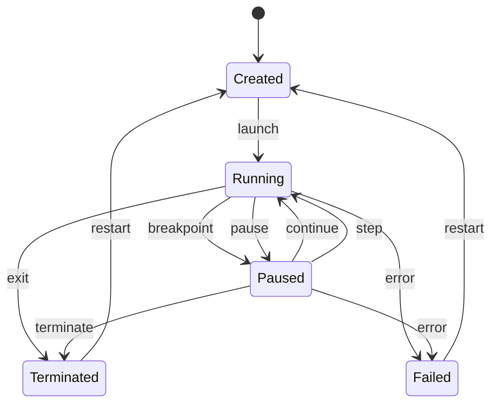

# Debug Protocol & Engine

This is the internal contract between the UI and the debug engine. It's
modeled on Debug Adapter Protocol (DAP) concepts — not implementing DAP
itself in v1, but shaped so that exposing a DAP server later (letting VS
Code/Neovim attach to an in-browser session) is additive rather than a
rewrite. See [architecture.md](./architecture.md) for where this sits in the
layer stack, and [risks.md](./risks.md) for the open question underneath all
of this section: how much of piccolo's dispatch loop needs to be
instrumented (or forked) to produce the events described below.

## DebugSession interface

The UI never talks to the Lua runtime directly — only to this:

```typescript
interface DebugSession {
  launch(source: string): Promise<void>;

  continue(): Promise<void>;
  pause(): Promise<void>;

  stepOver(): Promise<void>;
  stepInto(): Promise<void>;
  stepOut(): Promise<void>;

  setBreakpoint(source: string, line: number): Promise<Breakpoint>;
  removeBreakpoint(source: string, line: number): Promise<void>;

  getThreads(): Promise<Thread[]>;
  getStackTrace(threadId: number): Promise<StackFrame[]>;
  getScopes(frameId: number): Promise<Scope[]>;
  getVariables(reference: number): Promise<Variable[]>;

  evaluate(expression: string, frameId: number): Promise<Value>;
  setVariable(frameId: number, name: string, value: Value): Promise<void>;
}
```

Call chain: `React → DebugSession → LuaDebugger → LuaRuntime → piccolo (WASM)`.
Because everything routes through `DebugSession`, swapping the backend later
(a different Lua engine, a remote Lua process) doesn't touch the UI — this
interface is unchanged by the Wasmoon→piccolo pivot, which is the point of
having it.

## State machine

Debugger state is modeled explicitly, in one place — not scattered across
React components.



```typescript
type DebugState = "created" | "running" | "paused" | "terminated" | "failed";

class DebugSessionManager {
  state: DebugState;
  threads: Map<number, Thread>;
  breakpoints: Map<string, Breakpoint[]>;
  currentThread?: number;
  currentFrame?: number;
}
```

**Default behavior for uncaught errors** (not specified in the original
plan): an uncaught Lua runtime error transitions `Running → Failed` and
surfaces as a `stopped` event with `reason: "exception"` — the UI should
treat this like hitting a breakpoint (show the failing line, populate call
stack/locals) rather than just dumping a stack trace to the console. Errors
caught by `pcall`/`xpcall` inside user code do **not** trigger this — they
stay inside `Running`. Breaking on *caught* errors too ("exception
breakpoints") is a Phase 8 feature, not v1 default behavior.

## Debug events

Under official Lua this would be backed by `lua_sethook`. Under piccolo, the
execution model is different and the events below have to be **produced by
our own instrumentation**, not read off an existing hook API:

- piccolo drives execution by repeatedly calling something like
  `executor.step(&mut ctx, &mut fuel)` — each call performs a bounded unit
  of work (an instruction, or a small batch) and returns control to the
  host.
- The instrumentation layer (in `crates/lua-vm`, see
  [architecture.md](./architecture.md#project-structure)) wraps that loop
  and, after each `step()`, inspects whether a line boundary, a call, or a
  return just happened, and whether the fuel/instruction budget for this
  turn is exhausted — then emits the corresponding event across the
  `wasm-bindgen` boundary.
- This is the crux of [risks.md §1](./risks.md#1-piccolo-debug-introspection-surface-the-central-risk):
  piccolo needs to expose enough of its internal executor/frame state for
  this wrapper to determine "did the line change," "did we just enter a
  Lua function," "did we just return," and "what are this frame's locals" —
  and it isn't guaranteed to expose all of that out of the box.

The event shape the rest of the debugger consumes stays the same regardless
of how it's produced:

```typescript
interface DebugEvent {
  type: "line" | "call" | "return" | "exception" | "terminated";
  threadId: number;
  source?: string;
  line?: number;
}
```

Why all four kinds, not just line:

| Event  | Needed for                                                |
| ------ | --------------------------------------------------------- |
| LINE   | breakpoints, step over, step into                         |
| CALL   | call stack, step into, function tracing                   |
| RETURN | step out, call stack updates                              |
| COUNT  | pause responsiveness, infinite-loop protection, profiling |

The COUNT-equivalent here is naturally covered by the fuel budget itself —
"exceeded the per-turn fuel allowance" is the same signal that would
otherwise come from a Lua instruction-count hook, so it doesn't need a
separate mechanism.

## Breakpoints

```typescript
interface Breakpoint {
  id: number;
  sourceId: string;
  line: number;
  verified: boolean;
  condition?: string;
  hitCondition?: number;
  logMessage?: string;
}
```

Sequencing: **set/remove/hit** basic line breakpoints first (Phase 4).
**Conditional breakpoints, hit counts, logpoints** are Phase 8 — they reuse
the same `Breakpoint` shape (the fields already exist above) but need
`condition`/`logMessage` evaluated against the paused frame before deciding
whether to actually stop.

## Stepping algorithms

These are the fiddly part — get the depth/line comparison wrong and step
operations silently do nothing or skip a frame. Each should have dedicated
tests against fixture `.lua` files (see
[risks.md §4](./risks.md#4-testing-strategy-for-stepping-logic)), and
against the [conformance.md](./conformance.md) fixture corpus once that
exists, since stepping bugs and semantic bugs both surface as "wrong
behavior on this test script."

**Step Over** — resume execution until stack depth returns to ≤ the starting
depth *and* the line has changed:

```typescript
interface StepOperation {
  type: "over";
  threadId: number;
  initialDepth: number;
  initialSource: string;
  initialLine: number;
}
```

**Step Into** — capture the current frame, resume, and stop on the next
`CALL` event (entering the callee) rather than waiting for a line change at
the same depth.

**Step Out** — capture the current stack depth, resume, and stop once depth
drops below the captured value (i.e. the current function has returned).

## Call stack

```typescript
interface StackFrame {
  id: number;
  threadId: number;
  name: string;
  source?: SourceLocation;
  line: number;
  column: number;
  functionType: "lua" | "c" | "main";
  scopes: Scope[];
}
```

Backed by the introspection layer described in
[Debug events](#debug-events) above — piccolo's executor/frame stack, walked
by our instrumentation rather than `lua_getstack()`/`lua_getinfo()`.
Rendering is unaffected:

```text
Call Stack
▼ main        main.lua:20
▼ calculate   main.lua:14
▼ factorial   main.lua:8
```

## Value / inspector model

Don't `JSON.stringify(luaValue)` — Lua values aren't JSON values (nil,
boolean, number, string, table, function, thread, userdata; tables can be
cyclic; distinct objects need distinct identity).

```typescript
type LuaValueType =
  | "nil"
  | "boolean"
  | "number"
  | "string"
  | "table"
  | "function"
  | "thread"
  | "userdata";

interface LuaValue {
  type: LuaValueType;
  display: string;
  expandable: boolean;
  reference?: number;
}
```

These values are marshaled across the `wasm-bindgen` boundary from piccolo's
own Rust value representation — see
[architecture.md](./architecture.md#runtime-choice-rust--piccolo) for where
that boundary sits.

### Reference identity (`ObjectRegistry`)

```lua
local a = {}
local b = a
```

`a` and `b` must serialize as the *same* referenced object (`#1`), not two
separately-rendered empty tables — otherwise self-referential tables
(`t.self = t`) infinite-loop the serializer.

```typescript
class ObjectRegistry {
  private objects = new Map<number, LuaObject>();
  private nextId = 1;

  register(value: LuaObject): number {
    const id = this.nextId++;
    this.objects.set(id, value);
    return id;
  }
}
```

Table identity is naturally available here since piccolo tables are
GC-arena-managed Rust objects with stable identity; the registry's job is
purely to hand out stable serialization IDs to the TS side, not to
reconstruct identity that was lost.

### Tables

```typescript
interface LuaTableEntry {
  key: LuaValue;
  value: LuaValue;
}
```

Lazy-load entries — never enumerate a 100,000-entry table eagerly:

```typescript
getVariables(reference, { start: 0, count: 100 });
```

### Metatables

```text
▼ t
   fields
   ▼ metatable
       __index
       __newindex
```

Metatable support depth (which metamethods piccolo implements) is one of
the items tracked in [conformance.md](./conformance.md)'s known-deviations
ledger — don't assume full parity with official Lua's metamethod set
without checking.

### Functions and upvalues

```text
foo
────────────────────
Type       function
Source     main.lua:10
Parameters a, b
```

Upvalue exposure depends on what the instrumentation layer can read from
piccolo's closure representation — same lazy-expansion treatment as table
entries once available.

### Scopes / locals

```typescript
interface Scope {
  name: string;
  type: "local" | "global" | "upvalue" | "register";
  variablesReference: number;
}
```

## Evaluation

`evaluate(expression, frameId)` must run **in the selected stack frame's
environment**, not global scope — otherwise a paused local like
`local secret = 123` inside `foo()` wouldn't be visible to
`evaluate("secret")` while stopped inside `foo`.

Used by three surfaces, all going through the same `evaluate()`:

- **Watch expressions** — re-evaluated on every stop:
  ```text
  for watch in watches:
      evaluate(watch.expression)
  ```
- **REPL** — two modes: a global REPL, and (when paused) a debug-frame REPL
  where `REPL context = current stack frame`.
- **Hover evaluation** in the editor.

## Worker message protocol

```typescript
type WorkerRequest =
  | { type: "launch"; source: string }
  | { type: "continue" }
  | { type: "pause" }
  | { type: "stepOver" }
  | { type: "stepInto" }
  | { type: "stepOut" }
  | { type: "variables"; reference: number }
  | { type: "evaluate"; expression: string; frameId: number };

type WorkerEvent =
  | { type: "stopped"; reason: "breakpoint" | "step" | "exception" }
  | { type: "output"; text: string }
  | { type: "terminated" }
  | { type: "error"; message: string };
```

Unchanged from the Wasmoon design, and unaffected by the runtime pivot —
this boundary was already engine-agnostic. What changed underneath is how
`"pause"` is implemented worker-side: previously an `Atomics.notify` wakeup,
now just "the driver loop stops calling `step()`."

## Instruction limits / infinite-loop protection

The fuel budget passed to `executor.step()` is the direct analog of a Lua
instruction-count hook — cap the total fuel spent per `launch()`/`continue()`
run:

```typescript
const MAX_INSTRUCTIONS = 10_000_000;
```

On limit reached, terminate with `"Execution exceeded instruction limit"`
rather than letting the worker spin forever.

## Advanced: coroutines (Phase 8)

The model must not assume one VM = one call stack:

```text
Lua VM
├── Main Thread     → stack
├── Coroutine #1    → stack
└── Coroutine #2    → stack
```

`getThreads()` already exists in the v1 `DebugSession` interface for this
reason — call stack queries take a `threadId` so the UI's thread selector
just changes which stack is being viewed. Verify piccolo's own
coroutine/thread model maps cleanly onto this before Phase 8 — it's on the
[conformance.md](./conformance.md) checklist.

## Advanced: profiler (Phase 8)

Falls out of CALL/RETURN/COUNT-equivalent events almost for free once they
exist:

```typescript
interface FunctionStats {
  functionId: string;
  calls: number;
  totalTime: number;
  selfTime: number;
  instructions: number;
}
```

## Advanced: execution timeline (Phase 8)

Record the event stream (`LINE 10, LINE 11, CALL foo, LINE 4, ...`) and
render it as a per-function timeline. Primarily an educational/visualization
feature, not required for core debugging.

## DAP alignment

Not implemented in v1, but the API surface above is deliberately shaped
after DAP's core requests (`initialize`, `launch`, `setBreakpoints`,
`threads`, `stackTrace`, `scopes`, `variables`, `continue`, `next`,
`stepIn`, `stepOut`, `evaluate`, `setVariable`, `pause`, `disconnect`) so
that exposing an actual DAP server later — letting external editors attach
to a session — is a translation layer on top of `DebugSession`, not a
redesign.
