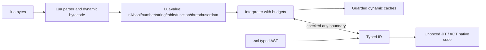

# Lua 5.5 compatibility without regressing typed Sol

> Status: an interpreter-first subset is implemented. The checked corpus
> manifest and this document identify supported and open behavior.

**Purpose:** make a useful, measured subset of Lua 5.5 programs run unchanged as
`.lua` while retaining Sol's actual end goal: `.sol` code has static types,
unboxed data, a shared SSA optimizer, and native AOT/JIT execution. Lua
compatibility is a runtime and migration boundary, not a reason to lower every
Sol program to a boxed Lua VM.

This document refines the dynamic compatibility section of the
[feature delivery plan](delivery-plan.md) into an implementation and test
plan. It follows the intent in [faster_lua.md](../../faster_lua.md): build a
typed, specialized compiler with one optimization IR for AOT and JIT, and make
performance claims only for named workloads on named hardware.

## Current evidence and scope

The checked manifest currently classifies all 34 top-level Lua 5.5.1 cases:
26 remain semantic `pending` cases and 8 are explicitly `host-required`.
Focused fixtures now cover implemented parser/runtime slices, but no complete
upstream case has been promoted to `pass`; the result remains a baseline, not a
claim that the suite is a single ready-made Sol acceptance test. Every
`pending` row now carries a `blocked-on:` note naming the specific missing
feature or bug class observed against the pinned corpus (Phase 3 triage);
common blockers are a sandboxed `require` with no `debug` library to register,
`<close>`/finalization (Phase 4), remaining binary-chunk support, and incomplete
weak-table collection in the legacy runtime — see
`docs/features/lua-superset-plan.md`'s Phase 3 section for the
session-by-session detail.

The upstream suite also exercises a Lua executable, its C API, dynamically
loaded C modules, a terminal/readline fallback, host files such as `/dev/full`,
and locale-dependent collation and decimal parsing. Those are valid Lua
distribution tests, but are separate from language semantics. Sol must classify
them explicitly instead of hiding failures or declaring parser acceptance to be
compatibility.

### Compatibility contract

| Area                  | Contract                                                                                                                                                                                                                                                                             |
| --------------------- | ------------------------------------------------------------------------------------------------------------------------------------------------------------------------------------------------------------------------------------------------------------------------------------ |
| `.sol`                | Statically checked. Typed scalars, records, arrays, maps, and typed functions remain direct SSA values where their types permit it. Dynamic operations are explicit through `any` or an imported `.lua` module.                                                                      |
| `.lua`                | Dynamic compatibility mode. Values, globals, tables, closures, varargs, and metatables use the Lua runtime representation. It begins in the interpreter/bytecode VM.                                                                                                                 |
| Boundary              | Importing `.lua` from `.sol` exposes `any`/a runtime handle. Converting it to a typed record, map, array, scalar, or function requires an explicit checked operation. No implicit table shape conversion or speculative unboxing crosses the boundary.                               |
| Optimization          | The dynamic VM may gain guarded inline caches and profile-guided specializations. A failed guard resumes compatible bytecode/interpreter state. `.lua` is not AOT-native by default; a future frozen-module profile may opt in only after deoptimization and GC root maps are sound. |
| Unsupported host APIs | Capability-gated and reported as such. `io`, `os`, native module loading, debug hooks, and C API embedding never become silently available just because the compiler process has those privileges.                                                                                   |

`global` is an upstream Lua 5.5 extension and therefore belongs only to `.lua`
grammar. Support `global <const> name = value`, `global function name`,
`global none`, and the documented wildcard form with their Lua 5.5 scope and
const rules. Do not admit `global` into typed `.sol` source.

## Test inventory and reporting model

Create a checked-in manifest at `tests/lua55/manifest.toml` that has one entry
per upstream case and records: upstream path and revision, category, required
host capabilities, expected output/error oracle, Sol status, and a link to the
adapted Sol fixture where one exists. Valid statuses are:

- `pass`: runs unchanged with Sol's supported capability profile and matches the
  oracle.
- `adapted`: the language assertion runs in a small Sol fixture because the
  upstream driver is testing the Lua executable or C API. The manifest names the
  removed host assumption and preserves the assertion.
- `host-required`: requires an intentionally unavailable capability; the runner
  checks that it is skipped with that reason.
- `pending`: a known semantic feature is missing. The entry names its owning
  feature area and issue/fixture.
- `diverges`: an intentional, documented difference with a migration path.

`fail` is never an accepted release status. A case that cannot yet run must be
`pending`, rather than being lost in a pile of command failures.

| Corpus group           | Representative upstream files                                                                             | What it establishes                                                       | First target                     |
| ---------------------- | --------------------------------------------------------------------------------------------------------- | ------------------------------------------------------------------------- | -------------------------------- |
| Grammar and values     | `literals.lua`, `constructs.lua`, `locals.lua`, `goto.lua`, `attrib.lua`, `bitwise.lua`, `bwcoercion.lua` | Raw lexical input, declarations, scope, literals, operators, control flow | L1–L3                            |
| Calls and environments | `calls.lua`, `closure.lua`, `vararg.lua`, `nextvar.lua`, `errors.lua`                                     | Globals, closures, varargs, multi-results, protected errors               | L3–L4                            |
| Object protocol        | `events.lua`, `tpack.lua`, `sort.lua`                                                                     | Tables, iteration, metamethod dispatch and order                          | L3–L5                            |
| Library semantics      | `strings.lua`, `math.lua`, `utf8.lua`, `coroutine.lua`, `pm.lua`                                          | Base/table/string/math/utf8/package/coroutine behavior                    | L5–L7                            |
| GC and stress          | `gc.lua`, `gengc.lua`, `tracegc.lua`, `big.lua`, `heavy.lua`, `verybig.lua`                               | Reachability, finalization rules, memory pressure and limits              | L6–L8                            |
| Lua distribution/host  | `main.lua`, `api.lua`, `files.lua`, `memerr.lua`, `cstack.lua`, `code.lua`, `db.lua`                      | CLI, C API, loadable modules, OS/terminal/filesystem/debugger behavior    | L0 then separate capability work |

## L0 — Reproducible oracle and corpus triage

**Purpose:** distinguish an upstream environment problem from a Sol semantic
failure before implementing runtime features.

- [x] Pin the Lua 5.5.1 source tarball checksum and build a reference runner in
      a Linux container. Use its own `src/lua`, matching C headers, and the
      suite's `libs` build targets; do not compare against an unrelated system
      Lua package.
- [x] Provision the reference profile with dynamic module loading, the expected
      readline fallback, `/dev/full`, and an ISO-8859-1 Portuguese locale. Log
      the OS image, compiler, Lua configure flags, locale, and module search
      paths next to the result.
- [x] Add `scripts/test-lua55-reference.sh`, which builds or validates the
      reference prerequisites and writes per-case stdout, stderr, exit code,
      duration, and environment metadata under a caller-selected results
      directory.
- [x] Evolve `scripts/test-lua55-suite.sh` from a raw loop into a manifest-aware
      Sol runner. It must retain the existing ability to execute every top-level
      test, but summarize `pass`, `adapted`, `host-required`, `pending`, and
      unexpected failures separately.
- [x] Check in normalized text or structured snapshots for deterministic oracle
      cases. Normalize paths, executable names, and platform line endings only;
      do not normalize semantic output, errors, or ordering.
- [x] Triage all 34 files and record why every host-dependent file is adapted or
      capability-gated. Add a regression test for the manifest parser so an
      unclassified upstream file fails CI.

**Exit gate:** the reference profile completes its upstream suite subject only
to recorded platform differences, all 34 cases have a manifest row, and a CI
report can tell a missing Sol feature from an unavailable host facility.

## L1 — Byte-accurate Lua source and complete syntax front end

**Purpose:** parse the Lua 5.5 surface before attempting to execute it.

- [x] Make source loading byte-oriented. Preserve arbitrary bytes in string
      literals, comments, long brackets, and diagnostics; source positions are
      byte offsets plus line/column, not UTF-8 `String` indexes.
- [x] Add Lua lexical forms: decimal/hex/hex-float numerals, escapes and long
      strings/comments, Unicode escape handling where Lua specifies it, and all
      punctuation/operator tokens. Retain the stricter typed lexer rules for
      `.sol` where they intentionally differ.
- [~] Parse all Lua statement and expression forms: `local`, global assignment,
      `do`/`end`, labels and `goto`, numeric and generic `for`, `repeat`, table
      constructors, indexing/field access, method definitions and calls,
      anonymous/local/nested functions, vararg expressions, call-statement
      sugar, and expression-list assignment/return rules.
- [x] Parse table constructors (array, named, and computed fields), function
      call shorthand, method declarations/calls, and indirect-call syntax into
      Lua-specific AST nodes.
- [x] Parse local, nested, anonymous, and named-vararg (`...name`) functions;
      reject a vararg expression outside its enclosing vararg function.
- [x] Parse Lua labels/gotos, generic `for` loops, and multi-value returns.
      Same-block labels/gotos and general iterator triples now execute; complete
      goto scope-entry validation remains open.
- [x] Parse Lua 5.5 `global` declarations in `.lua` only, including attributes
      and const diagnostics. Reject the same spelling in `.sol` with a useful
      source span and migration suggestion.
- [~] Establish parser fixtures for each construct plus negative syntax tests
      for ambiguous long brackets, bad numerals, invalid labels, forbidden
      varargs, const global writes, and `.sol`/`.lua` mode boundaries. The
      construct, long-bracket/numeral, vararg, and source-mode coverage is in
      `lua55_parser_surface.lua`/`lua55.rs`; label scope and global-const write
      validation require L2's `_ENV` declaration metadata.

**Exit gate:** all syntax-oriented corpus cases parse to an inspectable Lua AST
or fail at the same source location as reference Lua. This gate has no claim
about runtime behavior.

## L2 — Dynamic bytecode and value model

**Purpose:** provide a correct foundation for Lua semantics that cannot be
represented by the current scalar-only `any` box.

- [~] Introduce a dedicated `LuaValue` tagged representation: `nil`, boolean,
      integer, float, interned/owned string, table, closure, native function,
      thread, and opaque userdata. Keep it distinct from typed SSA values and
      make every reference variant traceable by the collector.
- [~] Define Lua truthiness, number equality/comparison/coercion, string
      identity/content rules, number formatting, and key canonicalization with
      differential fixtures. Specify NaN and integer/float table-key behavior.
      Numeric `for` loops (`Instr::ForPrep`/`ForLoop`) now run a float-mode
      loop when any control value (start/stop/step) is a float, matching real
      Lua, instead of unconditionally requiring integer control values (this
      used to make any `for i = 1, math.huge do ... end` fail before its
      first iteration). Integer loops now terminate at `i64` overflow instead
      of wrapping forever. Integer floor division/modulo follow the divisor's
      sign and shifts handle `i64::MIN` without recursive negation, matching
      the corresponding typed helpers. Arithmetic still has no automatic string-to-number
      coercion at all (`"2" + "3"` errors; real Lua coerces numeral strings
      in arithmetic contexts) — open.

      Known, deliberate divergence: `LuaValue::identity_address`
      (`lua_runtime/value.rs`) derives a string's `%p` identity from its
      canonical heap `ObjectId`, and Sol's canonical heap interns every string
      by content regardless of length, where real Lua's `lstring.c` only
      interns short strings (<= `LUAI_MAXSHORTLEN`, 40 bytes) - long strings
      each get their own allocation/address on every call. This makes
      `lua-5.5.1-tests/strings.lua`'s "long strings aren't internalized"
      assertion (`topointer(s1) ~= topointer(s2)` for two content-identical
      300-byte strings) permanently false without a short/long split in the
      string heap's interning policy - a representational change, not a local
      fix. Tracked as `pending` in `tests/lua55/manifest.toml`'s
      `strings.lua` entry.
- [x] Add Lua bytecode registers, constants, upvalue descriptors, and source
      spans. Interpret dynamic code through this VM; do not force it through
      typed Cranelift lowering. `lua_bytecode.rs` compiles each Lua function
      to a `Proto` (register-based instructions, constants, upvalue
      descriptors, per-instruction source lines); `lua_runtime.rs`'s
      `run_proto` executes it directly, replacing the prior `Env`-chain
      AST-walking tree-walker entirely.
- [~] Give every Lua module its own `_ENV` table and resolve reads/writes via
      that environment. Implement `global` declarations through explicit
      environment slots/metadata, including their const constraints. The
      legacy dynamic runtime backs each `Globals` scope by default with a real
      `LuaTable`, exposes the root table as `_G`, returns it for the implicit
      `_ENV`, and compiles global reads/writes through a lexically rebound
      local or captured `_ENV` when present. `_ENV` is a real, arbitrary-value
      upvalue rather than a table-only binding: `Globals::from_value`/
      `set_value` let a closure capture and rebind `_ENV` to any `LuaValue`
      (including a plain table assembled at runtime, not only the module's own
      root table), and `debug.getupvalue`/`setupvalue` expose the implicit
      `_ENV` upvalue like any other captured local. Closures therefore share
      mutations to an explicitly supplied environment. The upstream `calls.lua`
      corpus file, which exercises exactly this arbitrary-`_ENV` pattern, now
      passes against the pinned oracle. The remaining U2 work is to move these
      tables/cells onto canonical `sol-core` handles, make default global
      accesses use the complete table metamethod path, and define how Sol's
      `global <const>` metadata behaves when `_ENV` is an arbitrary user table.
      A bare `global name1, name2` declaration (no `= value`) retains each
      name's current value instead of clobbering built-ins with `nil`.
- [~] Add a host-independent error object and stack trace shape. Errors must
      cross dynamic call boundaries without Rust panics or process aborts.

**Exit gate:** direct fixtures cover all value tags, globals/\_ENV isolation,
numeric corner cases, and error propagation; bytecode execution agrees with
reference Lua for the non-library portions of the L1 corpus group.

## L3 — Tables, assignment, and iteration

**Purpose:** implement the dynamic object model that most Lua code depends on.

- [~] Implement heap tables with Lua array and hash parts, `nil` deletion,
      stable object identity, length behavior, resize policy, and mutation write
      barriers.
- [x] Implement table constructors with keyed, array, and computed-key fields;
      expand the final expression according to Lua multi-result rules.
- [~] Implement assignment targets and expression lists left-to-right with Lua
      adjustment rules: only the final call/vararg expands; surplus values are
      discarded and missing values become `nil`.
- [~] Implement `next`, `pairs`, `ipairs`, raw get/set/equality/length, and the
      base/table APIs needed by the core corpus. Define invalidation behavior
      for table mutation during iteration and test it against reference Lua.
      Iterator triples and numeric integer/float key canonicalization are
      implemented; mutation-during-iteration oracle coverage remains open.
- [ ] Keep typed `Map<K,V>`, records, and arrays separate. A dynamic
      table becomes one only through checked conversion that validates keys,
      fields, values, and absence/presence rules.

**Exit gate:** adapted fixtures extracted from `constructs`, `nextvar`, `tpack`,
and `sort` pass, including table identity, deletion, iteration, and multiple
assignment/return cases.

## L4 — Functions, closures, varargs, and protected execution

**Purpose:** make normal dynamic Lua programs executable without weakening typed
typed top-level function values.

- [~] Compile Lua closures with heap environment cells for captured locals.
      Closing an upvalue at scope exit must preserve a single shared cell across
      all closures that captured it. Fixed two register-allocation bugs in
      method-call codegen (`lua_bytecode.rs`): method calls with one or more
      explicit fixed arguments (e.g. `t:greet("x")`) clobbered the `self`
      register because fixed arguments started at `base` instead of
      `base + 1`; and a method call used as a trailing multi-value call
      argument (e.g. `f(s:format(...))`) panicked a `debug_assert_eq!` because
      `compile_method_base` allocated its base register after evaluating the
      receiver expression instead of before. Also fixed `function t.f(...)`/
      `function t:f(...)` declarations (both nested and top-level/hoisted)
      compiling the dotted/colon name as a literal global variable (e.g. a
      global literally named `"t.f"`) instead of assigning into `t`'s field;
      top-level dotted/method declarations are no longer hoisted ahead of the
      statement that creates their base table, matching real Lua's
      sequential-sugar semantics.

      Fixed 2026-09-27: a loop-body local captured as an upvalue by a nested
      closure could be re-assigned the same register number as an
      earlier-compiled, textually-preceding scratch temp within the same loop
      body (e.g. a `while` guard condition), because ordinary stack-discipline
      register recycling only protected already-captured registers
      (`retired_floor`) going forward, not registers a still-open loop had
      used earlier in its own body. Fixed by adding `LoopCtx.reg_floor`
      (`lua_bytecode/func_state.rs`): the highest register any `alloc_reg`
      call has handed out anywhere in the current loop's body, which now also
      floors `reset_to`/`pop_scope`/`end_statement`'s recycling, and the
      `while`-condition cleanup site's own re-tested register, for as long as
      that loop is being compiled. See `tests/lua55/manifest.toml`'s
      `closure.lua` entry.
- [~] Implement Lua call frames, recursive calls, proper vararg packs, and
      multi-result propagation through call, return, assignment, table
      construction, and parenthesized-expression truncation sites.

      Known gap: a named vararg parameter (`function f(...v)`) is supposed to
      bind `v` to the call's varargs without allocating any table/object (real
      Lua 5.5 semantics; see `lua-5.5.1-tests/vararg.lua`'s `notab` case,
      which asserts `collectgarbage"count"` is unchanged across two identical
      calls). Sol's `lua_runtime/dispatch.rs::call_closure` frame-construction
      code instead unconditionally allocates a fresh `Table` via
      `self.values_table(&varargs)` for every call with a named vararg
      parameter. Matching real Lua would need a lazy/virtual vararg-table view
      sharing the frame's own `varargs: Vec<LuaValue>` storage directly rather
      than copying into a separate heap `Table` - a new indexing/dispatch/
      GC-root-scanning primitive, not a local fix. Tracked as `pending` in
      `tests/lua55/manifest.toml`'s `vararg.lua` entry.
- [x] Implement `pcall`, `xpcall`, `error`, `assert`, and `select`, preserving
      error values and a bounded, useful stack trace. Add recursion/instruction
      budgets before host-exposed sandbox use. Recursion, instruction/backedge,
      and heap table/closure allocation budgets are enforced; exact byte and
      environment accounting awaits the dynamic GC allocator. Growing an
      existing table past its allocation budget (not just creating a new one)
      now goes through the same charge path (`charge_new_table_entry`,
      `LuaTable::charged_bytes`, with `collect_cycles` crediting back
      collected bytes), so unbounded table growth raises a catchable
      `LuaError` instead of an uncharged/uncatchable overflow; the upstream
      `heavy.lua` corpus file now runs to completion under `pcall` and matches
      the pinned oracle's structural behavior (differing only in exact error
      text and byte counts, tracked as `diverges` in the manifest, the same
      category as `sort.lua`'s non-deterministic timing output). `assert(v)` with
      no explicit message now raises the literal `"assertion failed!"` on a
      falsy `v` (previously it stringified the falsy `v` itself as the error
      message, e.g. `assert(false)` raised `"false"`). `LuaError` now carries
      an optional `value: Option<LuaValue>` alongside `message`/`stack`:
      `error(v)` and `assert(false, v)` stash the original `v` unchanged (same
      type, same reference identity for tables/closures), and `pcall`,
      `xpcall`, and `coroutine.resume` hand that exact value back via
      `LuaError::into_lua_value` instead of the `display_bytes()` string that
      was previously the only option. String values still round-trip as
      plain strings with no added position prefix. `error()`'s own fallback
      display text still uses non-metamethod-aware `display_bytes()`, matching
      real Lua's `error()`/`assert()`, which don't invoke `__tostring` (only
      `lua.c`'s top-level `msghandler` does).
- [x] Specify and implement tail-call behavior. The generic compiler emits an
      explicit semantic tail call for a sole returned call expression. Lua
      closure calls replace the active trampoline frame without increasing the
      call-depth charge; native and protected continuations retain the caller
      frame only when their observable error/yield behavior requires it.
- [x] Implement the typed-to-dynamic semantic bridge with checked scalar
      signatures and canonical identity-preserving boundary values. The
      specialized dispatcher represents dynamic functions as semantic slots;
      returned, raised, yielded, and tail-call outcomes use `sol-core`'s common
      call ABI. Non-scalar optimized layouts remain U5 work, and unsupported
      or reentrant graphs stay on the generic runtime rather than being
      miscompiled.
- [ ] Extend the `.sol` bridge to arbitrary `any` values and
      checked conversion to a typed function signature. Enforce arity/result
      checks at the bridge; do not let `LuaValue` appear in typed IR absent an
      explicit dynamic operation.
- [x] Split `.lua` compilation per function instead of per file: one dynamic
      construct anywhere in a file no longer forces every function in that
      file into the bytecode interpreter. `typeck::check_partitioned`
      classifies each top-level function (including the synthesized `main`)
      as native-candidate or dynamic, then demotes any native-candidate that
      (directly or transitively) calls a dynamic function to a fixed point,
      via `jit::called_functions` over the native call graph. Dynamic code
      may call into surviving native functions through a registered semantic
      callable. Specialized bytecode can also call dynamic functions through
      checked semantic slots. Only scalar (`i64`/`f64`
      /`bool`) parameters and returns may cross the bridge — non-scalar
      signatures (strings, tables, structs, arrays, maps, functions) are
      rejected at compile time with a clear error rather than silently boxed
      or miscompiled, preserving the "typed hot paths are never implicitly
      weakened" rule above. `sol run` uses this path (see
      `main.rs::run_lua_partitioned`); `sol build`/`sol debug` remain
      all-or-nothing pending follow-up work.

**Exit gate:** `calls`, `closure`, `vararg`, and relevant `errors` assertions
pass unchanged or as manifest-linked semantic fixtures, including shared
upvalues and final-expression result expansion.

## L5 — Metatables and essential libraries

**Purpose:** provide the Lua object protocol and the portable library subset.

- [x] Implement per-value/type metatables and table metatables. Table
      metatables dispatch
      `__index`, `__newindex`, `__call`, `__tostring`, `__len`, and `__pairs`;
      arithmetic, bitwise, concatenation, comparison, and equality lookup is
      also implemented. Strings now share one real, mutable metatable object
      (`LuaRuntime::string_metatable`, `{ __index = string }`), matching real
      Lua's `strmt`: `getmetatable("")` returns this table (the same table for
      every string, `getmetatable("") == getmetatable("x")`), `index()`/
      `metamethod()` resolve strings through it like any other `__index`/
      arithmetic/bitwise/etc. metamethod chain rather than a hardcoded
      special case, and mutating it directly (`getmetatable(""):__band = fn`,
      the `bwcoercion.lua`-style shim mentioned above) is now visible to every
      subsequent string operation. `setmetatable` on a string still errors
      (matches real Lua: `setmetatable`'s first argument must be a table).
      Remaining open item: other per-type metatables (numbers, booleans,
      functions) beyond strings.
- [~] Use metatable/table version counters for dynamic inline caches. Mutation
      counters are maintained now. Each future cache
      guards receiver kind, table shape, metatable identity, and version; any
      miss or mutation takes the generic bytecode path.
- [~] Implement deterministic base, table, string, math, and utf8 slices with
      per-function tests. Focused base/string support plus table
      `concat`/`insert`/`remove`/`pack`/`unpack`/`sort`/`create` and core numeric
      math functions (including `sqrt`/`sin`/`cos`/`tan`/`exp`/`log` and the
      inverse-angle/conversion/remainder/decomposition functions, Lua 5.5's
      xoshiro256** `random`/`randomseed`, and the
      `pi`/`huge`/`maxinteger`/`mininteger` constants) are present, along with
      `tonumber`, string-to-number arithmetic/bitwise coercion,
      `string.byte`/`char`, and the complete portable UTF-8 library
      (`len`/`char`/`codepoint`/`offset`/`codes`/`charpattern`, including lax
      extended UTF-8). The unchanged upstream `bwcoercion.lua` and `utf8.lua`
      cases now match the pinned Lua 5.5.1 reference. A
      real Lua pattern-matching engine (`crates/sol/src/lua_pattern.rs`:
      character classes, `[...]` sets, `^`/`$` anchors, `()` captures
      including position captures, `%1`-`%9` back-references, `*`/`+`/`-`/`?`
      quantifiers, `%b`/`%f`) backs `string.find`/`match`/`gmatch`/`gsub`
      (string/table/function replacements). `string.format` covers
      `d`/`i`/`u`/`x`/`X`/`o`/`c`/`f`/`F`/`e`/`E`/`g`/`G`/`s`/`q`/`%` with
      flags/width/precision (note: `%e`/`%g` use Rust's float formatter under
      the hood, so extreme-precision rounding may not bit-match C's libm).
      `collectgarbage` is a deterministic approximation over the existing
      allocation budget (`"count"` reports bytes used). `"collect"`/`"step"`
      run a full trial-deletion cycle-collector pass (see L6) on top of the
      `Rc`-based value graph, reclaiming table/closure reference cycles and
      running `__gc` finalizers; `"stop"`/`"restart"`/`"isrunning"`/
      `"incremental"`/`"generational"` are accepted but remain no-ops, since
      there is no incremental/generational scheduling to toggle.
      `string.pack`/`unpack`/`packsize` are implemented
      (`crates/sol/src/lua_pack.rs`: endianness `<`/`>`/`=`, alignment
      `!`/`!n`, integers `b`/`B`/`h`/`H`/`i`/`I`/`l`/`L`/`j`/`J`/`T`, floats
      `f`/`d`/`n`, strings `s`/`z`/`c`, padding `x`), including the
      align-without-storing `X` option (`x_alignment`/`align_pad`/
      `align_skip`: `X` reads the option that follows it and pads to that
      option's natural alignment without consuming or emitting any bytes of
      its own). The upstream `tpack.lua` corpus file now passes against the
      pinned oracle. Broader remaining math error-provenance edge case is
      tracked by the manifest.
- [x] Implement a sandboxed `package`/`require`: an explicit host-provided
      loader (`LuaRuntime::add_module`) registers exact-name in-memory module
      sources; `package.loaded` caches each module's result so repeated
      `require` calls return the same value; a cyclic `require` observes a
      deterministic partial-initialization sentinel instead of reloading or
      overflowing the call stack; each loaded module gets its own global
      environment (`_NAME` set, globals isolated from the requiring module and
      from other modules). Native/filesystem loaders stay off: `require` is
      rejected until the `package` capability is explicitly enabled by
      registering a module. Path-based search and a stable module-interface
      format remain open.
- [~] Split `io`, `os`, `debug`, native module loading, and locale APIs into
      declared capability profiles. The shared `sol_core::Capabilities` model
      independently declares package, filesystem, process, environment, clock,
      locale, stdin, stdout, native-module, and debug authority; the legacy
      `LuaCapabilities` name is only a naming alias. `package` denial
      (no registered module) vs. allowed (an explicit `add_module` call)
      behavior is tested. Implemented `os` effects are gated narrowly:
      `time`/`clock` require clock, `getenv` requires environment, and `exit`
      requires process authority, while pure `difftime` and explicit-timestamp
      `date` calls remain portable. `io.read` requires stdin and `io.write`
      requires stdout, with denial/allowed and cross-authority isolation tests
      (`LuaRuntime::with_capabilities`; the trusted `sol` CLI selects
      `Capabilities::NATIVE_CLI`, unlike library embedders which keep the
      sandboxed-by-default profile). `os.date` uses UTC-only
      hand-rolled calendar math (no timezone database), so `os.date(...)` and
      `os.date("!"...)` currently render identically, and its strftime-subset
      only covers `%Y %y %m %d %H %M %S %p %A %a %B %b %j %c %%`. `io.write`
      now returns a chainable handle (`io.stdout`, a lightweight table with a
      `write` method backed by `NativeFunction::FileWrite`), so
      `io.write("a"):write("b")` and `io.stdout:write("a"):write("b")` both
      work and return the same handle, matching real Lua's default-output-file
      chaining; this is not a full file-handle implementation (no `close`/
      `seek`/`lines`/real `io.open`/`io.stderr` — there is still only one
      process-wide output sink, `LuaRuntime::output`). Filesystem, locale,
      `debug`, and native-module authorities still gate no implemented host
      provider, so the profile split remains partial.
- [~] Implement `load`/`loadstring`/`dofile` (compile a Lua string/registered
      module into a callable closure at runtime). `load`/`loadstring` compile
      arbitrary source and return `(nil, error_string)` on failure, matching
      Lua's `load` contract; `dofile` is gated behind the same `package`
      capability and explicit in-memory loader `require`/`add_module` use (no
      raw filesystem access yet - a deliberate deviation until a real
      filesystem capability is designed).

**Exit gate:** the object-protocol assertions from `events`, `sort`, and table
tests pass; portable portions of `strings`, `math`, and `utf8` pass against the
oracle; every omitted library entry has a documented capability status.

## L6 — Precise roots, GC semantics, and finalization

**Purpose:** make the new reference-heavy runtime safe before optimizing it.

- [ ] Implement the precise-GC work required for dynamic values: layout descriptors for
      tables, strings, closures, upvalue cells, iterator state, errors, and
      coroutine frames; compiler/VM root stacks; and write barriers on every
      reference store.
- [~] Weak-table (`__mode`) behavior and table/function-valued table keys are
      implemented (`lua_runtime.rs`: `LuaKey` gained `Table`/`Closure`/
      `NativeFunction`/`Native`/`GMatchIterator` variants with identity-based
      `Hash`/`Eq`; `setmetatable` registers a weak-mode table into
      `LuaRuntime::weak_tables`; `collectgarbage("collect"/"step")` sweeps
      that registry via `sweep_weak_tables`/`prune_weak_table`, removing
      entries whose reference-typed key/value has no strong reference left
      outside the table itself). This is a registry-based sweep over
      explicitly weak-registered tables, not a general heap/root scan - see
      `docs/features/lua-superset-plan.md`'s Phase 4a.

      Cycle collection and `__gc` finalizers are now implemented on top of
      the `Rc`-based value graph (Phase 4b,
      `LuaRuntime::collect_cycles`/`track_table`/`track_closure`): every
      ordinary table/closure allocation is registered as a candidate, and
      `collectgarbage("collect"/"step")` runs a CPython-style trial-deletion
      pass that reclaims reference cycles (a self-referential or
      mutually-referential table/closure pair no longer leaks for the
      process lifetime) without needing to enumerate program roots. A
      table's `__gc` metamethod, if its metatable defines one, is called
      once right before the table is cleared during sweep, with its fields
      still intact; finalizer errors are discarded so a broken `__gc` can't
      fail `collectgarbage()` itself. The one deliberate gap versus real
      Lua: there is no resurrection support — an object referenced from
      inside its own `__gc` call is not kept alive for one more cycle, it is
      cleared immediately afterward regardless.
- [x] Add stress modes that collect at allocation points and after every dynamic
      bytecode instruction (Phase 4b addendum, `lua_runtime.rs`:
      `LuaRuntime::set_gc_stress`/`gc_stress` field). When enabled, both
      `tick()` (the once-per-dispatched-instruction chokepoint) and
      `charge_allocation()` (the per-allocation-site chokepoint) run a full
      weak-table sweep + trial-deletion cycle collection, rather than only on
      an explicit `collectgarbage()` call. This is sound at arbitrary
      mid-execution points because trial deletion's residual count
      (`strong_count - 1 - inter_candidate_edges`) never depends on
      enumerating roots — any live register/local holding a strong reference
      to a candidate surfaces as a positive residual automatically. Exposed
      to the `sol` CLI via `SOL_LUA_GC_STRESS=1`
      (`main.rs::lua_gc_stress_enabled`, mirroring the existing
      `SOL_LUA_*_BUDGET` env vars). Four fixtures in
      `crates/sol/tests/lua55.rs` re-run the self-cycle, table+closure-cycle,
      and finalizer scenarios with stress mode collecting on its own instead
      of an explicit `collectgarbage()` call, plus a fixture proving a
      still-reachable local survives 200 stress-collected allocations of
      unrelated cyclic garbage around it. Not yet done: collector
      statistics (e.g. pass counts/bytes reclaimed) are not yet surfaced to
      the benchmark harness (see the exit gate below) — memory-checker
      integration (ASan/valgrind) is also not wired into these fixtures, only
      Sol's own budget accounting.
- [~] Run `gc`, `gengc`, and `tracegc` in their own capability category; map
      their implementation-dependent expectations to semantic invariants and
      retain exact upstream assertions where Sol claims identical behavior.
      `gc.lua` no longer stops on the earlier `debug`-library/native-module
      gaps: `collectgarbage`'s mode/pause/stepmul bookkeeping, genuinely
      bounded incremental `"step"` stepping (`sol_core::Heap`'s resumable
      major-collection phase), the weak-value-string sweep exemption, and a
      general register-retirement GC-root leak in the Lua-mode bytecode
      compiler (stale, not-yet-recycled registers were kept rooted by
      `push_lua_frame_roots`, defeating weak-table pruning for a
      reference-typed condition/temporary) are all fixed — see
      `tests/lua55/manifest.toml`'s `gc.lua` case note for the fix-by-fix
      detail. A further `__gc`-finalizer-registration gap at line 457 (a
      finalizer attached via a non-function placeholder later overwritten
      with the real function, `setmetatable(u, {__gc = true})` then
      `getmetatable(u).__gc = function...`, never ran — real Lua registers
      on mere field *presence* at `setmetatable` time, deferring the
      callability check to actual finalization) is also fixed
      (`table_set_metatable` in `lua_runtime/table.rs`). The file now runs
      through the entire weak-tables section, including `__gc x weak
      tables`, and stops at line 477: `collectgarbage("count")` (live heap
      KB) does not settle back to its pre-allocation baseline after two
      ~4MB long-string weak-table keys become unreachable. Root-caused as a
      non-leak: both strings are correctly reclaimed once unreachable: the
      small (~1 KB) overshoot comes from `sol_core::TableObject`'s byte
      footprint tracking `Vec`/`HashMap` *capacity*, which (like Rust's std
      collections generally) never shrinks back down after entries are
      deleted, unlike real Lua's own shrink-on-delete array/hash table
      layout. Matching that byte-for-byte would need a representational
      change disproportionate to one memory-accounting assertion — deferred,
      same class as `constructs.lua`'s quadratic-heap gap. `gengc.lua`/
      `tracegc.lua` remain unattempted.

**Exit gate:** dynamic stress fixtures have no dangling references or missed
roots (done — see the stress-mode checklist item above), collector
statistics are exposed to the benchmark harness (**not done**), and every
supported GC observable has a reference-backed test (done for weak tables,
cycle collection, and finalizers, both under normal and stress-mode
collection; `gc.lua` itself now runs past the previous debug-library/
native-module and `__gc`-registration gaps and is blocked only on the
line-477 table-capacity memory-accounting gap above, a deferred
representational mismatch rather than a functional bug, tracked in
`tests/lua55/manifest.toml`; `gengc`/`tracegc` remain unattempted).

## L7 — Coroutines and resumable execution

**Purpose:** add Lua cooperative concurrency only after stack and GC ownership
are explicit.

- [x] Implement `coroutine.create`/`resume`/`yield`/`status`/`wrap`/`running`/
      `isyieldable` and error propagation. Rather than the originally-planned
      heap-owned explicit VM frame representation (which, on inspection,
      would require rewriting the interpreter's recursive `run_proto`/`call`
      structure into an explicit frame-stack machine), each coroutine is a
      real stackful fiber: a separate heap-allocated OS stack
      (`corosensei::Coroutine`, 1 MiB `mmap` + guard page) that a `resume`
      call context-switches onto and a `yield` call context-switches back
      from, entirely within one OS thread. This was chosen over both the
      frame-rewrite and an OS-thread-plus-condvar handoff because a fiber
      switch is just a stack-pointer/register swap - no allocation, no OS
      scheduler, no mutex - making it the fastest of the options considered
      (`crates/sol/src/lua_runtime.rs`: `LuaCoroutine`, `CoroLink`,
      `LuaRuntime::new_coroutine`/`resume_coroutine`/`call_coroutine_wrapper`;
      see `docs/features/lua-superset-plan.md` Phase 5). `LuaValue::Thread`
      holds the coroutine handle `type()` reports as `"thread"`;
      `LuaValue::CoroutineWrapper` (from `coroutine.wrap`) reports as
      `"function"` and propagates an internal error as a real Lua error
      instead of `coroutine.resume`'s `(false, message)` pair, matching Lua.
- [x] Yieldability works from any Lua call depth for free, as a consequence of
      the fiber approach: `coroutine.yield` inside a helper function, inside
      `pcall`, and inside a native builtin's Lua-callback argument (e.g.
      `string.gsub`'s replacement function) all context-switch correctly with
      zero special-casing in `run_proto`/`call`/`pcall`/`gsub_replacement` -
      covered by
      `dynamic_lua_runtime_coroutine_yields_across_nested_calls_pcall_and_native_callbacks`
      in `crates/sol/tests/lua55.rs`. Calling `coroutine.yield` outside any
      coroutine raises the Lua-compatible "attempt to yield from outside a
      coroutine" error.
- [ ] Keep coroutines on bytecode initially. A future dynamic JIT call either
      resumes through a compatible trampoline with complete root maps or
      deoptimizes to the saved interpreter frame before yielding. (Dynamic
      JIT does not exist yet for the `.lua` path, so this is unchanged.)
- [~] `crates/sol/tests/lua55.rs` covers create/resume/yield round trips
      (multiple yields, values flowing both directions), status transitions
      (`suspended`/`running`/`normal`/`dead`, including a coroutine observing
      its own status and `coroutine.running`/`isyieldable` inside vs. outside
      a coroutine), `coroutine.wrap` error propagation, and rejecting resume
      of a dead, running, or normal coroutine. Deterministic scheduling
      fixtures beyond these, dedicated repeated resume/yield stress, and
      GC-during-suspension tests remain open.

      Fixed 2026-09-27: `LuaValue::CoroutineWrapper` and `LuaValue::Thread`
      both wrap the same `HeapObject::Thread` representation and encode
      identically (`Value::object(thread_id)`), so `codec.rs`'s
      `decode_object` always decoded a value read back out of canonical
      storage (a table entry, an upvalue cell) as a plain `Thread`, silently
      discarding a `coroutine.wrap`-created closure's true identity on every
      round trip. Fixed by adding a `LuaCoroutine::is_wrapper` flag, set once
      at creation (`coroutine.rs::new_coroutine`), that `decode_object` now
      consults to pick `DecodeKind::Thread` vs. a new
      `DecodeKind::CoroutineWrapper`. Found and fixed while extending
      `coroutine.lua` corpus coverage; see `tests/lua55/manifest.toml`.

      Known, deliberate limitations: coroutines are not tracked by the
      Phase 4b cycle collector (`collect_cycles`), so a reference cycle
      routed through a coroutine leaks, the same conservative class of gap as
      other untracked types; there is no `coroutine.close`; threads and
      wrapper functions cannot yet be used as table keys (`LuaValue::key()`
      unchanged); and there is no "main coroutine" sentinel value -
      `coroutine.running()` returns `(nil, true)` for the main chunk instead
      of a real thread value.

**Exit gate:** portable assertions from `coroutine.lua` pass and a suspended
coroutine remains valid across full collections, protected errors, and module
calls. `tests/lua55/manifest.toml`'s `coroutine.lua` entry is now `pass`
(to-be-closed coroutine frames and the debug-library upvalue replacement the
upstream case exercises are both covered) after a 2026-09-27 fix to a
`coroutine.wrap` identity-loss bug: see the `[~]` item above.

## L8 — Optimization, differential testing, and release gates

**Purpose:** improve dynamic execution only after correctness is measurable,
while proving the typed path retains its defining advantage.

- [x] Add a differential runner that executes each manifest fixture on reference
      Lua and Sol, compares normalized stdout/stderr/exit status, and emits a
      minimized failure report with source, seed, and capability profile.
      `scripts/test-lua55-differential.sh` (Phase 6) runs every manifest
      case through both Sol and a pinned reference Lua 5.5.1 build, preserving
      per-case logs in `SOL_LUA55_DIFF_RESULTS_DIR`. It now compares all three
      axes named in this item: stdout byte-for-byte, exit status as "did this
      side fail at all" (Sol's CLI and PUC Lua's `lua` don't share a nonzero
      exit-code convention, so requiring the literal codes to match would
      test an undocumented implementation detail), and stderr the same way
      ("did this side produce anything on stderr at all", not literal text -
      Sol's error-message wording is not a byte-for-byte clone of PUC Lua's C
      error/traceback formatting). A divergence report names which axis
      failed (e.g. `stdout`, `exit-status(sol=1 ref=0)`,
      `stderr-presence(sol=0 ref=1)`) per case, and every diverging case also
      gets a minimized entry (source fixture, manifest capability profile -
      `category`/`requires` - which axis diverged, first lines of any stdout
      diff) appended to a single `failure-report.md` under
      `SOL_LUA55_DIFF_RESULTS_DIR`. **Update**: the script now also has an
      opt-in generated-input fuzz mode (`SOL_LUA55_DIFF_FUZZ_CASES` - default
      0, so existing invocations are unaffected -/`SOL_LUA55_DIFF_FUZZ_SEED`),
      driven by a dependency-free, deterministic LCG that assembles 1-4
      randomly-chosen blocks from six templates (arithmetic, concatenation,
      table indexing, multi-return, conditionals, `while` loops) into a
      self-contained, always-terminating program, runs it through both Sol
      and the reference build directly (no manifest entry needed), and diffs
      the same three axes as the corpus loop. Sol's CLI unconditionally
      echoes its synthesized `main`'s return value after a run's stdout (see
      `docs/spec/functions-and-modules.md` and
      `dynamic_lua_code_can_call_a_natively_typed_helper_function` in
      `crates/sol/tests/lua55.rs` - this is deliberate and tested, not a bug,
      and must not be "fixed"), which real Lua's CLI never does; every
      generated case ends with `return "SOL_LUA55_FUZZ_DONE"` so that one
      known, marker-tagged line can be stripped from Sol's stdout before
      diffing, rather than working around it by weakening the comparison. A
      diverging case's source is copied to `tests/lua55/fuzz-fixtures/` as a
      permanent fixture and given a real `seed:` value in `failure-report.md`
      (previously always `n/a`). Verified with the real reference Lua 5.5.1
      build (`/opt/homebrew/bin/lua5.5`, used only as an explicit
      `LUA55_REFERENCE_BIN` override for this one-off check, never as the
      script's default): 200/200 generated cases matched; the
      divergence/fixture-promotion path was separately verified with a
      stubbed reference binary forced to disagree. The fixed-corpus loop
      above is intentionally left as-is (not generalized to share code with
      the new fuzz loop), to avoid touching its already-delicate comparison
      logic.
- [x] Add property tests and fuzzing for lexer/parser round trips, table
      operations, multi-result adjustment, metamethod recursion, and GC root
      handling. Differential fuzz failures become permanent fixtures.
      `crates/sol/tests/lua55_fuzz.rs` adds a dependency-free, seeded
      splitmix64 PRNG (`SOL_FUZZ_SEED`/`SOL_FUZZ_CASES` env vars, defaults
      make a run reproducible) driving ten property/fuzz tests: two
      crash-safety fuzzers for the shared byte-oriented lexer/parser front
      end (raw random bytes including non-UTF-8, and a token-vocabulary
      "soup" that exercises real Lua keywords/operators in random order, both
      via `sol::lexer::lex_bytes`/`sol::parser::parse_with_mode` and both
      only asserting "does not panic", since malformed input legitimately
      returns `Err`); one table-operations model check (`LuaTable`'s
      `get`/`set` are private, so this generates Lua source performing random
      string-keyed sets and checks it against a plain `HashMap` reference
      model through the public `sol::lua_runtime::run_source`); two
      multi-result-adjustment property tests across randomized return
      arities (0-4 values) - one for multiple-assignment truncation/nil-fill,
      one for table-constructor semantics (last position expands to all
      results, non-last position truncates to exactly one, later positional
      elements still land at their syntactic index) - the latter's rules
      were manually verified against reference `lua` before being encoded as
      assertions; three metamethod-recursion tests - random-depth (1-80)
      linear `__index` fallback chains resolve correctly, a random-length
      (2-50) *cyclic* `__index` ring (no table ever holds the key) errors
      gracefully with `"chain too long"` instead of hanging or crashing (a
      direct regression test for the `MAX_METATABLE_CHAIN` fix below), and a
      random-depth (1-300) `__call` forwarding chain dispatches arguments and
      results correctly all the way through; and two GC-root-handling tests -
      randomly-shaped (2-6-table) cyclic garbage rings are reclaimed under an
      allocation budget too tight to hold more than a couple of iterations at
      once, and a table kept reachable through a randomized-depth (1-15)
      chain of field hops survives unrelated cyclic garbage collection
      happening all around it every iteration. Designing the cyclic-chain and
      call-chain tests surfaced a real, separate bug, fixed alongside these
      tests (see the two entries below): a native stack overflow (hard
      process abort) on ordinary deep Lua recursion, and unbounded native
      recursion in `__index`/`__newindex` fallback dispatch. A failing
      fuzz-generated case still prints its source on panic (no dedicated
      auto-promotion pipeline for *this* file's in-process fuzz tests, unlike
      the differential runner's generated-input mode above, which does
      auto-promote to `tests/lua55/fuzz-fixtures/`).
- [x] **Bug found via the above fuzzing work, fixed**: `LuaRuntime::index`/
      `set_index` (`crates/sol/src/lua_runtime.rs`) used to recurse through
      table-to-table `__index`/`__newindex` fallback chains as plain native
      Rust call frames with no bound, so a cyclic metatable chain (`a`'s
      `__index` is `b`, `b`'s is `a`) recursed forever and overflowed the
      native stack - a hard process abort, not a graceful Lua error - unlike
      function-valued `__index`/`__call` chains, which were already bounded
      by `call_depth`/`max_call_depth`. Fixed with a `MAX_METATABLE_CHAIN =
      2000` bound matching real Lua's `MAXTAGLOOP` (`lvm.c`), and - after an
      initial recursive-with-a-depth-counter version was itself found (via
      this same fuzz test, on a plain 8MiB stack) to still overflow before
      reaching that bound - rewritten as an explicit loop, so the bound costs
      O(1) native stack regardless of chain length instead of one recursive
      call frame per fallback. Verified to produce error wording
      byte-identical to real Lua 5.5.1's own message for the same cyclic
      case.
- [x] **Second bug found via the above fuzzing work, fixed**: Sol's dynamic
      interpreter dispatches every nested Lua call as a native Rust call
      (`LuaRuntime::call`), so before this fix, an ordinary non-tail-
      recursive Lua function - nothing pathological, no metatables involved -
      could overflow the native stack and abort the whole process at roughly
      400-500 levels deep, far below the interpreter's own documented
      `max_call_depth` safety-net budget (1000), which never got a chance to
      fire. Fixed at the `sol` CLI layer (`crates/sol/src/main.rs`): `sol
      run`/`build`/`debug` now dispatch onto a worker thread with an explicit
      256MiB stack instead of running on the ~8MiB default thread, so the
      existing `max_call_depth` check is now what actually fires for runaway
      recursion. This does not raise how deep Lua recursion Sol can express -
      still capped at `max_call_depth` - only makes that cap reachable
      without crashing first. **Still open, not attempted here**: real Lua
      keeps its own heap-allocated call stack rather than recursing natively
      per call, so it handles non-tail recursion hundreds of thousands of
      levels deep (verified empirically against
      `/opt/homebrew/bin/lua5.5`); closing that gap for Sol would mean
      changing dynamic-call dispatch to not consume native stack per level
      (e.g. a trampoline), which is a materially larger change than this
      pass's scope.
- [x] Benchmark dynamic table array/hash reads, polymorphic field access,
      closure allocation/calls, vararg/multi-result calls, metatable dispatch,
      GC pressure, and coroutine resume. Report interpreter cold start and
      steady-state cache/JIT results separately against the pinned Lua 5.5
      reference and any additional named runtimes. `benchmarks/*.lua` covers
      closure allocation/calls (`function_calls_closure`), table array/hash
      reads (`table_array`, `hashmap_lookup`), GC pressure (`gc_alloc`),
      coroutine resume (`coroutine_resume`), and, as of this update,
      polymorphic field access and metatable dispatch together
      (`metatable_dispatch.lua`: three unrelated "classes" sharing no common
      base, each with its own `__index` metatable, called through a single
      shared call site so every invocation re-resolves `area` through a
      different object's metatable rather than hitting a monomorphic
      target) and, as of this update, vararg/multi-result-call overhead
      specifically (`vararg_calls.lua`: multi-result return consumed by
      multiple assignment, `...` forwarded through a second vararg function
      and walked with `select`, and a call used as the sole trailing
      argument of another call so it must expand to all of its results).
      `scripts/benchmark.sh` now runs every benchmark twice and reports both
      numbers as separate rows: `<name>` (the existing `--warmup 3
      --min-runs 10` steady-state mean) and `<name> (cold)` (`--warmup 0
      --runs 1`, the first unwarmed process launch - a single sample, so its
      stddev is always 0) — see `benchmarks/RESULTS.md`. This closes the
      last concrete benchmark-fixture-coverage gap; still open, and
      unrelated to fixture coverage: there is no fuzzing/property-test
      infrastructure (see the `[ ]` item below).
- [~] Before and after every dynamic optimization, run the existing typed Sol
      numeric, allocation, callback, table/array, JIT, and AOT benchmarks.
      Reject a material typed-path regression (initial budget: 5% outside
      measurement noise) and inspect typed IR/assembly to confirm no `LuaValue`
      boxing or dynamic dispatch was introduced into strict kernels.
      `scripts/typed-regression-check.sh` automates the wall-clock half: it
      runs every typed-only benchmark (every `.sol` file under `benchmarks/`
      with no same-named `.lua` file - numeric, allocation, table/array, and
      closure/call workloads), compares each against a committed baseline
      (`benchmarks/typed-baseline.json`, `--record` to refresh it
      deliberately), and fails if a benchmark's mean regresses by more than
      5% *and* that regression exceeds the combined baseline+current
      standard deviation (so noisy-but-flat results, e.g. `matrix` at +8.8%
      in one real run here, correctly stay `ok` rather than false-alarming).

      It also now automates the mechanically-checkable half of "inspect
      typed IR/assembly": for each typed-only benchmark it runs
      `sol run --dump-ir` (forcing immediate promotion via
      `SOL_PROMOTE_THRESHOLD=1`/`SOL_OSR_THRESHOLD=1` so every kernel
      actually JIT-compiles and dumps, regardless of how many times the
      benchmark happens to call it) and greps the dump for `call_indirect` or
      a call to one of the runtime helpers that exist specifically to
      service `any`-typed/dynamic values (`sol_dynamic_binary`,
      `sol_dynamic_compare`, `sol_dynamic_neg`, `sol_truth`). A typed-only
      benchmark has no `any`/dynamic values by construction, so any of these
      appearing is a strong signal that a strict kernel started dispatching
      dynamically.

      Getting this right required a real fix, not just a script: Cranelift's
      `Function` `Display` only ever prints a callee as an opaque `u0:N`
      module-function-id reference, never its linkage name - so a naive
      `grep` for `sol_dynamic_binary` (or, as some existing `tests/programs.rs`
      IR-inspection tests already did, a `stderr.contains("sol_alloc")`-style
      assertion) can *never* match, regardless of whether that call is
      actually present. `jit.rs`'s `dump_clif_with_legend` fixes this: after
      dumping a function's CLIF, it walks that function's external-function
      table and resolves each `u0:N` callee back to its real declared name
      via `JITModule::declarations()`, printing a `"; fnN = <real name>"`
      legend line. `dumped_ir_legend_resolves_runtime_calls_to_their_real_names`
      (`tests/programs.rs`) is a regression test for this specifically -
      it forces a genuine, non-inlined, non-narrowed `any + any` and asserts
      the dump names `sol_dynamic_binary`, guarding against the check
      silently regressing back into a no-op.

      This still does not detect boxing itself: `Box`/`Unbox` (the
      typed/dynamic boundary coercions) compile to inline bit-packing/tag
      operations in `codegen.rs`, not a runtime call, so there is no callee
      name to grep for. Reviewing generated assembly for subtler boxing
      regressions in touched kernels by hand remains the honest remaining
      manual step, which is why the script still prints a reminder of it.
- [x] Add a release dashboard with corpus counts by manifest status, capability
      profile, benchmark environment, and typed regression status. Only move a
      case from `pending` to `pass` with an oracle-backed test.
      `scripts/lua55-dashboard.sh` (new) generates a markdown report with all
      four: manifest status counts (currently 22 `pending`, 8
      `host-required`, 4 `pass`, and 0 `adapted`/`diverges`), a
      capability-profile histogram (which
      `requires` tag blocks the most cases - `debug-library` currently blocks
      the most, at 8), the local benchmark environment (rustc/cargo/OS/`lua`/
      `luajit` versions, so a published number can be traced to the
      machine/compiler revision that produced it), and typed-regression
      status - reported honestly as "not yet automated" rather than
      fabricated, since the item directly above this one is still `[ ]`. It
      is a read-only report; it does not itself move any case from `pending`
      to `pass` (that still requires an oracle-backed test per this item's
      own rule).

**Exit gate:** all release-supported entries pass under the documented profile,
no unclassified corpus failures remain, and published performance claims state
the workload, machine, compiler revision, warm-up policy, and comparison.

### Addendum: CLI instruction/allocation budget was blocking any realistic benchmark

Attempting a first honest benchmark of the dynamic `.lua` path (not the typed
`.sol` native path `scripts/benchmark.sh` measures by default) surfaced that
`sol run` silently inherited `LuaRuntime::new()`'s sandboxed-embedder defaults
(1,000,000 instructions / 1,000 call depth / 64MiB allocation - sized for
untrusted embedded code), unlike `os`/`io` capabilities, which the CLI already
relaxes as a "trusted native tool." 8 of 10 `benchmarks/*.lua` files
(`fib`, `function_calls`, `function_calls_closure`, `gc_alloc`, `loop_sum`,
`matrix`, `nested_loop`, `objects`, `table_array`) failed outright with
`Lua instruction budget exhausted` or `Lua allocation budget exhausted` before
producing any output at all.

Fixed by adding `LuaRuntime::with_capabilities_and_budgets` and
`run_program_with_natives_and_budgets` (`lua_runtime.rs`), and wiring opt-in
`SOL_LUA_INSTRUCTION_BUDGET` / `SOL_LUA_CALL_DEPTH_BUDGET` /
`SOL_LUA_ALLOCATION_BUDGET` env vars into both `run_lua_partitioned` call
sites in `main.rs`, following the existing `SOL_PROMOTE_THRESHOLD`/
`SOL_OSR_THRESHOLD` env-var-override precedent (`tier.rs`). Defaults are
unchanged when the vars are unset, so library embedders (including the
browser/sandboxed use case) are unaffected - only the CLI's opt-in override
path is new. Regression coverage:
`dynamic_lua_runtime_capabilities_and_budgets_can_be_overridden_together`
(`tests/lua55.rs`).

With generous overrides, all 10 benchmarks ran to completion. Single-run,
one machine, release build, no warm-up (a first look, not a release-grade
measurement - a real L8 pass still needs hyperfine's warm-up + ≥10-run
methodology): Sol's dynamic interpreter was consistently slower than
reference Lua 5.4 (`lua`) by roughly 3x-47x depending on workload (worst on
function-call-heavy code: `function_calls`/`function_calls_closure` at
~46x; best on the two already-small/near-noise cases,
`hashmap_lookup`/`string_concat`), and far behind LuaJIT (up to ~870x on
`function_calls`). This is a naive tree-walking/bytecode interpreter with no
tiering, expected for this stage of the plan - Phase 4-6 (precise GC,
coroutines, then this L8 phase's own optimization work) haven't started yet.
A second, independent, unrelated-to-this-fix observation from the same run:
Sol's dynamic float-to-string conversion for large magnitudes prints full
decimal digit expansion (e.g. `5333329333341399000`) where reference Lua's
`%.14g`-based formatting uses scientific notation (`5.333329333341399e+18`)
- a real output-format divergence, not yet triaged into the manifest since it
wasn't hit by any of the 26 corpus cases audited in Phase 3.

**Update (Phase 6/L8)**: this single-run, no-warm-up estimate is now
superseded by a real hyperfine run (warmup 3, ≥10 runs) covering all ten
original benchmarks plus `coroutine_resume.lua` - see `benchmarks/RESULTS.md`'s
"Phase 6 (L8)" section for the full table and `docs/features/lua-superset-plan.md`'s
Phase 6 section for the performance-claim decision it fed into. The
directional finding held up and sharpened: `sol (dynamic)` isn't just far
from LuaJIT (26-334×, worse than this addendum's original 3-47x/870x
estimate on the heaviest workloads once measured properly with warm-up), it
is also 1.3-4.2× slower than this project's own separate, unoptimized
`crates/vm` tree-walking interpreter on every workload but one near-noise
outlier - a stronger signal that the dynamic path needs interpreter-level
work before a JIT would be the right next investment.

### Addendum: register-slot-reuse closure bug, and selective register unboxing

While investigating the interpreter overhead behind the benchmark numbers
above, found that `crates/sol/src/lua_bytecode.rs`'s register allocator
recycled temporary/local register numbers (`FuncState::end_statement`/
`pop_scope` reset `next_reg` downward) with no awareness of whether a given
register number had ever been captured as a `ParentLocal` upvalue by an
escaping closure. Because a captured register's `Rc<RefCell<LuaValue>>` cell
is shared by reference with the closure for as long as the closure lives
(potentially past the scope/frame that created it - e.g. a closure stored in
a table), a later, unrelated write to the same register number (an ordinary
expression temporary in a sibling or later statement) silently corrupted the
escaped closure's captured value. Reproduced against the unmodified binary
with a `do local x = 99; caps[1] = function() return x end end` followed by
unrelated arithmetic reusing `x`'s register number - `caps[1]()` returned the
unrelated temporary's value instead of `99`.

Fixed by tracking, per `FuncState`, the set of registers ever captured
(`captured: HashSet<Reg>`) and a monotonically increasing `retired_floor`
that every `next_reg`-lowering site (`reset_to`, `pop_scope`,
`end_statement`) now clamps against, so a captured register's number is
permanently retired from reuse for the rest of that function's compilation
once discovered in `resolve()`. This is deliberately conservative (may retire
a few more registers than strictly necessary) but guarantees no future reuse
can alias a still-live captured cell. Regression coverage:
`dynamic_lua_runtime_closures_survive_register_slot_reuse_after_their_scope_ends`
(`tests/lua55.rs`).

This same "which registers are ever captured" analysis is also the
prerequisite for closing part of the interpreter-overhead gap measured above.
Per `lua_bytecode.rs`'s top-of-file design note, every VM register was an
`Rc<RefCell<LuaValue>>` cell - one heap allocation per register per call,
plus an `Rc` deref and `RefCell` borrow-check on every single register read
or write, dominating interpreter overhead. Since the compiler now already
knows exactly which registers are ever captured
(`Proto::captured_registers: Vec<bool>`), `lua_runtime.rs`'s `run_proto` was
changed to a dual representation: an uncaptured register is a plain
`LuaValue` in a flat `Vec<LuaValue>` (`regs`); only the (typically small)
subset of registers actually captured by a nested closure get a real
`Rc<RefCell<LuaValue>>` cell (`cells: Vec<Option<Rc<RefCell<LuaValue>>>>`).
`NewLocal` and per-iteration loop-variable writes give a captured register a
*fresh* cell identity (so a closure created in one iteration keeps its own
cell after a later iteration reuses the same register number); everything
else reads/writes through the plain slot with no allocation, no `Rc`, and no
borrow-check.

Same methodology as the benchmark table above (single machine, release
build, no warm-up - a first look, not a hyperfine-grade measurement), same
budget overrides:

| benchmark | before (vs `lua`) | after (vs `lua`) |
|---|---|---|
| fib | ~32x | ~18x |
| function_calls | ~46x | ~13x |
| function_calls_closure | ~47x | ~13x |
| objects | ~27x | ~13x |
| gc_alloc | ~11x | ~10x |
| loop_sum | ~18x | ~10x |
| table_array | ~14x | ~8x |
| nested_loop | ~18x | ~12x |
| matrix | ~11x | ~9x |
| hashmap_lookup / string_concat | noise-level | noise-level |

A meaningful across-the-board improvement (roughly 1.5x-3.7x faster than
before this change) without closing the full gap to reference Lua - the
interpreter is still a naive tree-walker with no tiering for the dynamic
`.lua` path, and this fix only removed *unnecessary* boxing, not fixed-cost
interpretation overhead (dispatch, `LuaValue` cloning, dynamic type checks
per operation). Further gains need the tiering/JIT work already scoped for
this phase, not another register-representation change.

### Addendum: pooled call frames close part of the remaining per-call allocation gap

The register-unboxing addendum above removed *unnecessary* per-register
boxing but left one allocation-shaped cost untouched: `run_proto` allocated
two fresh heap-backed `Vec`s on **every single Lua function call** -
`regs: Vec<LuaValue> = vec![LuaValue::Nil; proto.num_registers]` and
`cells: Vec<Option<Rc<RefCell<LuaValue>>>>` (the latter built even when zero
registers in that function are ever captured, the common case). For
call-heavy benchmarks this dominates: `vararg_calls.lua` alone is 8,000,000
calls; `fib.lua`'s recursion and `function_calls.lua`'s 10,000,000 calls pay
the same tax.

Fixed by adding two free-list pools to `LuaRuntime` - `regs_pool: Vec<Vec<LuaValue>>`
and `cells_pool: Vec<Vec<Option<Rc<RefCell<LuaValue>>>>>` - and two helpers,
`take_regs_buffer`/`take_cells_buffer`, that pop a previously-used buffer off
the pool (falling back to a fresh allocation only when the pool is empty),
clear it, and refill it to the new callee's exact shape before use -
functionally identical to a fresh allocation, just without the `malloc`.
`recycle_frame_buffers` pushes both buffers back onto their pools. Because
Rust's own call stack for `run_proto`'s recursive `self.call()` is itself
LIFO, a buffer taken by an inner call is always returned before its caller
resumes, so this is correctness-safe for arbitrary recursion with no extra
bookkeeping.

**A wrong turn worth recording**: the first version of this fix wrapped
`run_proto`'s entire `'exec: loop { ... }` in an immediately-invoked closure,
so every one of its many internal `return`/`?` exit points could funnel
through one place that recycled the buffers before returning - avoiding the
need to touch each of the ~30 instruction-handling match arms individually.
It worked and was correct, but benchmarking it against an unmodified binary
(same machine, same binary swapped in place, not just before/after numbers
from a different run) showed a real, repeatable 3-8% *regression* on
benchmarks with no meaningful call traffic at all (`loop_sum`, `matrix`,
`nested_loop`, `table_array` - each effectively one `run_proto` call for the
whole program). The closure adds a layer of indirection between the hot
loop and `self`/`regs`/`cells`/`pc`/`top` (captured by reference rather than
being plain locals of the enclosing function), and that indirection cost
more on loop-heavy, call-light workloads than the pooling saved on call-heavy
ones. Recycling was moved to the one actual normal-return site instead
(`Instr::Return`, right before its `return Ok(values)`); error exits simply
drop their frame instead of recycling it, since errors are the rare path and
this avoids the closure restructuring entirely. Re-measured after this
change: the loop-heavy benchmarks returned to within noise of the
unmodified binary, and the call-heavy gains were unaffected.

Controlled A/B on one machine, same binaries, `hyperfine --warmup 2
--min-runs 8`, same unbounded-budget overrides as `scripts/benchmark.sh`:

| benchmark | before | after | speedup |
|---|---:|---:|---:|
| vararg_calls | 5.138 s | 3.988 s | 1.29x |
| fib | 2.217 s | 1.771 s | 1.25x |
| gc_alloc | 2.308 s | 2.092 s | 1.10x |
| function_calls_closure | 9.853 s | 9.219 s | 1.07x |
| function_calls | 9.658 s | 9.043 s | 1.07x |
| metatable_dispatch | 635.1 ms | 596.2 ms | 1.07x |
| objects | 4.297 s | 4.147 s | 1.04x |
| loop_sum / matrix / nested_loop / table_array / coroutine_resume | - | - | within noise (no meaningful call traffic to amortize, as expected) |

This closes part, not all, of the gap against `crates/vm`'s tree-walker
noted in the Phase 6 sections of `benchmarks/RESULTS.md`: recomputing that
ratio with these numbers, `sol (dynamic)` goes from ~3.3-3.6x slower than
`vm` on the call-heaviest benchmarks (`vararg_calls`, `fib`) to ~2.6-2.9x
slower - real, but still behind, since per-call `Vec` allocation was one
cost among several (register-cell indirection on every access, `LuaValue`
cloning, dynamic-dispatch-shaped instruction handling) that remain
unaddressed. `coroutine_resume` shows no change, consistent with it
resuming an existing fiber's frame rather than entering `run_proto` fresh
on the hot path being measured.

### Addendum: pooling the remaining per-call argument/return buffers (Phase 7.1)

The pooled-call-frames addendum above left two per-call `Vec<LuaValue>`
allocations untouched: `Instr::Call`'s argument buffer and a closure call's
return-value buffer. Fixed by adding a `values_pool: Vec<Vec<LuaValue>>`
free list (same shape as `regs_pool`/`cells_pool`) with
`take_values_buffer`/`recycle_values_buffer` helpers, wired into
`Instr::Call` (both the argument build and the results readout) and
`run_proto`'s `Instr::Return`/vararg handling (which now reuses `args`'s own
allocation as `varargs` via `drain` instead of collecting into a fresh
`Vec`). Also precomputes `Proto::captured_cell_count` at compile time
instead of rescanning `captured_registers` with `.filter().count()` on
every call.

**A correctness bug this surfaced**: the first version pushed a buffer back
to its pool without clearing it, deferring the clear to the next
`take_values_buffer` call - matching `recycle_frame_buffers`'s pre-existing
(latent, previously untested) behavior. That leaves any `LuaValue` still
sitting in the buffer holding its `Rc` alive for as long as the buffer sits
unused in the pool, which the trial-deletion cycle collector
(`collect_cycles`) has no way to see (it only walks `gc_tables`/
`gc_closures`, never these pools).
`dynamic_lua_runtime_gc_stress_mode_calls_finalizers_correctly_for_collected_cycles`
caught this immediately: a self-referential table passed as a
`setmetatable` argument lingered live in a recycled-but-not-yet-reused
`call_args` buffer, so only 2 of the expected 4 cycles were collected. Fixed
by clearing eagerly in `recycle_values_buffer` - and, since it's the exact
same latent defect, in `recycle_frame_buffers` too (untested until this
pass's new pooling made a case that exercises it).

Controlled A/B (`hyperfine --warmup 3 --min-runs 10`, same unbounded-budget
overrides):

| benchmark | before | after | speedup |
|---|---:|---:|---:|
| vararg_calls | 3.920 s | 3.745 s | 1.05x |
| fib | 1.651 s | 1.609 s | 1.03x |
| gc_alloc | 2.060 s | 1.999 s | 1.03x |
| objects | 4.160 s | 4.072 s | 1.02x |
| function_calls_closure | 9.286 s | 9.074 s | 1.02x |
| function_calls | 9.066 s | 8.962 s | 1.01x |

Smaller than the first pooling pass (1-5% vs. 7-29%), as expected - this
closes the last of an already-mostly-pooled cost category rather than a new
one. Part of the broader interpreter-level LuaJIT-technique-adoption plan
(`docs/features/lua-superset-plan.md`'s Phase 7); constant-pool field/global
names, string-key cloning, dormant inline-cache infrastructure, and
`LuaValue` representation remain open as that plan's later phases.

### Addendum: constant-pool field names and `Rc`-backed `LuaKey::String` (Phases 7.2+7.3)

`Instr::GetField`/`SetField`'s handlers built a fresh `LuaValue::String(Rc::
new(name.as_bytes().to_vec()))` on every execution from the instruction's
inline `Rc<str>` field name, then `LuaValue::key()` cloned that `Vec<u8>` a
*second* time to build the table's hash key - two heap allocations and two
full-string copies per field/method access, for a name that never changes
after compile time.

Fixed in two combined steps (planned as separate phases, landed together
since they close the same allocation site): `Instr::GetField(Reg, Reg, u32)`/
`SetField(Reg, u32, Reg)` now carry a constant-pool index into `Proto::consts`
(reusing the existing `Const::Str(Rc<Vec<u8>>)`, the same pattern
`Instr::LoadConst` already used) instead of an inline `Rc<str>`, via a new
`FuncState::push_name_const` helper used at every `GetField`/`SetField`
emission site; and `LuaKey::String` changed from `Vec<u8>` to
`Rc<Vec<u8>>`. Together, a field/method access now clones two `Rc`s instead
of allocating and copying two fresh byte buffers. `PartialEq`/`Hash` for
`LuaKey::String` are unchanged in behavior - both were already hand-written
to compare/hash by content, and `Rc<T>`'s own `PartialEq`/`Hash` impls
delegate to `T`, so wrapping in `Rc` doesn't switch them to pointer-identity
semantics.

**Scoping decision**: `Instr::GetGlobal`/`SetGlobal` were *not* changed to
the same constant-pool-index scheme, despite the original plan proposing
all four. Unlike `GetField`/`SetField`, they were already allocation-free:
`Globals::get`/`define`/`assign` take `&str` and look up directly into a
`HashMap<String, Binding>`, so the existing inline `Rc<str>` was already just
a cheap deref-and-hash at every execution, not a source of allocation. Adding
a constant-pool index for them would only have saved a few bytes of `Instr`
size at the cost of introducing a bytes-to-`&str` conversion (and touching
roughly 30 call sites that currently pass plain string literals into
`Globals::define`), for no measured win - out of scope for what this pass
needed to fix.

A useful side effect: shrinking `GetField`/`SetField` from a 16-byte fat
`Rc<str>` pointer down to a 4-byte index also shrinks `Instr`'s overall size
(it was the largest-variant driver), which densifies the *entire*
instruction stream the dispatch loop iterates - not just field-access-heavy
code. Pinned with a new `instr_size_regression` test in `lua_bytecode.rs`
asserting `size_of::<Instr>()` stays at or under a fixed bound. Another
incidental win: `LuaKey::value()` (used by `next`/`pairs` key iteration) also
lost an allocation, since its `String` arm went from rebuilding a fresh `Vec`
to cloning the now-`Rc`-backed key directly.

Controlled A/B (`hyperfine --warmup 3 --min-runs 10`, same unbounded-budget
overrides):

| benchmark | before | after | speedup |
|---|---:|---:|---:|
| objects | 4.066 s | 2.869 s | 1.42x |
| metatable_dispatch | 568.3 ms | 328.9 ms | 1.73x |
| table_array | 530.7 ms | 524.3 ms | 1.01x (within noise) |
| fib | 1.643 s | 1.628 s | 1.01x (within noise) |

The largest win in this rewrite series so far. `objects.lua` and
`metatable_dispatch.lua` are field/method-access-bound and improved
substantially (42% and 73% faster respectively); `table_array.lua`
(array-index-bound) and `fib.lua` (register-arithmetic-bound) are correctly
unaffected, confirming the fix is scoped to the workloads it targets rather
than a coincidental global speedup. Full regression coverage
(`cargo test --manifest-path crates/sol/Cargo.toml`: unit + `lua55.rs` +
`lua55_fuzz.rs` + `programs.rs`, 174 tests total) and
`scripts/test-lua55-manifest.sh` both pass unchanged - no observable Lua
semantics changed, only the field-access representation.

## Delivery order and dependencies

1. Complete L0 before interpreting the headline “34 tests” number; it is the
   source of trustworthy oracles and honest exclusions.
2. Deliver L1–L4 in order. Tables depend on dynamic values; closures and
   multiple returns depend on bytecode frames and table construction semantics.
3. Deliver L5 and the precise-GC subset in L6 before coroutines. Metatables add runtime
   indirection and GC adds reference density, both of which coroutine suspension
   must preserve.
4. Treat L7 and L8 as separate releases. No dynamic JIT cache, native code, or
   broader capability profile is a prerequisite for claiming a correct
   interpreter compatibility tier.

The manifest, reproducible reference runner, and initial Lua 5.5 `global`
fixture are implemented. Continue from the earliest unchecked dependency in
this document; keep every added behavior measurable and keep `.sol`'s typed
compiler independent throughout.
