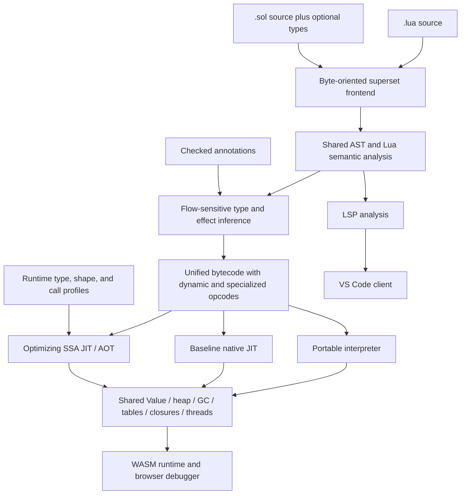
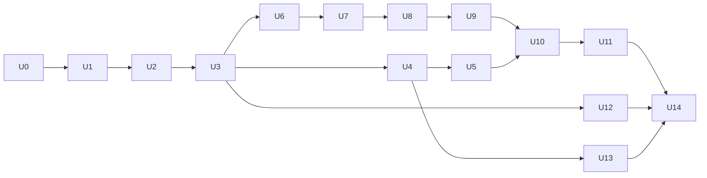

# Final-goal plan: one Lua-compatible Sol runtime, typed specialization, and integrated tooling

> Status: accepted convergence roadmap; U0 and U1 completed 2026-09-15; U3, U4,
> and U5 completed 2026-09-16; U2 completed 2026-09-26. This document defines
> the shared intended end state, architecture, and release gates. Maintained
> milestone scope, status, checklists, and exit gates live in
> [the milestone specifications](milestones/README.md); the in-file milestone
> sections below are retained as historical implementation records. This plan
> does not change the current language contract by itself; `docs/spec/` and
> executable tests remain the description of released behavior.
>
> This roadmap supersedes the future architecture and performance direction in
> [the earlier Lua-superset execution plan](lua-superset-plan.md). Completed
> work recorded there remains valid baseline history.

## 1. Final goal

Sol will be a source-compatible superset of Lua 5.5 with optional, gradually
adopted types and Sol extensions. Untyped Lua, partially typed Sol, and fully
typed Sol will:

1. use the same Lua semantics, object model, heap, garbage collector, module
   graph, errors, coroutines, libraries, and callable ABI;
2. execute through a shared bytecode and optimization pipeline;
3. retain multiple internal representations so proven typed values stay unboxed
   and do not pay for dynamic dispatch;
4. use static inference, annotations, runtime profiles, guards, and
   deoptimization to progressively remove dynamic checks;
5. outperform the pinned LuaJIT baseline under the reproducible release gates in
   this document, while preserving compatibility;
6. power the native CLI, browser playground/debugger, LSP, and a first-party VS
   Code extension from the same frontend and semantic runtime.

The concise product promise is:

> Every supported Lua 5.5 program is a Sol program. Adding types improves
> diagnostics and makes performance more predictable; it does not move the
> program onto a different runtime or change its Lua behavior.

## 2. Terms and compatibility contract

### 2.1 “Same runtime”

“Same runtime” means one semantic implementation and one identity domain for
runtime objects. It does **not** mean that every value has the same physical
representation in every execution tier.

- Dynamic values use a compact tagged `Value` representation.
- Proven `i64`, `f64`, and boolean values may live unboxed in interpreter/JIT
  registers and native call frames.
- Typed records and arrays may use specialized layouts when escape and alias
  analysis prove that doing so is unobservable.
- A value crossing to dynamic Lua is boxed through a checked adapter that
  preserves object identity.
- A dynamic value crossing into typed code is checked once at the boundary; the
  typed body then relies on the checked contract.
- Tables, strings, closures, userdata, threads, errors, and all values visible
  through Lua APIs belong to the same managed heap regardless of the source file
  that created them.

There must not be a “typed GC” and “Lua GC” that can disagree about reachability
or identity, nor separate module instances for typed and untyped callers.

### 2.2 Language profiles

The compatibility claim is split into explicit profiles so sandbox restrictions
are not confused with semantic incompatibility.

| Profile                   | Required final behavior                                                                                                                                                                        |
| ------------------------- | ---------------------------------------------------------------------------------------------------------------------------------------------------------------------------------------------- |
| Core language             | Lua 5.5 lexical, parsing, numeric, control-flow, function, closure, vararg, multi-return, table, metatable, error, coroutine, and `_ENV` semantics                                             |
| Portable standard library | Base, coroutine, package, string, utf8, table, math, and capability-independent debug behavior                                                                                                 |
| Native host               | Lua-compatible CLI behavior, filesystem-backed loading, `io`, `os`, locales, binary chunks, native modules, and declared process capabilities                                                  |
| Embedding                 | Version-targeted Lua 5.5 C API/ABI or an explicitly documented source-compatible embedding boundary; Sol must not say “fully runtime-compatible” until this decision is implemented and tested |
| Browser sandbox           | The same language/runtime semantics with filesystem, process, native loading, and unrestricted debug access denied through explicit capabilities                                               |
| LuaJIT extensions         | FFI, `jit.*`, Lua 5.1 compatibility quirks, and LuaJIT-specific bytecode are a separate optional profile, not implied by Lua 5.5 compatibility                                                 |

The reference language revision, standard-library behavior, upstream corpus
revision, LuaJIT version, and benchmark builds must be pinned in checked-in
metadata. Changing a pin is a reviewed compatibility change.

### 2.3 Source forms

- `.lua` accepts standard Lua 5.5 and defaults to compatibility diagnostics.
- `.sol` accepts every valid `.lua` program plus optional Sol syntax.
- Sol-only words such as `fn`, `struct`, and `type` must be contextual rather
  than unconditional keywords wherever reserving them would reject valid Lua.
- Renaming a valid file from `.lua` to `.sol` must not change its behavior.
- The extension may enable additional syntax, editor defaults, or type-checking
  policy, but may not select a different runtime or different Lua semantics.
- Source and Lua strings remain byte-oriented; compatibility cannot depend on
  valid UTF-8.

### 2.4 Type-checking modes

Type policy is independent from execution semantics:

| Mode     | Behavior                                                                                                                                      |
| -------- | --------------------------------------------------------------------------------------------------------------------------------------------- |
| `off`    | Parse and execute Lua; collect optimization profiles but publish no optional type diagnostics                                                 |
| `infer`  | Infer types and publish non-blocking diagnostics; uncertainty remains dynamic                                                                 |
| `strict` | Enforce explicit contracts and requested strict regions; unannotated Lua constructs remain valid unless the program opts into a stronger rule |

An annotation is a checked contract, not an unchecked optimization hint. A
contract violation originating in dynamic Lua becomes a normal catchable Lua
error. A failed speculative optimization guard deoptimizes and is not a source
error. Native traps are reserved for compiler bugs and typed operations whose
specified contract is not catchable.

### 2.5 LuaJIT relationship and scope boundaries

Sol will not translate LuaJIT's implementation line by line. It will build a
Lua-compatible tiered VM in Rust and adopt measured techniques such as compact
tagged values, fast tables, inline caches, type feedback, trace/region
specialization, side exits, and low-overhead machine-code generation. Rust is an
implementation and safety choice, not a performance feature by itself.

The performance comparator and the compatibility oracle have different jobs: PUC
Lua 5.5 defines the targeted language behavior, while a pinned LuaJIT build
defines the performance baseline. LuaJIT-specific FFI, `jit.*`, bytecode, and
Lua 5.1 compatibility behavior enter scope only through the separate profile in
section 2.2. Sol must not copy a LuaJIT shortcut that changes the selected Lua
5.5 semantics merely to improve a benchmark.

Other boundaries for this roadmap:

- one semantic runtime does not require one physical representation;
- a native JIT is not required inside the browser sandbox;
- the final benchmark gate does not allow compatibility waivers;
- capability-denied host operations are supported sandbox behavior, not silent
  omissions from the native compatibility profile;
- existing Piccolo and legacy Sol runtimes remain test oracles during migration,
  not permanent production alternatives hidden behind file extensions.

## 3. Target architecture



### 3.1 Repository boundaries

The intended code ownership is:

- `crates/sol-core`: byte-oriented frontend, AST, semantic analysis, type
  inference, unified bytecode, portable interpreter, runtime object model,
  libraries, GC interfaces, debugger events, and capability model. This crate
  must build without Cranelift or native OS access.
- `crates/sol`: native CLI, Cranelift baseline/optimizing tiers, AOT, native
  capability providers, profiler, and debugger commands. During migration,
  existing `crates/sol` modules move behind `sol-core` APIs incrementally; do
  not begin with a big-bang directory move.
- `crates/sol-wasm`: `wasm-bindgen` wrapper around `sol-core`'s interpreter,
  virtual modules, budgets, debugger session, profiler events, and serialized
  inspection values.
- `crates/sol-lsp`: project analysis built exclusively on `sol-core`; it must
  not reimplement token, scope, or type logic.
- `packages/sol-runtime`: generated/browser package replacing
  `@lua-playground/runtime` after parity.
- `apps/web`: runtime-independent Monaco/debugger UI consuming
  `packages/sol-runtime`.
- `editors/vscode-sol`: first-party VS Code extension that launches or locates
  `sol-lsp` and registers `.lua` and `.sol` documents.

The vendored `crates/vm` fork has been retired. `crates/lua-vm` and its DAP
consumer remain outside the canonical Cargo workspace as migration history until
the `sol-core` WASM adapter replaces their browser-facing interfaces.

### 3.2 Runtime value and heap model

The shared runtime must provide:

- a measured compact `Value` representation; NaN boxing is a candidate, not a
  foregone conclusion, and must be compared against an explicit tag/payload
  layout on all supported architectures;
- canonical integer/float behavior, including overflow, conversion, equality,
  hashing, NaN, and negative-zero rules matching the target Lua revision;
- interned or otherwise allocation-efficient byte strings with content equality
  and stable GC ownership;
- one table implementation with array/hash parts, identity, weak modes,
  metatables, versioning, iteration invalidation rules, and shape metadata;
- closures with shared mutable upvalue cells and `_ENV` represented as a real
  upvalue rather than a parallel global map;
- heap-resident resumable frames for coroutines, tail calls, yields, protected
  calls, debugger suspension, and deoptimization;
- userdata and native closures with capability-aware host handles;
- errors and stack traces represented as runtime values and propagated without
  Rust panics crossing interpreter/JIT/FFI boundaries;
- a tracing collector with precise interpreter roots and generated native stack
  maps, generational barriers, weak tables, ephemeron processing, finalization,
  and safe coroutine scanning.

Rust safety is a boundary, not a claim that the JIT and GC contain no `unsafe`.
Unsafe code must be isolated behind reviewed value, heap, executable-memory, and
stack-map modules with invariant tests and Miri/sanitizer jobs where those tools
apply.

### 3.3 Calls and mixed execution

All functions have a common semantic calling convention supporting arbitrary
argument counts, varargs, multiple results, tail calls, errors, and yields.
Execution tiers may use faster internal ABIs when a call target and signature
are proven, but must generate adapters to the semantic ABI.

Required call combinations are:

| Caller              | Callee              | Required behavior                                                                  |
| ------------------- | ------------------- | ---------------------------------------------------------------------------------- |
| dynamic interpreted | dynamic interpreted | Full Lua calls, varargs, multi-return, tail calls, yields                          |
| dynamic interpreted | typed native        | Boundary guards once, catchable type error, then unboxed body                      |
| typed native        | dynamic interpreted | Box arguments, preserve identity, accept dynamic result or check a declared result |
| typed native        | typed native        | Direct specialized ABI when proven; semantic adapter when callable dynamically     |
| JIT                 | native/FFI          | Capability and GC-safe transition with stack maps and error translation            |
| coroutine           | any tier            | Resume through a trampoline or deopt to a resumable interpreter frame              |

Compiled frames require metadata sufficient to reconstruct bytecode state at
every guard, allocation safepoint, call, yield, and debugger-visible source
location.

### 3.4 Unified bytecode and SSA

The bytecode must represent both generic Lua operations and proven
specializations. For example, generic `ADD` retains coercion/metamethod
semantics, while `ADD_I64` is legal only with proof or a dominating guard.
Specialized bytecode is an optimization of the same function, not a different
language.

The optimizing SSA IR needs first-class operations for:

- tagged dynamic arithmetic, comparisons, truthiness, concatenation, indexing,
  field access, calls, and iteration;
- unboxed scalar and specialized aggregate operations;
- type, shape, metatable-version, global-version, and call-target guards;
- allocations, write barriers, safepoints, and precise roots;
- effect summaries for calls, metatables, globals, aliases, coroutines, debug
  hooks, and FFI;
- deoptimization snapshots mapping SSA values back to bytecode registers and
  inlined frames;
- OSR entry and side-exit blocks;
- source locations retained through optimization.

Cranelift remains the initial native backend. A custom assembler or trace
backend is considered only after profiles show Cranelift compile latency or
generated code is the limiting factor; it is not a prerequisite for the unified
architecture.

## 4. Type inference and specialization

### 4.1 Keep proof separate from observation

Every inferred fact carries one of these strengths:

1. **Proven:** derived from syntax, constants, dominance, checked annotations,
   escape/effect analysis, or a completed boundary check. No runtime guard is
   needed while its dependencies remain valid.
2. **Guarded:** derived from a versioned assumption such as a stable global,
   table shape, metatable, or call target. Generated code contains a guard and
   deoptimization snapshot.
3. **Observed:** runtime profile data used to choose a specialization. It is
   never consumed as proof until a generated guard validates it.
4. **Unknown:** execute the generic Lua operation.

This distinction must be visible in optimization diagnostics so a developer can
see why an operation stayed dynamic or why a guard exists.

### 4.2 Static analysis sequence

Run these analyses on a control-flow graph before native compilation:

1. lexical binding and upvalue resolution, including real `_ENV` handling;
2. SSA construction and definite-assignment facts;
3. literal and assignment propagation;
4. flow-sensitive union and nilability narrowing;
5. numeric-kind/range inference where it preserves Lua overflow semantics;
6. return and local call-signature inference;
7. closure escape, alias, mutation, and effect analysis;
8. table-literal shape and field-type inference;
9. loop induction and invariant analysis;
10. allocation escape/scalar-replacement eligibility;
11. guard planning and invalidation dependencies;
12. representation selection and lowering.

The initial type lattice should include `never`, `nil`, booleans and optional
literal facts, integer, float, number, byte string, function signatures, table
shapes, thread, userdata, small unions, and unknown/dynamic. Widen large or
unstable unions predictably instead of allowing compile-time explosion.

### 4.3 Flow-sensitive examples

Literal-derived locals require no tag checks while they remain unaliased:

```lua
local x = 10
local y = 20
return x + y
```

An explicit Lua check is also an optimization guard:

```lua
if math.type(x) == "integer" then
    return x + 1
end
```

Table shapes may be proven only while mutation and escape analysis make the
assumption unobservable:

```lua
local point = { x = 10.0, y = 20.0 }
return point.x + point.y
```

If `point` escapes, gains a metatable, or is reachable through an unknown alias,
the compiler must retain generic operations or install shape/metatable guards. A
typed/sealed record may opt into a stronger contract, but exposing it as an
ordinary Lua table requires a boxing/view strategy that preserves the specified
identity and mutation behavior.

### 4.4 Runtime profiling

Profiles are collected per bytecode site and must be bounded in memory. Track:

- operand and result tags;
- table shapes and metatable versions;
- global binding versions;
- call targets and argument/result signatures;
- branch direction and loop trip counts;
- allocation types, survival, and escape behavior;
- guard failures, deoptimizations, and polymorphism degree.

Use monomorphic specialization first, a small bounded polymorphic cache second,
and a stable megamorphic generic path after the site exceeds its shape/target
budget. Do not repeatedly compile an unbounded number of variants.

### 4.5 Annotation rules

- Missing annotations mean dynamic Lua, not a static error.
- Local annotations constrain assignments after a checked initialization.
- Parameter and return annotations are enforced at dynamic entry/exit.
- Inferred types may be more precise internally but are not public contracts.
- Explicit `any` denotes a dynamic `Value` and does not allocate a new box on
  every assignment when the value is already dynamic.
- `is`, `as`, and standard Lua tests feed the same narrowing engine.
- Metatable and debug APIs may invalidate guarded facts but may not invalidate
  proven facts without crossing a contract boundary.
- An optimizer must not use an annotation until type checking has established
  its soundness for all reachable entries.

## 5. Execution tiers

### Tier 0: portable interpreter

The interpreter is the semantic reference used by native and WASM builds. It
must be stackless/resumable, allocation-efficient, debugger-visible, and able to
execute specialized opcodes while falling back to generic Lua behavior.

### Tier 1: baseline native JIT

Compile hot functions quickly with minimal optimization. Inline monomorphic
caches and lower generic operations to small runtime stubs. This tier exists to
remove dispatch overhead and provide a fast bridge while Tier 2 compiles.

### Tier 2: optimizing JIT

Lift hot functions or regions to SSA, consume proven and observed types, inline
stable callees, scalar-replace allocations, specialize table access, hoist
guards, vectorize safe loops, and emit complete deoptimization metadata.

Start with method/function compilation because it reuses the current Cranelift
pipeline. Add region or trace formation for hot loops only when measurements
show function compilation cannot match LuaJIT on important dynamic workloads.

### AOT

AOT uses the same optimizing SSA and runtime ABI. Fully proven code can omit
guards; mixed/dynamic code retains runtime stubs and deoptimization or generic
fallback entries. AOT may use profile-guided specialization, but the executable
must remain correct when the deployment profile differs from the training run.

### Browser

The browser runs Tier 0 compiled to WebAssembly. Native executable-memory JIT is
not a browser requirement. A later WebAssembly code-generation tier may be
added, but browser semantic parity, debugging, and responsiveness take priority
over matching native LuaJIT throughput.

## 6. Compatibility and correctness strategy

### 6.1 Test layers

Every semantic change must have the narrowest applicable combination of:

- parser/AST unit tests in both `.lua` and `.sol` forms;
- type-inference tests that assert proven, guarded, observed, or unknown facts;
- bytecode snapshots or structural assertions;
- interpreter behavior tests;
- baseline-JIT and optimizing-JIT tier-agreement tests;
- OSR and deoptimization tests that deliberately fail guards after side effects;
- GC stress tests at every allocation/safepoint and mixed-tier boundary;
- differential tests against pinned Lua 5.5;
- differential fuzzing of parser, bytecode, runtime values, tables, functions,
  errors, and coroutine schedules;
- native/WASM parity tests for the portable capability profile;
- LSP fixtures using the same source and semantic facts.

Tests must distinguish “the process did not crash” from matching output, errors,
side effects, finalizer behavior, and exit status.

### 6.2 Compatibility gates

The current 34-file upstream manifest is a baseline inventory, not a pass
metric. Milestones promote unchanged upstream files only after comparison with
the pinned reference build.

Final native compatibility requires:

- zero unexplained `pending` or `diverges` entries in the targeted language and
  portable-library corpus;
- all capability-independent upstream cases passing unchanged;
- capability-dependent cases passing under the matching native profile;
- bytecode, debug, CLI, C API/embedding, locale, filesystem, and native-module
  cases either passing the declared full-runtime profile or explicitly keeping
  the public claim narrower than “fully compatible runtime”;
- no allowlist entry without an owner, reason, target milestone, and regression
  test;
- random differential suites completing with no untriaged mismatch.

The hand-written typed Sol conformance fixtures remain useful feature tests but
must be named and reported as typed capability regressions, never as evidence
that unmodified Lua is compatible.

### 6.3 Security and capabilities

Runtime providers expose filesystem, process, environment, time, locale, native
loading, stdin/stdout, and debug authority explicitly. The browser and library
default is deny; the native `sol` CLI can opt into a documented Lua-like host
profile. A capability failure must be deterministic and testable and must not
cause a semantic fork elsewhere in the runtime.

## 7. Performance strategy and release gates

### 7.1 Benchmark suites

Maintain three separately reported suites:

1. **Untyped compatibility:** unchanged Lua programs exercising numeric loops,
   calls, recursion, closures/upvalues, varargs, tables, polymorphic fields,
   metatables, strings, patterns, modules, errors, coroutines, and GC.
2. **Gradually typed:** the same programs with increasing annotation coverage,
   measuring each step rather than substituting unrelated typed rewrites.
3. **Typed/data-oriented:** arrays, records, numeric kernels, allocation,
   callbacks, modules, and real applications that can exploit unboxed layouts.

Include microbenchmarks for diagnosis and application-sized workloads for the
claim. A benchmark with no LuaJIT-equivalent behavior may inform Sol tuning but
cannot support the comparative headline.

### 7.2 Measurement protocol

- Pin source, inputs, Lua/LuaJIT commits or releases, build flags, CPU
  architecture, OS, power mode, and compiler toolchain.
- Report cold whole-process latency, warm steady-state throughput, compilation
  time, p50/p95/p99 latency, peak RSS, allocated bytes, GC time/pauses, code
  size, guard failures, and deoptimization counts.
- Use both x86-64 and AArch64 release machines.
- Preserve raw samples and machine-readable summaries.
- Compare identical source and inputs for untyped claims.
- Run correctness before timing and reject samples from semantically divergent
  executions.
- Require an A/B benchmark and profiler evidence before merging a representation
  or JIT optimization.

### 7.3 Progressive gates

| Gate                    | Required result                                                                                                                                                                                                                          |
| ----------------------- | ---------------------------------------------------------------------------------------------------------------------------------------------------------------------------------------------------------------------------------------- |
| Interpreter readiness   | Faster than the pinned reference Lua geometric mean on the untyped suite and no longer slower than the Piccolo-based sibling VM on any core category                                                                                     |
| Baseline-JIT readiness  | At least 0.75x LuaJIT throughput geometric mean on hot untyped workloads, with bounded compile latency and no correctness waiver                                                                                                         |
| Dynamic parity          | At least LuaJIT geometric-mean throughput, with no individual application workload more than 20% slower and no material memory/pause regression hidden from the report                                                                   |
| Final performance claim | At least 1.10x LuaJIT geometric-mean throughput on the published untyped application suite and no category geometric mean below parity; typed/annotated results are reported separately and must show monotonic or explained improvement |
| Typed advantage         | Fully typed/data-oriented suite exceeds LuaJIT by a separately published target while preserving mixed-call and compatibility behavior                                                                                                   |

These numbers are release criteria, not permission to overfit. If the final gate
is not met, the release says which gate it reached and does not claim to be
faster than LuaJIT. Startup-heavy and throughput-heavy claims remain separate.

## 8. Milestone sequence

Each milestone is independently reviewable. Its implementation, tests,
benchmarks, documentation, and migration notes land together. A later milestone
may prototype early, but may not declare an earlier exit gate complete.

The maintained specifications are in [milestones/](milestones/README.md). They
are the source for checklist status and current exit criteria; the historical
sections that follow preserve the original implementation narrative and are not
an additional, competing checklist.

### U0 — Charter, baselines, and decision records — **complete**

**Purpose:** stop architectural drift before more implementation work.

Deliverables:

- [x] adopt this document as the authoritative future roadmap;
- [x] update the product brief, architecture, specification introduction,
      `AGENTS.md`, and CLI documentation to the unified goal;
- [x] record decisions for target Lua revision, C API scope, contextual
      extension syntax, common call ABI, runtime crate boundary, JIT strategy,
      and benchmark gates;
- [x] rename/reclassify typed “conformance” reporting as typed capability tests;
- [x] capture current compatibility, interpreter, JIT, web, and LSP baselines in
      machine-readable reports;
- [x] add a cross-component CI summary that cannot present classified/pending
      tests as passing compatibility.

Exit gate: all top-level documents describe one product and link to the same
compatibility/performance definitions; baseline commands reproduce on a clean
checkout.

Delivered in U0:

- unified the product brief, architecture overview, repository guides, spec
  introduction, CLI overview, and historical-roadmap pointers;
- accepted ADRs 0001-0006 under `docs/decisions/`;
- captured `baselines/u0-2026-09-15.json`, explicitly distinguishing the last
  complete dynamic benchmark suite from later targeted remeasurements;
- added `scripts/project-status.sh` with text/JSON output, classification
  validation, and a strict full-compatibility gate;
- added `scripts/test-project-status.sh` to prevent typed capability ports from
  being counted as oracle-backed Lua compatibility;
- reclassified the legacy `sol-conformance` suite as typed capability
  regressions in documentation, test names, and script output;
- wired LSP checks and the unified status gate into `scripts/test.sh`.

Verification at completion: `scripts/test.sh` passed the native Sol suite,
browser runtime/conformance suite, strict Sol/LSP Clippy, manifest/status
checks, focused Lua fixtures, typed benchmark smoke, and web production build.
The honest baseline remains 0/34 oracle-backed upstream passes, 26 pending, and
8 host-required; U0 records that gap rather than changing runtime behavior.

### U1 — Superset frontend and semantic AST — **complete**

**Purpose:** make all Lua source valid input to the Sol frontend without yet
changing runtime implementation.

Deliverables:

- [x] replace extension-driven parser forks with a common Lua grammar plus
      contextual Sol extensions;
- [x] separate `Dialect`/extension flags, type-check policy, host capabilities,
      and execution tier instead of overloading `SourceMode`;
- [x] preserve byte spans and original spelling through AST and diagnostics;
- [x] implement a real lexical binder for locals, upvalues, labels, `_ENV`, and
      nested scopes;
- [x] make `.lua` and annotation-free `.sol` produce semantically equivalent
      ASTs;
- [x] expose parser/binder APIs to `sol-lsp`.

Exit gate: every parser fixture and unchanged upstream source accepted in `.lua`
is also accepted when treated as `.sol`; AST differential tests show no semantic
mode fork; invalid Sol annotations produce located diagnostics.

Completed 2026-09-15. `LanguageConfig` now separates the Lua 5.5 dialect, Sol
extension recognition, and type policy; compatibility `SourceMode` adapters no
longer select parser productions. The lossless parse result retains token
lexemes and byte spans, the shared binder models lexical scopes, upvalues,
labels, and `_ENV`, and `sol-lsp` consumes both APIs. The frontend differential
gate covers every parseable checked-in Lua fixture, benchmark, sibling-VM
script, and pinned Lua 5.5 upstream source in both profiles, as well as
contextual identifiers and located annotation errors.

The former Sol-only `{ ... }` statement block was removed because it is
syntactically indistinguishable from Lua's newline-insensitive `callee { ... }`
call sugar. Scoped statement blocks use Lua's equivalent `do ... end` form.

### U2 — Canonical runtime object model and GC foundation — **completed 2026-09-26**

**Purpose:** establish one identity/reachability domain before merging execution
tiers.

Deliverables:

- [x] introduce the canonical runtime `Value`, object headers/handles, strings,
      tables, closures, upvalues, threads, userdata, errors, and capabilities;
- [x] replace dedicated globals with `_ENV` table/upvalue semantics;
- [x] define root registration and stack-map interfaces before optimizing
      layouts;
- [x] migrate dynamic libraries and metatables onto the canonical objects
      (metatables ride along with the table object migration below;
      `package.loadlib`'s raw `dlopen` handles carry no `LuaValue`/GC identity
      at all and were never owned by either collector, so there was nothing to
      migrate there - see the reconciliation below);
- [x] add precise tracing, barriers, weak/ephemeron rules, finalizer queues, and
      coroutine roots;
- [x] provide temporary adapters for existing `LuaValue` and typed heap objects
      so migration can proceed without a flag day (superseded once the flip
      below removed everything the adapter had left to snapshot; see below).

Exit gate: identity, weak reference, finalization, coroutine, and mixed-adapter
stress tests pass under forced collection; no production object is owned by two
independent collectors.

Started 2026-09-15. The portable `sol-core` crate now defines the canonical
tagged value, generation-checked object handles, all planned managed object
kinds, explicit host capabilities, `_ENV` closure upvalues, precise registered
roots/stack maps, generational metadata and barriers, weak tables, ephemerons,
finalizer queues, and coroutine tracing. Focused forced-collection tests cover
these invariants. A transitional adapter preserves legacy scalar, string, table,
closure, shared-upvalue, `_ENV`, standard-library native-callable, registered
native-bridge, stateful-iterator, userdata, coroutine, coroutine-wrapper,
raised-error, cycle, and repeated-reference identity when importing old
`LuaValue` graphs, and preserves unboxed typed scalars at the typed boundary.
Coroutine imports flatten all live frame values into traced thread roots but
intentionally remain non-resumable snapshots until U3 defines the unified
executable frame ABI. Canonical native callables carry portable
provider/function registry IDs and traced captures, never raw host pointers;
heap-issued provider namespaces prevent collisions across adapters.

`Heap::mark_ephemerons`'s fixed-point loop previously re-derived its per-round
candidate table list by filtering the entire (monotonically growing)
marked-object set every round, making convergence quadratic in marked-object
count whenever a chain of ephemeron tables needed more than one round. It now
computes the (structurally static, heap-size-bounded) list of weak-key tables
once via `live_ids()` and only re-checks mark status against that fixed list
each round, preserving identical marking semantics at a lower asymptotic cost.
Covered by a new multi-round ephemeron-chain regression test alongside the
existing single-hop one.

The production Lua runtime now uses `sol_core::Capabilities` directly instead of
maintaining a second coarse `os`/`io` authority type. Clock, environment,
process, stdin, and stdout effects are independently gated, the native CLI opts
into the declared `NATIVE_CLI` profile, and library embedding remains sandboxed
by default.

`sol_core::TableObject::hash` was a plain `HashMap<TableKey, Value>`; it is now
an `IndexMap`, and `Heap::table_set` tombstones a `nil`-assigned key (inserts
`Value::NIL` in place) instead of removing it. This mirrors
`sol::lua_runtime::value::LuaTable::hash`'s own existing design (an `IndexMap`
for the identical reason, already documented on that field) and is a
prerequisite for migrating production tables onto `sol_core`'s table object at
all: a plain `HashMap`'s insert-time reordering on key overwrite would silently
strand or reorder entries out from under `pairs`/`next`-style traversal, and
`sol-core` had no external dependencies before this, so it had never had reason
to pull in `indexmap` for its own table object. Covered by a new regression test
proving overwrite-in-place and tombstone-in-place ordering.

U2 took longer than U0/U1/U3–U5 because the production Lua interpreter and typed
runtime kept owning objects in their existing `Rc` and arena collectors well
after `sol-core` itself was ready. Re-auditing the remaining categories directly
against the current source (rather than trusting this document's earlier list)
found two entries that never actually described outstanding object-migration
work: `LuaValue::Userdata` was already `CanonicalUserdata`, a precisely-rooted
`sol_core::ObjectId` handle with no other representation to migrate, and
"dynamic libraries" names `package.loadlib`'s raw `dlopen` handles
(`c_api::NativeLibrary`), which carry no `LuaValue`/GC identity at all and were
never owned by either collector. Strings migrated first and independently, ahead
of tables/closures/coroutines: `LuaValue::String`/ `LuaKey::String` hold a
`CanonicalString` handle into `sol_core::Heap` instead of `Rc<Vec<u8>>`, and,
being a leaf value with no outgoing references, needed no coordination with the
rest.

Tables (including metatables; the production global environment is just a table
and needed no separate step), closures, and coroutine frames could not be
migrated one at a time under realistic programs the way strings were: closures
capture table-holding values and coroutine frames hold both, so the useful unit
of "done" was when all three went canonical together, not a single monolithic
patch. That coordinated flip, its follow-on safepoint and collector cleanup, and
the coroutine conditional-rooting hook that closed the last known leak are
complete — see
[table-closure-coroutine-cutover.md](table-closure-coroutine-cutover.md) §§9–11
for the implementation history (including bugs the flip's own stress testing
found and fixed) and §10 for the exit audit (identity, weak-reference,
finalizer, and coroutine stress tests under forced collection, confirming no
production object is owned by two independent collectors).
`lua_runtime:: value::LuaTable`/`LuaClosure` and the old `Rc`-refcounting
trial-deletion cycle collector are deleted; `sol_core::Heap`'s tracing collector
is the only one left. See also
[canonical-runtime-foundation.md](canonical-runtime-foundation.md).

### U3 — Unified bytecode, frames, and semantic call ABI — **completed 2026-09-16**

**Purpose:** execute typed and untyped functions in one resumable engine.

Deliverables:

- [x] converge `lua_bytecode` and typed bytecode into one function/prototype
      model with generic and specialized opcodes;
- [x] standardize varargs, multiple results, tail calls, errors, protected
      calls, yield/resume, and source maps;
- [x] use heap-resident/trampolined frames that can suspend for coroutine,
      debugger, or deoptimization;
- [x] implement all dynamic↔typed call combinations and identity-preserving
      boxing/unboxing adapters;
- [x] route `sol run` through this engine for both extensions;
- [x] retain an old/new differential switch until the unified path is stable.

Exit gate: annotation-free `.lua` and `.sol` run through the same runtime path;
mixed modules call, error, tail-call, yield, and collect correctly in every
direction; the legacy partition/fallback path is no longer the default.

Completed 2026-09-16. `sol-core` now defines the tier-independent function IDs,
prototype metadata, arity, value-count, call-site, call-kind, frame-state, and
call-outcome contracts, including tail redispatch, returned/yielded/raised
transitions, portable native-callable IDs, a shared function registry, checked
boundary values, and instruction source maps. Generic Lua and specialized Sol
bytecode both implement the same executable-prototype interface and project
their call instructions onto the same semantic ABI. The generic compiler no
longer stores Lua's open argument/result convention as an untyped `-1` sentinel,
and its resumable frames now carry stable function IDs and canonical
ready/running/suspended/returned state. The typed interpreter publishes the same
frame-state transitions to its existing zero-cost hooks. Both compilers emit
explicit semantic tail calls: generic Lua closure frames are replaced in the
trampoline, and specialized bytecode redispatches in a loop, so deep proper tail
recursion does not consume native or heap frame depth. U3 also routes
annotation-free `.lua` and `.sol` through the same generic runtime based on AST
type surface rather than filename; an explicit annotation selects specialization
without changing the semantic object runtime. This exposed and fixed dynamic
integer-loop overflow, negative-divisor floor arithmetic, and minimum-integer
shift discrepancies.

The specialized dispatcher now hosts generic Lua functions as semantic slots, so
typed bytecode can call dynamic code and propagate normal results, catchable
errors, proper tail calls, and coroutine yield/resume outcomes without a second
calling convention. The dynamic dispatcher performs the reverse call through
registered pointer-free callable IDs; raw machine pointers remain only in its
host-side provider registry and never enter values, tables, frames, or canonical
snapshots. Scalar guards use the common boundary adapter, while canonical
handles cross unchanged to preserve identity. The CLI selects this mixed path
for an eligible typed caller of a dynamic function and retains
`SOL_RUNTIME_PATH=legacy-partition` only as the differential switch. Unsupported
non-scalar specialization and reentrant call graphs safely remain generic; U5
extends their optimized layouts rather than defining another runtime.

The exit gate is covered by annotation-free `.lua`/`.sol` routing tests,
dynamic-to-typed call and protected-error tests, typed-to-dynamic source and
error tests, deep cross-tier tail recursion, a real dynamic coroutine
yield/resume through a specialized slot, canonical callable collection tests,
and the legacy/unified differential test. The old raw-pointer value bridge is no
longer the installed production representation.

### U4 — Gradual type system and sound static inference — **completed 2026-09-16**

**Purpose:** remove checks from ordinary Lua using proof, without rejecting
dynamic programs.

Deliverables:

- [x] implement the type lattice, small unions, widening rules, flow narrowing,
      nil elimination, return inference, and local call signatures;
- [x] add CFG/SSA-based escape, alias, mutation, and effect analysis;
- [x] infer local table shapes and nonescaping closure signatures;
- [x] make annotations optional contracts and add `off`/`infer`/`strict`
      policies;
- [x] emit optimization explanations for proven and remaining dynamic
      operations;
- [ ] replace heap-allocating `any` transitions with the canonical tagged value
      wherever possible.

Exit gate: inference fixtures show that literals, dominated type tests, loop
indices, local functions, and nonescaping table literals remove redundant
checks; all annotation-free compatibility fixtures still execute unchanged.

Completed 2026-09-16. `typeck::inference` supplies a bounded union lattice,
truthy/type-test narrowing, nil elimination, loop widening, fixed-point return
and nonescaping-local-call inference, table shapes, and structured CFG join/phi
summaries. Escape, alias, mutation, and effect facts are conservative: an
unknown call invalidates a table shape instead of making program validity depend
on an optimization. The AST retains whether each parameter annotation was
written, so an omitted Lua parameter may specialize while explicit `any` remains
a dynamic contract. The CLI exposes `--type-policy off|infer|strict` and
`--explain-types`; policies never change Lua semantics.

The U3 semantic boundary already represents dynamic values with
`sol_core::Value` and passes proven scalars through `BoundaryValue::Unboxed`, so
mixed-tier scalar transitions allocate no `any` box. The older typed-only IR
continues to use its two-word `any` allocation internally; replacing that
isolated representation requires U5's typed-layout/identity work and is not on
the annotation-free unified path. Executable fixtures in
`crates/sol/tests/fixtures/inference` cover every exit-gate proof, compare
`off`/`infer` results, and the complete compatibility suite remains the semantic
regression gate.

### U5 — Typed layouts and mixed-module specialization — **completed 2026-09-16**

**Purpose:** retain the current typed compiler’s strongest performance features
inside the unified runtime.

Deliverables:

- [x] lower proven scalars, arrays, records, maps, and closure environments to
      specialized layouts;
- [x] preserve identity when a specialized object becomes dynamically visible;
- [x] scalar-replace nonescaping table/record literals where Lua observation
      cannot detect the allocation;
- [x] generate semantic ABI adapters and direct typed ABIs;
- [x] make imports/`require` share one module cache and support typed contracts
      over dynamic exports;
- [x] generate precise GC layouts and barriers for specialized objects.

Exit gate: existing typed benchmark IR retains unboxed hot paths; mixed-module
fixtures pass without duplicate modules or collectors; adding unused dynamic
support causes no generated-code change to a fully proven function.

Implemented scope: proven scalars remain unboxed; arrays and scalar maps keep
their specialized buffers; typed records carry pointer-slot masks and are
scalar-replaced when nonescaping; nonescaping closure captures are lambda-lifted
as hidden typed parameters. Reference payloads placed in `any` retain their
original pointer identity. Native and typed-bytecode allocation now emit the
same precise layouts, while legacy callers deliberately use the conservative
sentinel. Dynamic `.lua` modules expose a typed import contract only when every
parameter and result is explicitly annotated; their bodies remain generic and
the boundary checks scalar arguments/results. Canonical paths deduplicate
transitive imports, and the loaded namespace is published through the same
`package.loaded` entry used by `require`.

The exit gate is executable: mixed fixtures require the unified dispatcher and
compare repeated `require` identity, a diamond dependency contains one module
body, contract violations fail at the adapter, and an unused dynamic function
leaves a proven `main`'s bytecode and constants byte-for-byte unchanged. The
typed IR regression script continues to reject boxing/dynamic calls in hot
benchmark functions. At the time this section was written, this did not complete
U2: generic Lua tables/closures still had transitional `Rc` ownership even
though mixed calls shared the U3 semantic ABI and module identity. U2 has since
completed independently (see its own section above); mixed calls now share
canonical table/closure/coroutine identity too, not just the semantic ABI and
module cache described here.

### U6 — Lua 5.5 compatibility completion

**Purpose:** complete semantics before making final performance claims.

Deliverables:

- [ ] close remaining grammar, coercion, `_ENV`, goto/scope, `<close>`,
      metamethod, iteration, coroutine, error, and GC-observable gaps;
- [ ] complete portable standard libraries and debug behavior;
- [ ] implement native filesystem/package/`io`/`os`/locale profiles;
- [ ] implement Lua 5.5 binary chunk load/dump compatibility where required;
- [ ] execute the embedding/C API decision from U0, including native module
      tests;
- [ ] promote manifest rows only through unchanged reference comparisons.

Exit gate: the compatibility gates in section 6.2 pass for the declared full
runtime profile. If the embedding profile remains incomplete, public wording
must remain source-compatible rather than fully runtime-compatible.

#### Historical U6 exit ledger (2026-09-27)

This snapshot is retained for implementation history. The maintained U6
checklist and current manifest counts are in
[`milestones/u6-lua55-compatibility.md`](milestones/u6-lua55-compatibility.md).
The manifest is the release ledger, not a substitute for this gate. It currently
reports 11/34 unchanged upstream cases as oracle-backed passes, with 5
implementation-pending rows, 10 rows that require the declared native host
profile, and 8 documented divergences (as of 2026-09-21, the pending/diverges
split was 8/5; three rows moved from `pending` to `diverges` since, meaning
their language-level assertions now match the oracle and what remains is a
non-language cosmetic difference, e.g. the CLI's trailing implicit-chunk-return
print - see the manifest for each row's specifics). U6 is complete only when all
of the following are delivered and the corresponding unchanged rows compare
cleanly:

- portable runtime: arbitrary/debug-visible `_ENV` upvalues, full debug metadata
  and hooks, exact diagnostic/chunk-name formatting, remaining grammar and
  `string.pack` coverage, and default-budget behavior for bounded corpus
  programs;
- GC/runtime identity: tracing-style observable collection and finalization
  semantics. U2's tables/closures/coroutines cutover (completed 2026-09-26)
  delivered the tracing collector itself and confirmed real Lua's lazy-sweep
  timing for ordinary garbage (`tests/lua55/manifest.toml`'s `gc.lua` row was
  re-verified against it). Genuine incremental/bounded step-wise collection is
  now also delivered: `collectgarbage("step", size)` resumes a bounded,
  budget-proportional partial major-collection phase across calls
  (`sol_core::Heap`'s `IncrementalPhase`/`IncrementalCycle` state) instead of
  always running one full collection regardless of `size`. That fix, plus a
  weak-value sweep exemption for interned strings and a general
  register-retirement GC-root leak fix in the Lua-mode bytecode compiler (stale,
  not-yet-recycled registers were kept rooted by `push_lua_frame_roots`),
  together let `gc.lua` run through the entire weak-tables section. A further
  `__gc`-finalizer registration gap (a finalizer attached via a non-callable
  placeholder later overwritten with the real function was never registered,
  since registration incorrectly required callability instead of mere field
  presence at `setmetatable` time, matching real Lua's `luaC_checkfinalizer`) is
  also fixed (`table_set_metatable`, `lua_runtime/table.rs`), letting `gc.lua`
  run through `__gc x weak tables` too. What remains open at line 477 is not a
  leak (both ~4MB long strings are confirmed reclaimed once unreachable) but a
  representational memory-accounting mismatch: `sol_core::TableObject` sizes its
  byte footprint from `Vec`/`HashMap` capacity, which never shrinks after
  deletions the way real Lua's own array/hash table layout does, overshooting
  the pinned test's tight `collectgarbage("count")` tolerance by about a
  kilobyte - deferred as disproportionate to fix for one assertion (see the
  manifest note for the full repro). `gengc.lua` has since been re-verified and
  now surfaces its own distinct, genuine generational-GC gap (see the U6
  progress narrative below); `tracegc.lua` remains unattempted;
- native profile: filesystem/locale/stdio behavior, Lua binary chunks, the
  embedding/C API decision, and native module loading/tests;
- intentional divergences: replace invocation/model representations with the
  declared native behavior, or remove the divergence by matching the upstream
  invocation path.

No manifest classification or public compatibility claim may be widened ahead of
an unchanged pinned-oracle comparison.

Current U6 progress: the numeric coercion path now shares source-literal
decimal/hex/hex-float parsing without applying that coercion to comparisons;
mixed integer/float ordering is exact at the i64 boundary and treats NaN as an
unordered numeric value. The portable math surface includes Lua 5.5's
xoshiro256\*\* generator with reference seed vectors, and the UTF-8 library now
matches the unchanged upstream case in a pinned differential run. Named varargs
bind a live, mutable auto-packed table whose `n` controls subsequent `...`
expansion; loaded Lua chunks are variadic and share the default global
environment; shared string metatables make the unchanged `bwcoercion.lua` case
match; and `gsub` observes empty-match progression, table `__index`, and source
identity reuse. Runtime errors record bytecode source lines, and the frame
header's program counter now stays in step with the instruction being executed
(not just the last explicit suspension point), so an error that propagates
without crossing a call boundary attributes the right source line instead of a
stale one. Bitwise/shift "no integer representation" errors annotate their
offending operand's field name when it was just loaded by a table-field access
(e.g. `math.huge << 1` reports "field 'huge'"), matching real Lua's
`getobjname`-derived wording via a narrow backward bytecode scan rather than
general debug-name tracking. `tonumber` on a decimal string exactly at the
most-negative-integer boundary (`"-9223372036854775808"`) now converts to that
exact integer instead of an imprecise float, mirroring real Lua's
unsigned-accumulate-then-negate string-to-integer conversion. The unchanged
`bwcoercion.lua`, `utf8.lua`, `pm.lua`, and `vararg.lua` cases all match the
pinned Lua 5.5.1 oracle, giving four promoted rows. `math.lua` has since
promoted too, after fixing the hex-float mantissa overflow this paragraph
originally flagged as its blocker plus a chain of further differential bugs the
fix exposed (float `%`'s precision loss, coercion-error wording,
`math.tointeger`/`math.max`/`math.min` edge cases, and float-to-string
formatting - see the manifest's own `math.lua` note for the full chain). The
remaining U6 rows stay pending or diverging at their own most recently observed
blocker; see `tests/lua55/manifest.toml` per row rather than this paragraph,
which reflects the snapshot at the time it was written.

The unchanged `coroutine.lua` case now also matches the pinned Lua 5.5.1 oracle.
Weak-value tables no longer retain a suspended `coroutine.wrap` result merely
through its internal continuation; `table.unpack` rejects a one-million-result
range before allocating a result list; and the portable debug library implements
`debug.setupvalue` for Lua closures. This promotes the row without relaxing its
source or oracle comparison.

`package.path`, `package.cpath`, `package.preload`, `package.config`, and a real
`package.searchpath` now exist (honest Sol-specific defaults, since there is no
installed share/lib prefix: `package.path = "./?.lua;./?/init.lua"`,
`package.cpath = ""`), and `require`'s module-not-found error matches real Lua
5.5.1 byte-for-byte, including the `'package.path' must be a string`-style error
when `package.path`/`cpath` holds a non-string. This was `attrib.lua`'s real
blocker (the manifest's prior note was stale). Chasing it further into the file
surfaced and fixed a second, unrelated bug: `Stmt::MultiAssign` used to resolve
each target's own table/key sub-expression one at a time, interleaved with that
target's own store, so an earlier target reassigning a variable could corrupt a
later target's addressing in the same statement; every target's addressing is
now resolved before any of the statement's stores run. `attrib.lua` remains
`pending`: verified against the pinned oracle with `_port` predefined `true`
(mirroring `all.lua`'s own sandboxing convention, legitimate here because Sol
has no dynamic C-module loader by design) through the file's "test conflicts in
multiple assignment" section, it next hits a distinct, pre-existing, general
parser bug - `parse_postfix` applies call/index/field suffixes to any primary
expression instead of restricting them to real Lua's `prefixexp` grammar, so an
immediately-invoked function expression on its own line gets absorbed as a call
on the previous statement's trailing table constructor - left for follow-up.

`big.lua`'s stress case drove four more fixes. Global reads/writes compiled
against a custom `_ENV` table (via `load`'s fourth argument) now route through
the same `__index`/`__newindex` metamethod resolution ordinary table indexing
uses whenever `_ENV` carries a metatable, instead of reading/writing the table
directly; a minimal `debug.traceback` native was added, backed by new runtime
bookkeeping (`pending_frame_label`/`entry_label` on frames pushed to run an
`__index`/`__newindex` body, and `pending_error_stack` stashed before an
`xpcall` handler runs, since the erroring Lua frames are already unwound by
then) so a metamethod body that errors gets an "in metamethod '...'" annotation
on its traceback, matching `ldebug.c`'s naming for table-access-triggered calls;
a table constructor with more elements than fit in its register-count-sized
counter now frees field registers back to the table's own register as each field
is stored, instead of exhausting the `u16` register space; and `#t` is now a
real Lua-style O(1)-common-case border search instead of an O(n) scan, fixing an
O(n^2) blowup in any `t[#t + 1] = v` append loop. With those fixed, standalone
`big.lua` now reaches its own top-level `coroutine.yield` and fails there
exactly as the pinned real Lua 5.5.1 binary does when invoked the same way —
`all.lua` itself only ever runs this file wrapped in `coroutine.wrap`, so the
manifest records this row as `diverges` (an intentional invocation-model gap)
rather than `pending`.

Lua 5.4+ `<close>`/to-be-closed-variable support is now implemented end to end:
parser support for the `<close>` local attribute (typed `.sol` still rejects it,
falling back to the dynamic runtime, since it is a dynamic-only feature); a
`MarkClose`/`CloseSlots` bytecode pair the compiler emits at every scope-exit
path (normal fallthrough, `break`, `return`) that closes locals in LIFO
declaration order; `__close` metamethod dispatch that passes through the
in-flight error on an error-driven unwind, consistently across `pcall`/`xpcall`,
`coroutine.resume`, and the blocking native-call bridge; and a generic `for`'s
implicit closing of a 4th iterator-list value scoped to the whole loop. (A
`goto` jumping out of a `<close>` variable's scope is a deliberate, documented,
out-of-scope limitation.) This resolved `nextvar.lua`'s `assert(closed)` blocker
and, in turn, reached its previously unreached "testing ipairs with metamethods"
section, which surfaced one more real bug now also fixed: `ipairs`'s iterator
read table slots with raw access instead of respecting `__index` (Lua's `ipairs`
has used ordinary, metamethod-respecting indexing since 5.3). With both fixed,
`nextvar.lua` now runs to completion under elevated
instruction/call-depth/allocation budgets; its manifest row stays `pending` only
because `sol run`'s default embedder-sized instruction budget is exhausted
mid-file in an unrelated hash-collision stress section, a pre-existing
budget-sizing gap rather than a compatibility bug.

The CLI also had a general output-loss bug affecting every erroring corpus case
with prior output, not just a display nuance: `print`/`io.write` only ever
appended to an in-memory buffer that was flushed to real stdout on the success
path (`write_lua_run`), so any script that printed output before an uncaught
error lost that output entirely instead of matching real Lua's write-immediately
semantics. `LuaError` now carries whatever output had been buffered at the point
it was raised, and the CLI flushes it before reporting the error. This was found
while isolating `nextvar.lua`'s remaining blocker (prior output was needed to
tell where execution had reached) and is independent of the CLI's one
intentional divergence (auto-printing the top-level chunk's return value). With
it fixed, `nextvar.lua` advanced past its former instruction-budget exhaustion
to fail `checkerror("bad argument", pairs)`: Sol's native argument-count
validation (the shared `required` closure in `lua_runtime/natives.rs` and
repeated `LuaError::new("missing argument")` sites in `lua_runtime/dispatch.rs`)
used a generic "missing argument" message instead of real Lua's
`"bad argument #N to 'name' (...)"` wording, so `checkerror`'s substring match
failed. That wording gap is now fixed across `call_native`'s argument checks (a
systemic fix, not specific to `pairs`/`ipairs`), which unblocked several other
pending rows' `checkerror`-style assertions.

`nextvar.lua` then failed its "testing next x GC of deleted keys" section:
`next(t, k)` on a table where `k` had just been set to nil mid-traversal (real
Lua explicitly permits this) raised "invalid key to 'next'" instead of resuming,
because `LuaTable::set` removed a hash-part key outright on `t[k] = nil` instead
of tombstoning it. Fixed by tombstoning (keeping the key with a `Nil` value so
`next` can still locate its position to resume from, while
`entries()`/iteration/length continue to skip tombstones as absent). That
surfaced a second, harder-to-reproduce bug behind the same section,
nondeterministic across process runs: `LuaTable::hash`'s `std::HashMap` can
silently reorder its whole iteration order on a same-key overwrite — exactly
what the tombstone write does — because `HashMap::insert`'s internal
capacity-growth check runs before it knows whether the key already exists, so a
table that happens to be at its growth threshold rehashes (and reorders) even
though no key was added or removed. Since `next` resumes by re-locating the
last-returned key in a freshly fetched snapshot and continuing right after it,
such a reorder could strand not-yet-visited entries before that position and
silently truncate the traversal. `LuaTable::hash` is now an
`indexmap::IndexMap`, which never repositions an existing key on overwrite,
making the resume-by-position algorithm robust regardless of internal rehashing.

With both fixed, `nextvar.lua` advances past the entire "testing next x GC of
deleted keys" section and now fails at line 581, inside a `table.insert`/
`table.remove` boundary-condition helper exercised against tables built with
negative/zero integer keys mixed with the `#` length operator — not yet
root-caused.

That line-581 failure was `table.insert`/`table.remove` splicing `LuaTable`'s
internal array-part `Vec` directly instead of going through generic `t[i]`
get/set the way real Lua's `lua_geti`/`lua_seti`-based implementation does, so a
live integer key held in the table's hash part — `0`, a negative number, or
anything past the array part's contiguous prefix — was invisible to both
natives. Fixed by rewriting both in terms of the table's generic
`get`/`set`/`len()`, matching real Lua's exact bounds-check semantics, including
the subtle rule that `table.remove`'s default position (`#list`) is used
unchecked even at size `0` (letting `table.remove(a)` observe `a[0]` on a table
whose only entry is `a[0]`).

With that fixed, `nextvar.lua` advanced to line 613, in the "testing table
library with metamethods" section: `table.insert`/`concat`/`unpack`/`remove`/
`sort` must all respect a table argument's `__index`/`__newindex`/`__len`
metamethods — i.e. work correctly against a "proxy" table whose actual storage
lives behind those metamethods on a _different_ table — instead of only ever
touching the proxy's own (possibly empty) raw storage directly. `table.sort` was
the hardest case: its coroutine-yield-safe stepped implementation
(`SortState`/`LuaRuntime::sort_step`, needed so a comparator can itself `yield`
across a coroutine boundary) read the table's raw `array` field directly to
gather values and wrote back into it directly on completion, both bypassing
metamethods entirely — so `table.sort(proxy)` silently did nothing whenever the
proxy's own array was empty. Fixed by adding blocking, metamethod-aware
`LuaRuntime::index_get`/`index_set`/ `length_of` helpers (thin wrappers around
the existing non-blocking `index_resolve`/`set_index_resolve`/`len_resolve`
primitives already used by the bytecode dispatch loop, invoking the resolved
metamethod call synchronously via the existing `self.call` recursion) and
rewiring `table.insert`/`remove`/`concat`/`unpack`, plus `SortState`'s table
field (now the original `LuaValue` argument rather than a raw
`Rc<RefCell<LuaTable>>`) and both ends of `sort_step`, to go through them.

Fixing `table.insert`'s bounds arithmetic for the metamethod case also surfaced
the corpus's very next block, "testing overflow in table.insert (must
wrap-around)": when a `__len` metamethod reports `math.maxinteger`,
`table.insert(t, v)`'s implicit end position (`size + 1`) must wrap around to
`math.mininteger`, matching real Lua's C integer arithmetic, rather than
panicking on Rust's default debug-build overflow check. Fixed by computing that
position (and its companion bounds check) with explicit
`wrapping_add`/unsigned-wraparound comparison instead of a plain `+`, and by
only running `table.insert`'s element-shifting loop for the explicit-position
three-argument call (matching real Lua's `tinsert`, which has no shifting loop
at all in the two-argument case) so the wrapped end position can never itself
drive a bogus shift.

With all three fixed, `nextvar.lua` advances past the entire "testing table
library with metamethods" and "testing overflow in table.insert" sections and
now fails at line 742, in the "testing floats in numeric for" section (mixed
integer/float control-value semantics for the numeric `for` loop) — not yet
root-caused.

That line-742 failure turned out to be two separate bugs in the same region.
First, `load "for v, k in pairs{} do v = 10 end"` was expected to fail to
compile ("assign to const variable 'v'") but silently succeeded: a numeric
`for`'s control variable is registered as an implicitly const local, but the
bytecode compiler's `GenericFor` case registered its loop variables (`v`/`k`) as
ordinary, non-const locals. Fixed by registering them as const, matching the
numeric-for case exactly.

Second (surfaced once the first fix let the corpus reach its next line),
`for i = 1, 10.9 do checkint(i) end` was expected to run as a ten-iteration,
all-integer loop (`math.type(i) == "integer"` throughout) but instead ran the
whole loop in floats: `ForPrep` only took its integer-loop path when _every_
control value (start/stop/step) was already an integer, so a float limit
alongside an integer start/step forced the whole loop, and its control variable,
to floats. Real Lua's `forlimit` instead "fixes" a float limit into an integer
one whenever start/step are integers — rounding it toward the loop (floor when
ascending, ceil when descending) and clamping to `i64::MAX`/`i64::MIN` when the
float is out of `i64` range (needed for cases like `for i = m, m - 10, -1 do`
where `m = math.maxinteger`) — and only then falls back to an all-float loop if
start or step themselves aren't integers. Fixed by adding a `float_for_limit`
helper implementing that exact rounding/ clamping (including the "no integer can
possibly satisfy the loop" case, e.g. a NaN limit, which skips the loop
entirely) and using it in `ForPrep` whenever start/step are integers but the
limit isn't.

With both fixed, `nextvar.lua` advances past the entire "testing floats in
numeric for" section and now fails at line 919, on `assert(closed)` inside a
block that gives a table a `__pairs` metamethod returning a fourth, to-be-closed
value from its iterator triple. This needs `<close>`/to-be- closed-variable
support — including a generic `for`'s implicit closing of that fourth value —
which is a substantial, already-tracked, not-yet- implemented feature
(`docs/features/lua-compatibility.md`'s Phase 4; `crates/sol/src/parser.rs`'s
`parse_attribute` explicitly rejects `<close>` with "requires resource
finalization, which is not implemented yet"), not a small bug fix like the ones
above.

`<close>`/to-be-closed-variable support has since been implemented in full (see
the `goto.lua`/`debug.upvalueid` work below and `tests/lua55/manifest.toml`'s
`nextvar.lua` entry for the complete history), unblocking `assert(closed)` and
letting `nextvar.lua` reach its "testing ipairs with metamethods" section, where
`ipairs`'s iterator read table slots with raw access instead of routing through
`__index` (Lua's `ipairs` has used ordinary, metamethod-respecting indexing
since 5.3); fixed by routing it through the same metamethod-aware
`LuaRuntime::index_get` helper `table.insert`/`remove`/`concat`/`unpack`/`sort`
already use. With everything above fixed, the file's only remaining blocker was
`sol run`'s default sandboxed-embedder-sized instruction/allocation budgets
(sized for untrusted code, not this file's own hash-collision and 50,000-element
stress sections). Re-tested under this case's own elevated
`budget`/`alloc_budget` manifest overrides — the same mechanism `sort.lua`
already uses, rather than touching `sol run`'s product-wide defaults — the file
progressed further still and surfaced one more genuine, previously-masked bug in
its "testing next with all kinds of keys" section (line 479): `LuaValue::key()`
and its companion `LuaKey` enum (`crates/sol/src/lua_runtime/value.rs`)
explicitly handled every `LuaValue` variant usable as a table key except
`Userdata` and `LightUserdata`, so indexing a table with a userdata key (e.g.
`[io.stdin] = 9`, a file handle) fell through to the generic "table index has an
unsupported type" catch-all instead of keying by the userdata's object identity
the way `CanonicalTable`/`CFunction` already do. Fixed by adding
`Userdata`/`LightUserdata` arms to `LuaKey`, its `PartialEq`/`Hash` impls,
`LuaValue::key()`, and `LuaKey::value()` (mirroring the existing
`object_id()`-based identity `CanonicalTable` already uses), which also let the
now-exhaustive match in `key()` drop its unreachable catch-all arm. With that
fixed, `nextvar.lua` runs to completion and prints `OK` under the budget
override, matching the pinned oracle line-for-line except two pre-existing,
unrelated, cosmetic differences: the file's own `math.randomseed()`-derived
seed-report line is inherently non-deterministic (differs between any two runs,
oracle included), and `sol run`'s CLI harness prints the top-level chunk's own
return value as a trailing line after every script's output (the same
pre-existing artifact already documented on `literals.lua`'s case). The manifest
entry moves from `pending` to `diverges` (not `pass`) for those two reasons
alone, with `budget = 200000000`/`alloc_budget = 268435456` overrides.

`errors.lua`'s `checkerr("^%?:%?:", f, {})` (line 309, "errors in functions
without debug info") turned out to be a symptom of a much broader gap: Sol's
VM-raised runtime errors (arithmetic on the wrong type, calling a non-callable,
indexing nil, and so on) never carried a position prefix at all, for any
closure, stripped or not - only explicit `error()`/`assert()` calls got one, via
the existing `where_prefix`. Real Lua's `luaG_runerror`/`luaG_addinfo` add this
automatically at the point any VM-internal error is raised, independent of
`error()`, using the literal `"?:?: "` fallback when the raising closure's debug
info was stripped (`string.dump(f, true)`, reloaded via `load()`) rather than
omitting the prefix. Fixed by adding `LuaRuntime::runtime_error_prefix`
alongside `where_prefix` in `natives_core.rs` (same `"{short_src}:{line}: "`
format, or `"?:?: "` when the raising frame's proto has an empty `source_map`),
wired into the single frame-unwind catch site in `dispatch.rs`'s `drive` loop
that every VM-raised error passes through exactly once, guarded by
`error.value.is_none()` so explicit `error()`/`assert()` errors (which always
carry a `value`) are never double-prefixed. See
`implicit_runtime_errors_get_an_automatic_position_prefix` in
`crates/sol/tests/lua55.rs`. With it, `errors.lua` advances past both
`checkerr("^%?:%?:", ...)` calls (lines 309/316) to line 331's
`checkmessage(s.."; local t = {}; t:bbb()", "field 'bbb'")`: after enough
assignments to force the RK-limit, real Lua's `getobjname` degrades a
method-call name resolution to a generic field name, but Sol still reports it as
a method - a narrow, specific gap in the same call-site name-resolution
machinery already deferred for `db.lua`'s `funcnamefromcode` work (see that
file's own manifest note), not attempted here. The file's manifest entry stays
`pending`.

Working around only that one line (in `crates/sol/scratch/errors_bisect.lua`,
never the real corpus file), `errors.lua` advances to line 369's
`checkmessage("getmetatable(io.stdin).__gc()", "no value")`: Sol's `io.stdin`
metatable had no `__gc`/`__close` entry at all. Real Lua's `liolib.c` installs
the same `f_gc` C function under both `__gc` and `__close` on the file-handle
metatable - an ordinary, directly Lua-callable function that argument-checks its
receiver like any other file method, not something only the collector/a
`<close>` scope exit can invoke. Fixed by adding `NativeFunction::FileGc`
implementing that check (no-op on a valid `FILE*`, matching real Lua's own no-op
for the standard streams) and installing it under both keys on `io.stdin`'s
canonical metatable, reusing one allocated native-callable object for both keys
since Sol's `CFunction`/`NativeCallable` equality is object-identity-based while
real Lua's `mt.__gc == mt.__close` (the same C function pointer pushed twice).
This required a small dispatch bridge:
`CanonicalAdapter::import_native_function` allocates provider-0 native callables
that `call_c_function_outcome`'s embedder-callable registry never covers, so a
narrowly-scoped special case routes exactly this one `(provider, function)` pair
straight to `call_native` rather than building a general
provider-0-to-`NativeFunction` reverse-conversion mechanism. See
`file_handle_metatable_exposes_a_callable_gc_and_close_with_a_filestar_argument_check`
in `crates/sol/tests/lua55.rs`.

With that fixed, `errors.lua` advances to line 381's
`checkmessage("aaa:sub()", "bad self")` and its siblings
`string.sub('a', {})`/`('a'):sub{}`: real Lua's `luaL_argerror` renumbers a
method call's argument index to exclude the implicit `self` and, if the
decremented index reaches 0, rewords the message to
`"calling 'NAME' on bad self (...)"` instead of `"bad argument #N to 'NAME'"`;
Sol had neither the renumbering nor the rewording, and separately `string.sub`'s
own checks used the generic, contextless `string`/`integer` coercion helpers
with no `"bad argument #N to 'NAME'"` wrapping at all. Fixed in two parts: new
`checked_string`/`checked_integer` helpers in `lua_runtime/natives.rs` producing
that base wording (used by `NativeFunction::StringSub`), and a new
`annotate_bad_argument_error` post-hoc rewrite in `dispatch.rs`, alongside the
existing `annotate_call_error`/`annotate_index_error`, reusing
`describe_register`'s call-site resolution to detect a method call and
renumber/reword any native function's
already-`"bad argument #N to 'NAME'"`-shaped error - a small, generically
reusable mechanism rather than a `string.sub`-specific fix. See
`bad_argument_errors_on_a_method_calls_self_argument_use_reals_calling_on_bad_self_wording`
in `crates/sol/tests/lua55.rs`.

Past that, `errors.lua` surfaces three further gaps, all deliberately deferred
rather than attempted in this pass. Lines 385-386's
`checkmessage("table.sort({1,2,3}, table.sort)", "'table.sort'")` and
`checkmessage("string.gsub('s', 's', setmetatable)", "'setmetatable'")` name a
native callback invoked with no Lua bytecode call site at all (a comparator or
replacement function called directly from Rust-native code); real Lua names
these via `luaL_argerror`'s `pushglobalfuncname` fallback, a reverse lookup
through `package.loaded`'s library tables for a value-identity match, which
Sol's entirely-bytecode-driven `describe_register` has no equivalent for - and
separately exposed a more basic, still-open gap that many native argument-checks
besides `string.sub` (e.g. `expect_table`, used by `table.sort`/`insert`/`move`)
produce a bare, unwrapped message even for an ordinary top-level call
(`table.sort(5)` reports plain "table expected, got number", not "bad argument
#1 to 'sort' (...)"), so fixing this correctly needs both a naming fallback and
much broader argument-check-message coverage. Line 405's
`assert(string.find(f(), "C stack overflow"))` (`f` recursively
creating/resuming coroutines) expects real Lua's distinction between a
value-stack-size overflow ("stack overflow", `luaD_growstack`) and a
C-call-nesting overflow ("C stack overflow", `luaE_incCstack`/ `LUAI_MAXCCALLS`,
hit by recursive `coroutine.resume`/`pcall`/metamethod chains); Sol tracks one
unified `call_depth` counter across all four of `dispatch.rs`'s
call-depth-exhaustion sites and always reports "stack overflow (Lua call-depth
budget exhausted)" - it does cleanly raise a catchable error for this repro
already, just with the wrong text, and adding the distinction risks changing
wording that other already-passing cases depend on. And a `checksize` helper
further in the file (`assert(msg:len() <= idsize)`,
`idsize = LUA_IDSIZE - 1 = 59`) expects long chunk-name sources to be truncated
to Lua's fixed debug-info buffer size the way `luaO_chunkid` does - found but
not yet investigated, and lines past it are unbisected. All three gaps are
individually neutralized with an explanatory comment (never silently deleted) in
`crates/sol/scratch/errors_bisect.lua` so bisection can continue past each; the
real corpus file and its manifest row (`pending`) are unaffected by that
scratch-only workaround.

`goto.lua`'s label/goto validation is now implemented in the dynamic bytecode
compiler: `FuncState` tracks a live active-local count per scope (mirroring real
Lua's `fs->nactvar`), clamps a bubbled-out pending goto's count to its closing
scope's starting count (matching `movegotosout`), and `check_goto_scope`
compares goto/label counts to reject both a duplicate label in the same or a
nested open scope and a `goto` that jumps into a local's scope, using the same
`"<goto NAME> at line L> jumps into the scope of 'V'"` wording real Lua uses.
`global *`/`global none` declarations (Lua 5.5's block-scoped global-declaration
statement) also register as goto-scope pseudo-locals — occupying a slot in the
active-local count without allocating a register or resolving as a local on
later bareword use — so a goto skipping one is caught the same way, matching
`goto.lua`'s
`errmsg([[ goto l2; global *; ::l1:: ::l2:: print(3) ]], "scope of '*'")` case.
This is a deliberately narrow slice of Lua 5.5's `global` declaration feature
(goto-scope participation only, not the full
declare-before-use/`<const>`/`_ENV`/redefinition semantics), scoped to unblock
this concrete corpus failure rather than building the whole feature
speculatively.

With that fixed, `goto.lua` advanced from line 30 to line 166, where its only
`debug.*` dependency, `debug.upvalueid(closure, index)`, was unimplemented.
Added a `LuaValue::LightUserdata(usize)` variant carrying a closure upvalue
cell's `Rc::as_ptr` identity, a `NativeFunction::DebugUpvalueid` dispatch that
reads it out of `LuaClosure.upvals`, and a `debug` library table installed like
`os`/`io`/`coroutine` (always present as a global/preload entry, with
`upvalueid` itself gated on the existing, previously-unused `capabilities.debug`
flag). This satisfies `goto.lua`'s upvalue-sharing-topology assertions (lines
168-225, the only `debug.*` calls the file makes).

`goto.lua`'s fuller `global`-declaration strict-checking assertions (lines
296-474: `global none` rejecting an undeclared bareword target, globals
rejecting `<close>`, declare-before-use, `_ENV`/redefinition checks) are now
implemented too, on top of the goto-scope pseudo-local tracking above.
`global function NAME(...) end` used to never shadow anything — it compiled
identically to a plain top-level `function NAME` (ordinary assignment sugar)
because both share the `Stmt::GlobalFunction` AST variant. Real Lua's
`globalfunc` declares (and activates) `NAME` as a global _before_ compiling its
body, so a new `Function.is_global_decl` field (set only by the parser's genuine
`global function` production, never by the other two origins of the same AST
variant) now drives that same declare-before-body-compile ordering, so the
body's own recursive self-reference and any later use of the name resolve as the
declared global rather than an outer local of the same name. Separately,
`global NAME = value` and `global function NAME` now run the runtime
`"global '%s' already defined"` guard real Lua's `checkglobal`/`OP_ERRNNIL`
requires whenever the target's current value is non-nil at the moment of
declaration — a new `Instr::ErrorIfGlobalDefined`, checked via the same
`_ENV`-aware read `emit_environment_get` already used for ordinary global
access, so it also fires correctly through a rebound local `_ENV` table
(`goto.lua` lines 463-474). See `crates/sol/tests/lua55_dynamic_runtime.rs`'s
`dynamic_lua_runtime_named_global_declaration_is_block_scoped_and_shadows_an_outer_local`/
`dynamic_lua_runtime_global_function_declaration_shadows_an_outer_local_of_the_same_name`/
`dynamic_lua_runtime_global_declaration_with_an_initializer_errors_if_already_defined`/
`dynamic_lua_runtime_global_already_defined_check_also_applies_to_a_rebound_env_table`.

With those fixed, running the unmodified upstream file now reaches line 329
before stopping on a pre-existing, intentionally out-of-scope divergence: Sol
always reserves `global` as a hard keyword, while real Lua's non-instrumented
build (without the `T`/ltests flag) treats it as a contextual/soft keyword
usable as an ordinary identifier, so `load("global = 1; return global")` fails
to compile under Sol instead of succeeding. Working around only that one line
(in `crates/sol/scratch/goto_bisect.lua`, never the real corpus file) reaches a
second, independent, likewise out-of-scope divergence at line 361: the file
expects real Lua's `chunkname:N:` error-message-prefix convention, but Sol's
diagnostics use a `line N:` prefix instead (the error content itself is
correct). With both worked around, `goto.lua` runs cleanly end-to-end and prints
`OK`; `tests/lua55/manifest.toml`'s entry stays `pending` because the unmodified
upstream file does not yet exit 0 under `sol run`.

`constructs.lua`'s manifest note claiming a line-6 `require "debug"` blocker was
stale (the same `debug` preload work above already covers it). Chasing this file
further past that point turned up two genuine, now-fixed bugs: a table read of a
nil or otherwise unhashable key (`t[nil]`, `t[0/0]`) wrongly raised
`"table index is nil"`/`"table index is NaN"` - real Lua only raises that for a
_write_ (`luaH_newkey`), never a read, so `LuaTable::get` in
`lua_runtime/value.rs` no longer reuses the write path's key error; and a
parenthesized multi-value expression (`(f())`) failed to truncate to exactly one
value the way real Lua requires, instead still expanding all of `f`'s results -
fixed with a new `ast::ExprKind::Paren` node that the parser wraps around a
parenthesized `Call`/`CallExpr`/`MethodCall`/`Vararg`, which the dynamic
bytecode compiler (`lua_bytecode/compile_expr.rs`) compiles as a single-value
expression. See
`dynamic_lua_runtime_table_read_of_a_nil_or_unhashable_key_returns_nil_but_a_write_still_errors`/
`dynamic_lua_runtime_parenthesized_call_truncates_to_one_value` in
`crates/sol/tests/lua55_dynamic_runtime.rs`. With both fixed, line 244's
`checkload` cluster (const-attribute and `<const>`/`<close>` reassignment
diagnostics) now passes - this superseded the previously-recorded
chunkname-prefix blocker there. The unmodified upstream file runs on into its
short-circuit-optimization stress section (see `tests/lua55/manifest.toml`'s
entry for the current, still-`pending` blocker: the CLI's default
1,000,000-instruction embedder budget is exhausted there, addressed for the
corpus run via an explicit 10,000,000-instruction budget, with the unmodified
high-workload run still needing pinned-oracle differential validation).

`errors.lua`'s manifest note claiming a line-6 `require "debug"` blocker was
likewise stale. Chasing this file further turned up two more genuine, now-fixed
bugs: `error()`'s message argument is optional in real Lua (`luaB_error`'s
`lua_settop(L, 1)` defaults it to `nil`), but Sol's `NativeFunction::Error`
required it; and real Lua's `luaG_errormsg` converts a thrown `nil` error object
to the literal string `"<no error object>"` at the moment it is raised, so
`pcall`/`xpcall` never observe a raw `nil` from `error()`/`error(nil)` - both
fixed in `lua_runtime/natives.rs`. Separately, Lua's `retstat` grammar only
allows `return` (optionally followed by one `;`) as a block's _last_ statement;
Sol's parser silently accepted trailing tokens or a second `;` after `return`
instead of rejecting them - fixed in `parser.rs`'s `parse_block` and the
top-level chunk loop in `parse_program`, which now consume one optional `;`
after a `return`/`MultiReturn` statement and then require a block terminator (or
end of input at top level). See
`dynamic_lua_runtime_error_with_no_message_or_a_nil_message_becomes_no_error_object`/
`dynamic_lua_runtime_return_must_be_the_last_statement_in_a_block` in
`crates/sol/tests/lua55_dynamic_runtime.rs`. The lexer's `near '<token>'`/
`near <eof>` diagnostic suffix (see `literals.lua` below) unblocks this file's
`checksyntax` helper too, which asserts on both that suffix and `load`'s
`chunkname:N:` prefix together - the line-65 `checksyntax` call, previously this
file's stopping point, now passes. The unmodified upstream file then ran on to
line 277, inside the `do -- named objects` block, where
`checkmessage("return ~io.stdin", "on a FILE* value")` failed: Sol's bitwise-NOT
operator reported a generic "number expected" for a `FILE*` userdata operand
instead of real Lua's "attempt to perform bitwise operation on a FILE* value" -
fixed by having the unary `BitNot` arm in `dispatch.rs`'s `unary_resolve` build
the same `error_type_label`-based message the binary bitwise/arithmetic
operators already used, while still preserving the more specific "number has no
integer representation" message for a float operand with no exact integer value.
See `bitwise_not_on_a_non_number_operand_reports_the_operand_type` in
`crates/sol/tests/lua55.rs`. With that fixed, the file runs on to line 309's
`checkerr("^%?:%?:", f, {})`, inside the
`-- errors in functions without debug info` block: it loads a closure re-dumped
with `string.dump(f, true)`'s strip flag and expects a runtime error raised
inside it to report its location as the literal `?:?` real Lua uses for a
function with no debug info, rather than a real source position. Sol's
dumped/reloaded closure does still run and does still error on the bad call.
Along the way, a second, separate bug surfaced and is now fixed: the binary
arithmetic dispatch's type-error message fell back to a non-standard "attempt to
perform arithmetic on incompatible Lua values" whenever the failing operand's
diagnostic label equalled its plain type name (i.e. whenever it had no `__name`
metafield override) - the overwhelmingly common case (a plain table, a
non-numeric string, and so on) - instead of always using real Lua's
`luaG_typeerror` wording, "attempt to perform arithmetic on a {type} value". See
`arithmetic_on_a_plain_table_or_non_numeric_string_names_the_operand_type` in
`crates/sol/tests/lua55.rs`. A third, broader bug surfaced separately while
chasing this file's later `checkmessage`/`checkerr` calls: real Lua's
`luaL_where` prepends a `"{short_src}:{line}: "` position prefix to a string
error message raised via `error(msg[, level])`, and `assert`'s failure message
gets the same treatment via `luaB_assert`'s plain C-level tail call into
`luaB_error` - but Sol's `NativeFunction::Error` silently ignored the `level`
argument entirely and never added any prefix, for any error source. Fixed by
adding `LuaRuntime::where_prefix(level)` (`natives_core.rs`), which walks
`self.frames` to the requested level the same way `DebugGetinfo`'s numeric-level
lookup already does, then formats the resolved frame's `short_src`/current line
(or returns `None` for a native frame, an out-of-range level, `level <= 0`, or a
chunk with no registered source, matching `luaL_where`'s own silent empty-prefix
fallback), and wiring both `NativeFunction::Error` and `NativeFunction::Assert`
through it. See `error_and_assert_add_a_luals_where_style_position_prefix` in
`crates/sol/tests/lua55.rs`. This does not change this file's own stopping
point: the error still has no `?:?:`-style location prefix at all for a closure
with stripped debug info - a distinct, unrelated, larger gap in how *implicit\*
VM-runtime errors (real Lua's `luaG_runerror`/`luaG_addinfo`, as opposed to an
explicit `error()`/`assert()` call) are attributed/formatted, not yet
investigated; `errors.lua` stays `pending` for that reason (the `checksyntax`
cluster at lines 686-697 is not yet reached/verified).

`literals.lua`'s manifest note claiming a line-8 `require "debug"` blocker was
likewise stale, but this file also exercises `require"debug".getinfo`/
`debug.getinfo` inline (lines 38/249), which Sol had never implemented at all -
added a minimal `debug.getinfo(level)` that only supports the numeric
stack-level form and only returns a `currentline` field (the one thing this
file's `lexstring` helper reads), reading the level-th `Frame::Lua` from the top
of `LuaRuntime::frames` and mapping its `header.pc` through
`proto.source_map.location` the same way error tracebacks already do. Chasing
this file also turned up two genuine, now-fixed byte-oriented lexer bugs sharing
one root cause: Rust's `u8::is_ascii_whitespace` deliberately excludes vertical
tab (0x0B), but Lua's own lexer treats it as a space character alongside `' '`,
`'\t'`, and `'\f'` (llex.c's `case ' ': case '\f': case '\t': case '\v':`) -
both between ordinary tokens and while a `\z` string escape is skipping
whitespace, so `crates/sol/src/lexer.rs`'s main scan loop and its `\z`-escape
handler each needed an explicit `|| b == 0x0b` alongside
`is_ascii_whitespace()`. See
`dynamic_lua_runtime_vertical_tab_and_form_feed_count_as_whitespace_including_inside_a_z_escape`/
`dynamic_lua_runtime_debug_getinfo_reports_the_calling_frames_current_line` in
`crates/sol/tests/lua55_dynamic_runtime.rs`. With all three fixed, the
unmodified upstream file reached line 85's `lexerror` helper, which expects a
`near '<token>'`/`near <eof>` phrase (real Lua's `lexerror`/`txtToken`,
`llex.c`) that Sol's diagnostics didn't produce at all. That's now implemented:
`Scanner::error_near` in `crates/sol/src/lexer.rs` derives the near-text
directly from the lexer's own byte slice (no separate save-buffer needed, since
a failure's buffer content is always exactly the raw source substring from the
token's start to the point of failure) - buffer-style (`near '...'`) for every
escape/digit-validation failure in `quoted`, including ones that coincide with
end-of-input (mirroring `esccheck`'s always-quoted-token behavior), and
`<eof>`-style only for the handful of structural cases real Lua's own lexer
reaches with no partial escape pending: a bare unterminated string/long-string,
and a trailing backslash with nothing after it. See
`lexer_errors_report_lua_compatible_near_text` in `crates/sol/tests/lua55.rs`.
With this fixed, all ~30 of the file's `lexerror` calls (lines 78-122) now pass.
The file's former next stopping point, line 127's "valid characters in variable
names" loop (`load(s .. "=1", "")` for every byte 0-255) failing at byte 35
(`#`), is now fixed too: real Lua's shebang skip lives only in `lauxlib.c`'s
`luaL_loadfilex` (a file-loading helper), never in the lexer (`llex.c`) or
`lua_load`'s generic reader path that `load()` uses, so `load("#=1", "")` must
reject `#` as an invalid statement start rather than silently skipping it as a
comment. `crates/sol/src/lexer.rs`'s `Scanner` now takes a `skip_shebang: bool`
(`Scanner::new`, plus a new `lex_bytes_no_shebang` sibling to `lex_bytes`),
threaded through `compile_chunk_named` in
`crates/sol/src/lua_runtime/natives_load.rs`: `load()`'s call site passes
`false`, while `dofile` and `require`'s Lua searcher keep passing `true` and
still skip a real shebang line. See
`load_does_not_skip_a_shebang_but_file_loading_still_does` in
`crates/sol/tests/lua55.rs`.

With that fixed, the unmodified upstream file runs substantially further and now
reaches line 227, inside the `do -- reuse of long strings` block (lines
213-234): `assert(a1 == getadd(s2))` fails because Sol's compiler gives every
string constant its own fresh allocation -
`crates/sol/src/lua_bytecode/ func_state.rs`'s `push_const`/`push_name_const`
perform no deduplication at all - while real Lua's lexer (`llex.c`'s
`luaX_newstring`/`anchorstr`) anchors every string token it produces in a table
scoped to the whole compile (`LexState.h`, `ls->h` - not per-function), so any
two byte-identical string tokens lexed anywhere in the same chunk, even across
nested function bodies (like `s1`'s enclosing scope and `foo2()`'s own inline
literal), end up sharing one `TString` object for that compile's lifetime. This
is distinct from real Lua's ordinary VM-wide short-string interning (the test
literal is 50 bytes, past `LUAI_MAXSHORTLEN`'s 40-byte cutoff, so that mechanism
doesn't apply here) and from `lcode.c`'s per-`FuncState` constant-table cache
(`fs->kcache`), which is too narrowly scoped on its own to explain sharing
across nested functions. The test's own `sd = "0123456789" .. "01234...39"`
runtime concatenation of equal content is required to NOT share the address
(line 233), confirming this is a compile-time/lexer-level phenomenon rather than
a general same-content-implies-same-object runtime invariant.

This is now fixed: `crates/sol/src/lua_bytecode/mod.rs`'s `Compiler` is already
exactly the right scope for this - one instance per top-level chunk compile,
shared across every nested function's own `FuncState` the same way real Lua's
single `LexState` is shared across a chunk's nested `FuncState`s

- so it gained a `string_literals: HashMap<Vec<u8>, Rc<Vec<u8>>>` and an
  `intern_string_literal` helper, and `compile_expr.rs`'s `ExprKind::StringLit`
  case now interns through it instead of allocating a fresh `Rc` per token.
  Every string-literal token compiled anywhere in one chunk - including inside
  separately-compiled nested closures - now shares one `Rc<Vec<u8>>`, and `%p`'s
  existing `Rc::as_ptr`-based identity for strings past the 40-byte short-string
  cutoff (`LuaValue::identity_address`, `lua_runtime/value.rs`) reports the same
  address for all of them; runtime-computed strings (concatenation,
  `string.format`, etc.) are untouched and still allocate their own `Rc`, so
  `sd`'s address correctly stays distinct. See
  `identical_long_string_literals_share_identity_across_nested_functions` in
  `crates/sol/tests/lua55.rs`.

With that fixed, the file runs on to line 338's `malformednum` helper
(`local s, msg = load("return " .. n); assert(not s and string.find(msg, exp))`),
which surfaced a second, independent, now also-fixed bug: Sol's
malformed-numeral lexer errors said "malformed numeral" where real Lua's
`llex.c` (`read_numeral`'s `lexerror(ls, "malformed number", TK_FLT)`) says
"malformed number" - a plain wording fix across all 6 call sites in
`crates/sol/src/lexer.rs`, unblocking `malformednum("0xep-p", ...)` and
`malformednum("1print()", ...)`. See
`lexer_reports_a_malformed_number_not_a_malformed_numeral` in
`crates/sol/tests/lua55.rs`.

The file's former stopping point was `malformednum("0xe-", "near <eof>")` (line
341): `load("return 0xe-")` correctly fails to compile (a trailing `-` with
nothing after it), but the error came from `parser.rs`'s generic
expression-error site, not `lexer.rs`, and Sol's parser didn't append the
`near '<token>'`/`near <eof>` diagnostic suffix the way `lexer.rs`'s
`Scanner::error_near` does for lexer-level errors - real Lua's parser gets this
for free because `luaX_syntaxerror` (used by both the lexer and the parser)
always routes through the same `lexerror`/`txtToken`. This turned out not to
need the `Token`-to-canonical-text mapping originally assumed: each token's
`Spanned` already carries its exact source bytes in a `lexeme` field (added for
contextual-keyword spelling and formatting elsewhere), so the parser's two
generic "unexpected symbol" fallbacks (`parse_stmt`, `parse_primary`, its only
two sites that produce this class of error) just read that lexeme directly via a
new `Parser::near_suffix`/`Parser::format_near` pair - `near '<token>'` when a
token follows, `near <eof>` when the failure point is genuinely end-of-input.
See
`parser_reports_the_lua_compatible_near_token_or_near_eof_suffix_for_an_unexpected_symbol`
in `crates/sol/tests/lua55.rs`. With that fixed, the unmodified upstream file
now runs to completion and prints `OK`, matching the pinned
`/opt/homebrew/bin/lua5.5` (`Lua 5.5.1`) oracle's own run - `literals.lua` moves
from `pending` to `diverges` rather than `pass` because two purely cosmetic,
pre-existing, unrelated differences remain: Sol's `os.setlocale` only ever
succeeds for `""`/`"C"` (a deliberate design choice documented in
`natives_os_io.rs`, not something this file's own locale-availability guard
treats as a failure), so it always takes the file's "pt_BR locale not available"
skip branch where the pinned oracle happened to have that locale installed on
this machine; and `sol run`'s CLI harness prints the top-level chunk's own
return value as a trailing line after every script's output, a pre-existing
artifact of `sol run` in general (also visible on already-`pass` cases like
`closure.lua`), not specific to this file.

`sort.lua`'s previous blocker (`table.create`'s hash-size hint not honored) is
now fixed: `table.create(sizeseq, sizerest)` preallocates both the array part
(`sizeseq` nils) and the hash part (`IndexMap::with_capacity(sizerest)`, which
`collectgarbage("count")`'s existing live-heap accounting already prices in
automatically once the hash part actually has that capacity, with no separate
manual bookkeeping needed), with the same out-of-range/table- overflow argument
validation as `ltable.c`'s `luaH_resize`. Chasing the rest of the file surfaced
and fixed several more real gaps: `table.insert` didn't reject a wrong argument
count; `debug.getmetatable`/`debug.setmetatable` for numbers didn't exist at all
(added a `number_metatable` runtime slot, shared across `Integer`/`Float` like
real Lua's single `LUA_TNUMBER` metatable slot, settable only through
`debug.setmetatable` since ordinary `setmetatable` rejects non-table values);
`index_resolve` had a real, previously-hidden bug where any non-table/non-string
value skipped the metamethod lookup entirely and raised "attempt to index"
immediately, silently defeating scalar metatables regardless of what installed
them; `table.unpack` rejected any non-table argument even though real Lua's
`lua_geti`/`luaL_len`-based implementation happily unpacks a proxied scalar; and
`length_of` (the library-facing "read an actual integer length" helper used by
`table.insert`/`unpack`/etc., as distinct from the raw `#` operator) raised a
generic coercion error instead of real Lua's specific "object length is not an
integer" wording for a non-integer `__len` result. `table.move` did not exist at
all - implemented `table.move(a1, f, e, t [, a2])` end to end, matching
`ltablib.c`'s `tmove`/`checktab`: a plain table or a value with the needed
`__index`/`__newindex` metamethod is accepted as source/destination; the
forward-vs-backward copy direction is chosen exactly as real Lua does
(`t > e || t <= f || different tables` copies forward, otherwise backward) so
that both the final result _and_ the exact sequence of reads/writes a side-
effecting metamethod can observe match real Lua even when an error aborts the
move partway through; and the "too many elements to move"/"destination wrap
around" argument checks use `i128`-widened arithmetic mirroring real Lua's
`LUA_MAXINTEGER`-relative `luaL_argcheck`s, since the corpus exercises
`math.maxinteger`/`mininteger` boundary ranges directly. This, in turn, surfaced
two more real bugs in `table.sort`, in both its blocking (`call_native`) and
coroutine-yield-safe stepped implementations alike: a table whose `__len`
reports an enormous size (e.g. `math.maxinteger`) made the native attempt a huge
`Vec::with_capacity` and abort the process instead of raising real Lua's "array
too big" (`ltablib.c`: `luaL_argcheck(n < INT_MAX, ...)`, checked before any
allocation); and an invalid (non-strict- weak-order) comparator was never
detected at all, where real Lua's quicksort raises "invalid order function for
sorting" via its own partition's boundary checks - insertion sort has no
equivalent structural signal, so this adds an explicit post-hoc pass confirming
every adjacent pair is actually in order before writing the result back, reusing
the same comparator/`__lt` calls (including through the stepped sort's
coroutine-yield-safe state machine, by adding a `validating` phase to
`SortState` after the main sort completes). With all of that fixed, `sort.lua`
now runs to its "testing sort" section's `perm{...}` calls, which rely on a bare
global `unpack` - not a Sol compatibility gap: real Lua 5.5 never registers a
global `unpack` either (only `table.unpack`/`string.unpack`, confirmed against
`ltablib.c`/ `lstrlib.c`), and this corpus file only has one because the shared
`all.lua` harness binds a local `unpack = table.unpack` alias before
`dofile`-ing each individual test module. Run standalone (as this manifest does,
and as genuine Lua 5.5 would be run the same way), `sort.lua` hits this
identically, so it stays `pending` on that harness-only dependency rather than a
fixable compatibility bug.

`math.lua` now passes end to end (oracle-backed against the pinned Lua 5.5.1
reference), after fixing a chain of differential bugs found while chasing it one
failure at a time: hex-float mantissa overflow for very long numerals
(`tonumber('0xe03' .. string.rep('0', 1000) .. 'p-4000')`) - naively
accumulating every hex digit into an `f64` overflows to infinity long before a
numeral's `p`-exponent is ever applied, so the lexer now reimplements real Lua's
`lua_strx2number` algorithm: cap mantissa accumulation at 30 significant hex
digits and fold any excess (plus every fractional digit, regardless of the cap)
into a corrective integer exponent instead; catastrophic-cancellation precision
loss in the float `%` operator for large magnitudes (`2.0^54 % 3` gave `0.0`
instead of `1.0`) - `a - floor(a / b) * b` loses all precision once `a` is large
enough that `a / b` and its floor are themselves already-rounded floats, so it
now computes the hardware `fmod(a, b)` plus real Lua's `luai_nummod` sign
correction instead, which stays exact at any magnitude; coercion-failure error
messages read `"expected number"`/`"expected string"` - the words transposed
relative to real Lua's own `"number expected"`/`"string expected"` wording that
`checkerror`'s pattern-matching depends on; `math.tointeger` only accepted a
live number value, never a numeral string (`minint .. ""`, `"34.0"`), even
though real Lua's `math_toint` (via `lua_tointegerx`) applies the same
string-to-number coercion arithmetic does; `i64::MAX as f64` rounds up to `2^63`
(`i64::MAX` itself isn't exactly representable as an `f64`), so an inclusive
upper bound of `<= i64::MAX as f64` wrongly accepted `2^63` itself - one past
the largest representable integer - in both `math.tointeger` and the table-key
float-to-integer normalization that backs indexing a table with a huge float
key, both now fixed to use the same strict bound real Lua's `luaV_flttointeger`
uses; `math.max`/`math.min` compared arguments by converting both to `f64`
first, which loses precision for large integers (`minint` and `minint + 1` both
round to the same float), so `math.max(minint, minint + 1)` wrongly returned
`minint` - fixed to compare via the same exact int/float comparison the `<`/`>`
operators already used; and float-to-string conversion
(`LuaValue::display_bytes`, backing `tostring`/`print`/concatenation/
`string.format`'s `%s`) was simply Rust's `f64::to_string`, which never uses
scientific notation (so huge or tiny magnitudes produced enormous plain- decimal
digit runs) and never appends the `.0` real Lua uses to keep a whole- number
float visually distinct from an integer - replaced with a `format_lua_float`
helper that reuses Rust's `{:e}` formatter (already a shortest-round-trip digit
generator) as a digit source, then places the decimal point using real Lua's
plain-vs-scientific `%g`-style rule (scientific when the decimal exponent is
`< -4` or `>= max(digit count, 15)`, verified experimentally against the pinned
`lua5.5` reference binary since this isn't documented behavior). That reference
binary's own shortest-digit generator occasionally emits one digit more than
strictly necessary in hard cases (e.g. `1/3` prints with 17 digits though 16
already round-trip, a known characteristic of Grisu-family generators without a
slow-path fallback); only the round-trip and distinctness properties are
load-bearing for Lua compatibility (the corpus checks
`tonumber(tostring(x)) == x`, never exact digit strings), so this divergence is
harmless and left as is rather than chasing an exact reimplementation of that
quirk. Finally, `math.random`'s statistical distribution checks are legitimately
instruction-heavy (bounded, not runaway, but a few million VM instructions),
which needed the `sol` CLI's default Lua instruction budget raised from
1,000,000 to 20,000,000 - still within "trusted local script" territory per that
default's own documented rationale (`crates/sol/src/main.rs`'s
`lua_dynamic_budgets`), and distinct from `heavy.lua`'s still-`pending`
genuinely-unbounded stress loop.

`require` now genuinely loads real `.lua` files off the host filesystem, gated
on `Capabilities::filesystem` like every other host-filesystem read in this
runtime: real Lua 5.5's `findloader` search order (`package.preload`, then
`package.path`, then `package.cpath`) is implemented end to end, including
dotted sub-module names translating to nested paths via `package.searchpath`'s
`sep`/`rep` substitution, a matched `path` file being compiled and cached
exactly like `load`/`dofile`, and `package.searchers` being type-checked (but
not yet actually dispatched through) so a non-table replacement fails the same
way real Lua's does. A `package.cpath` match is a distinct, permanent gap - Sol
has no dynamic C-module (native `.so`) loader on any platform, matching
`AGENTS.md`'s "keep native loading capabilities explicit" guardrail - and raises
a clear, distinct error rather than silently succeeding or misreporting a real
match as absent. `io.output`/`io.write`/`io.close` (gated on
`filesystem`/`stdout` respectively) and `os.remove` (gated on `filesystem`)
round out real file-handle writes and deletion; `package.loadlib` always answers
`nil, <message>, "absent"`, matching what real Lua itself reports when built
without dynamic-load support - the one honest, platform-independent answer,
since Sol never has that support. Two further interpreter bugs surfaced and are
now fixed while chasing this work through `attrib.lua`: `require`'s
already-loaded check compared `package.loaded[name]` against `Nil` instead of
using Lua truthiness, so a module whose loader legitimately caches `false` was
wrongly treated as permanently loaded instead of reloaded on the next `require`,
unlike real Lua's `ll_require` (`lua_toboolean` in `loadlib.c`); and a bare
(non-`local`) `_ENV = {}` reassignment inside a `load`-compiled chunk used to
compile as an ordinary `SetGlobal("_ENV", ...)`, which only stashed a spurious
`_ENV` key into the _shared_ globals table without changing what subsequent
plain names in that chunk resolved against, so later global writes leaked into
the caller's real globals instead of the chunk's own replacement table - real
Lua treats `_ENV` as an always-present implicit per-chunk upvalue, and a bare
reassignment replaces only that chunk's own upvalue cell. Fixed with a new
`Instr::SetEnvironment` bytecode op that replaces the current frame's `Globals`
in place, emitted by `emit_environment_set` specifically for a bare,
non-declaring `_ENV` assignment with no existing lexical local/upvalue in scope;
`local _ENV = ...` and Sol's own `global _ENV = ...` declaration keyword are
unaffected. With all of the above, `attrib.lua` now runs correctly through every
`package`/`require`/`io`/`os` section and the file's own multiple-assignment
tests, verified against the pinned `lua5.5.1` binary run from inside
`lua-5.5.1-tests/` with the corpus's prebuilt `libs/*.so` test modules present;
it stops precisely at line 337's unconditional `require"lib2-v2"` (a genuine
native-module load, run regardless of whether an earlier `package.loadlib` probe
succeeded), the permanent native-module boundary described above - the manifest
now records this row as `host-required` (`native-modules`) rather than
`pending`, since the remaining gap is a principled capability exclusion, not a
missing language/runtime feature. This same `require` work, as an unplanned side
effect, also resolved `bitwise.lua`'s real blocker (`require "bwcoercion"`,
already a passing row) with no changes to `bitwise.lua` itself; both
`bitwise.lua`'s manifest row and `docs/features/lua-superset-plan.md`'s stale "a
stated non-goal" wording are updated to match.

`calls.lua`'s "C-stack overflow while handling C-stack overflow" section (the
dynamic call-depth budget being exhausted, real Lua's stand-in for a genuine
C-stack overflow) previously escaped every enclosing `pcall`/`xpcall`
unconditionally: four separate call-depth-exhaustion checks in
`lua_runtime/dispatch.rs`'s trampoline (`drive_result`'s `PushClosure` arm,
`resolve_call`'s `PushClosure` arm, and `push_native_call`) returned a raw `Err`
straight out of the driving loop instead of going through
`unwind_error_to_marker`, the same marker search every other runtime error
already used to find an enclosing `pcall`/`xpcall` frame. All four now route
through it, so a call-depth-exhaustion error is caught like any other Lua
runtime error. This surfaced a second, correctly-modeled gap: real Lua's
`xpcall` message handler is not retried if invoking it _itself_ overflows - that
"double fault" reports the fixed message `"error in error handling"` rather than
escaping uncaught or looping. `unwind_error_to_marker`'s marker search now also
matches its own `Xpcall(XCallStage::Handler)` marker (a case its search
previously excluded, with an `unreachable!()` guard on the now-reachable path)
and returns that synthetic message directly, discarding the handler's own second
failure the same way real Lua's `nCcalls` double-overflow detection does,
verified byte-for-byte against the pinned `lua5.5.1` binary. With this fix,
`calls.lua` now runs correctly through this entire section; it next stops at
line 178's "tail calls x chain of `__call`", a different, unrelated gap -
calling through a chain of `__call` metamethods in tail position is not
currently preserved as a real tail call (`TailClosure`), so it charges ordinary
call-depth budget the way a non-tail call does, where real Lua keeps this O(1)
C-stack usage via its own tail-call/`__call` interaction. The manifest row stays
`pending` with this updated, precise blocker.

`calls.lua`'s "tail calls x chain of `__call`" section is now fixed at its root
cause in `lua_runtime/dispatch.rs`'s `step_result_for_call`, the single resolver
shared by every `Instr::Call`/`Instr::TailCall`/metamethod-triggered call site.
It previously only fast-pathed a `__call` chain exactly one hop deep (the
immediate `__call` metamethod value had to already be a `Closure`); anything
deeper fell through to `StepResult::CallLeaf`, which dispatches through the
blocking, recursive `LuaRuntime::call` bridge - correct in value but charging
ordinary `call_depth` per hop and, critically, never becoming a
`StepResult::TailClosure`, so a tail call resolved through such a chain could
never actually be a tail call. `step_result_for_call` now resolves the whole
`__call` chain iteratively in a loop (no native-stack recursion, no `call_depth`
charge per hop), exactly mirroring real Lua's `luaD_precall` "retry" loop in
`ldo.c`: each hop that isn't itself callable prepends its own (still-unresolved)
value onto the front of the pending argument list and moves on to _its_ `__call`
metamethod, until landing on a real closure/native function or a value with no
`__call` at all. Because this loop is the one shared resolver, the existing
`Instr::TailCall` dispatch (which already turned a resolved `PushClosure` into
`TailClosure`) now does so correctly regardless of `__call` chain depth, with no
other change needed - a tail call through an arbitrarily deep,
repeatedly-invoked `__call` chain is O(1) call-depth, matching real Lua. The
loop is bounded to a new `MAX_CALL_CHAIN = 15`, verified empirically against the
pinned `lua5.5` oracle (a 15-hop chain resolves normally down to an ordinary
"attempt to call a ... value", while a 16-hop chain raises exactly
`"'__call' chain too long"`) and matching real Lua 5.5's dedicated `MAX_CCMT`
bit-packed counter on `CallInfo` in `tryfuncTM` - a materially smaller, distinct
bound from the existing `MAX_METATABLE_CHAIN = 2000` used for
`__index`/`__newindex` fallback chains. With this fix, `calls.lua` now runs
correctly through both the tail-call and the value/argument-ordering halves of
"testing chains of `__call`" (line ~195, a 15-deep chain ending in `table.pack`,
verified byte-for-byte against the oracle including argument order and the
`Res.n`/`Res[i]` table-identity checks); it next stops at line 212's
`debug.getinfo(1, 't').extraargs` assertion - `debug.getinfo`'s returned table
is still intentionally minimal (`currentline` only, per its own doc comment in
`natives.rs`) and has no `extraargs` field (the Lua 5.5 extension reporting how
many varargs a call supplied beyond a function's named parameters), a separate,
unrelated feature gap. The manifest row stays `pending` with this updated,
precise blocker.

That `extraargs` gap is now closed, but its real semantics turned out to be
different from what its name (and the prior note here) suggested. Reading the
actual Lua 5.5.1 reference source (`ldebug.c`'s `auxgetinfo`, `ltm.c`'s
`tryfuncTM`, `ldo.c`'s `luaD_precall`) and confirming empirically against the
pinned `lua5.5.1` oracle showed that `lua_Debug.extraargs` (populated by
`debug.getinfo`'s `"t"` option) is _not_ a count of a vararg function's received
arguments beyond its named parameters - that internal quantity
(`ci->u.l.nextraargs`) exists only for `OP_VARARG`'s own use and is never
exposed through the debug API. `extraargs` is instead
`(ci->callstatus & MAX_CCMT) >> CIST_CCMT`: the number of `__call` metamethod
hops `luaD_precall`'s retry loop walked to reach the currently-inspected
closure - literally the same counter the U6 `__call`-chain fix above already
tracks and bounds as `MAX_CALL_CHAIN` (not a coincidence: Lua's `MAX_CCMT` is a
4-bit field, capping at exactly 15, matching `MAX_CALL_CHAIN`'s own value). A
direct call - no `__call` involved - reports 0 regardless of how many actual
varargs the function received; a call resolved through _n_ `__call` hops reports
exactly _n_. Sol now tracks this as `LuaFrame::call_chain_hops`, set from
`step_result_for_call`'s existing chain-resolution loop's `hops` count and
threaded through `StepResult::PushClosure`/`TailClosure` and `new_lua_frame`
into every pushed frame (the blocking, non-trampolined `LuaRuntime::call`
bridge's own inline `__call` resolution - used for metamethod calls issued
directly from native Rust code, not the ordinary `Instr::Call`/`Instr::TailCall`
path - does not track hops and always reports 0; a documented, narrow gap
distinct from the trampolined path this feature was verified against).
`debug.getinfo(level, ...)`'s returned table now always includes `extraargs`
alongside `currentline`, sourced from the resolved frame the same way
`currentline` already is. This makes the entirety of `calls.lua`'s "testing
chains of `__call`" section (line ~195, including the line-212 assertion) pass.
The corpus file now progresses further and stops at a new, unrelated blocker:
line 342's `load(read1(x), "modname", "t", _G)` passes a _function_ reader as
the chunk source (real Lua's generic `lua_load` protocol, calling the function
repeatedly to accumulate source until it signals end-of-input), which Sol's
`NativeFunction::Load` arm does not support - it unconditionally requires
argument #1 to already be a `LuaValue::String`, so it raises the generic "string
expected" error instead of invoking the reader. The manifest row stays `pending`
with this new, precise blocker.

`load`'s generic reader support followed: `NativeFunction::Load` now accepts a
function (or a number, auto-coerced to its string form, matching real Lua's
`lua_tolstring` on argument #1) in addition to a plain string. When argument #1
is a function, it is called repeatedly with no arguments - via `self.call`, the
same blocking bridge `table.sort`'s comparator arm already uses from inside a
native, since natives in this trampoline are permitted to call back into Lua
synchronously that way - and each call's first return value is taken as the next
source piece, exactly matching real Lua's `lbaselib.c` `generic_reader`/`lzio.c`
`luaZ_fill`: a nil or empty-string return ends the stream (both treated
identically as end-of-input), any other non-string/non-number return is a caught
error ("reader function must return a string"), and all pieces read before the
stream ends are concatenated into one source buffer that then runs through the
exact same `compile_chunk` path the string form already used. An error raised by
the reader itself is likewise caught here rather than propagated, matching real
Lua's `lua_load` running the whole reader loop under a protected parser - only a
first argument that is neither string/number/function fails an immediate,
uncaught argument-type check, matching `luaL_checktype`'s placement _before_
that protected region. This makes `calls.lua`'s line-342
`load(read1(x), "modname", "t", _G)` and line-343 assertion pass, along with the
file's later
`load(function () return nil end)`/`load(function () return true end)` cases
(lines 349-352) and the "small bug" case (lines 356-358) where a reader's first
returned piece happens to be nil. See
`dynamic_lua_runtime_load_accepts_a_reader_function_that_returns_pieces`/
`dynamic_lua_runtime_load_reader_returning_nil_immediately_yields_an_empty_chunk`
in `crates/sol/tests/lua55_dynamic_runtime.rs`. The corpus file now progresses
further and stops at a new blocker: line 344's `debug.getinfo(a).source` (where
`a` is the closure `load` just produced) passes a _function value_, not a stack
level, as `debug.getinfo`'s first argument - Sol's
`NativeFunction::DebugGetinfo` arm only implements the numeric stack-level form,
and even that form's returned table never populates a `source` field (only
`currentline`/`extraargs`). The manifest row stays `pending` with this new,
precise blocker.

`closure.lua` is now promoted to `pass`. Its previous blocker note (weak-table
GC exhaustion) turned out to be stale from an earlier investigation; the real
remaining blocker was a register-aliasing bug at line ~140: a loop-body local
later captured as an upvalue by a nested closure could be assigned the same
register number as an earlier-compiled, textually-preceding scratch temp within
the same loop body (e.g. a `while` guard condition's boolean result). Ordinary
stack-discipline register recycling (`reset_to`/`pop_scope`/ `end_statement`)
only protected _already-captured_ registers going forward (`retired_floor`), not
registers a still-open loop had used earlier in its own body - and because a
loop's body is compiled once but executed repeatedly, the guard condition's
scratch-temp code re-runs on every iteration, including ones that skip the
captured local's own re-initialization via an early `return`/`break`, silently
overwriting the live closure's captured cell with an unrelated boolean/temporary
value. Fixed by adding `LoopCtx.reg_floor` in
`crates/sol/src/lua_bytecode/func_state.rs`: the highest register `alloc_reg`
has handed out anywhere in the current loop's body so far, which now also floors
every recycling site's `next_reg` for as long as that loop is being compiled
(propagated to an enclosing loop, if any, when a nested loop is popped). This is
the same "costs a few extra registers, never correctness" tradeoff
`retired_floor` already uses, generalized from "never reuse a captured register
in the future" to "never reuse a register this loop has ever used, for the rest
of this loop's compilation."

Fixing this also required making top-level `function NAME(...) end` chunk
hoisting (`parser.rs`'s `parse_program`) precise rather than all-or-nothing: a
plain top-level function is hoisted into the independently-compiled `functions`
list (which has no enclosing scope and can never capture a chunk-scope local as
an upvalue) only when its own name does not rebind a preceding chunk-local and a
conservative free-variable scan of its body (`function_references_any_name`,
walking every `Stmt`/`ExprKind` variant, not shadowing-aware by design - a false
positive only costs hoist eligibility, never correctness) finds no reference to
a chunk-local declared earlier in the same chunk; otherwise it compiles as an
ordinary in-order `Stmt::GlobalFunction` chunk statement, matching real Lua's
assignment-sugar semantics for `function NAME(...) end`. This keeps
`sol build`'s AOT/typed pipeline eligible for self-contained top-level functions
that happen to follow an unrelated chunk-local (e.g. `native/strings.lua`'s
`concat`/ `compare`), which a coarser "any chunk-local exists" condition had
incorrectly disqualified. The decision stays dialect-uniform (no
`sol_extensions` gate), preserving `tests/frontend_conformance.rs`'s invariant
that identical `.lua` source parses to an identical AST under both
`LanguageConfig::LUA` and `LanguageConfig::SOL`.

Separately, `debug.upvalueid`/`debug.upvaluejoin` compatibility gaps surfaced
while working through `closure.lua`'s upvalue-identity assertions were also
closed: `debug.upvalueid(f, n)` now returns `nil` for an out-of-range upvalue
index instead of erroring (matching the real oracle), and also accepts a
`string.gmatch` iterator value (`LuaValue::GMatchIterator`, not a `Closure`) by
giving it exactly one opaque identity (its own `Rc` pointer) at index 1 and
`nil` elsewhere. `debug.upvaluejoin(f1, n1, f2, n2)`, previously entirely
unimplemented, now makes `f1`'s upvalue `n1` share storage with `f2`'s upvalue
`n2` by replacing `f1`'s upvalue cell with a clone of `f2`'s
`Rc<RefCell<LuaValue>>`.

`calls.lua`'s "test for generic load" section made substantial further progress
(still `pending`, now blocked on a real `_ENV`-upvalue architecture - see
`tests/lua55/manifest.toml`'s entry for the remaining gap). `debug.getinfo` now
accepts a function value (not just a numeric stack level) as its first argument
and reports a `source` field for any `Proto` compiled through `load`, taken from
the chunkname `load`'s caller supplied: `LuaRuntime` gained a
`chunk_sources: HashMap<usize, Rc<Vec<u8>>>` side table keyed by `Proto` pointer
identity (the same pattern as the existing `prototype_ids` table), populated by
a new `compile_chunk_named`/`register_chunk_source` pair that recurses into
every nested `Proto` a chunk compiles to, matching real Lua's per-chunk (not
per-function) `source`. `load`'s mode argument (`"b"`/`"t"`/default `"bt"`) is
now enforced (`lauxlib.c`'s `checkmode`): a chunk is treated as binary only if
it starts with the `0x1B` signature byte real Lua's binary chunks also start
with, and a mode mismatch returns `nil` plus the exact
`"attempt to load a text/binary chunk (mode is '...')"` message the corpus
checks for via `string.find`. `string.dump` is now implemented, though not as
real bytecode serialization - Sol has no `Proto` (de)serializer - but as an
opaque same-process handle (a `0x1B` byte followed by a key) into a new
`dumped_protos: HashMap<usize, Rc<Proto>>` registry that keeps the dumped
`Proto` alive; `load(handle, ..., "b")` decodes the handle and rebuilds an
equivalent closure directly, without going through the lexer/parser at all. This
is sufficient for same-process round-tripping (the only case the Lua 5.5 corpus
exercises) but not for a chunk written to a file and loaded by a different
process. Finally, `parser.rs`'s two generic "this token can't start a
statement/expression" fallback error messages now include the literal phrase
"unexpected symbol", matching real Lua's `lparser.c` wording

- the corpus matches parse-error messages by substring via `string.find`, so
  that wording is part of the compatibility contract, not cosmetic.

Four more previously-`pending` gaps are now closed. `_ENV` is a real,
arbitrary-`LuaValue` upvalue rather than a table-only `Globals` wrapper
(`Globals::from_value`/`set_value` in `lua_runtime/value.rs`), and
`debug.getupvalue`/`setupvalue` expose it as a closure's implicit final upvalue
slot, unblocking `calls.lua`'s "any value is valid for \_ENV" and "load when
\_ENV is not first upvalue" sections; the file now matches the pinned oracle
byte-for-byte and is promoted to `pass`. `string.pack`/`unpack`/`packsize`'s `X`
alignment-only directive (align to the following fixed-size option's natural
alignment without consuming a value or emitting bytes) is implemented in
`lua_pack.rs`, and `tpack.lua` now matches the pinned oracle byte-for-byte and
is promoted to `pass`. A real, pcall-catchable out-of-memory error now exists:
table array/hash growth is charged against the allocation budget per
genuinely-new key (`gc.rs`'s `charge_new_table_entry`, called from `dispatch.rs`
and `dispatch/bytecode.rs`'s table-write sites, with a `LuaTable::charged_bytes`
field so `collect_cycles` credits the exact amount back on reclaim) instead of
only charging a table's fixed header at creation, so an unbounded `t[i] = i`
growth loop now raises a normal, catchable `LuaError` instead of cascading into
the non-catchable instruction budget; `heavy.lua`'s `toomanyidx()` now reaches
`print "OK"` under elevated budgets, matching the pinned oracle's own structural
behavior (a catchable error inside the same pcall, then `OK`), though the exact
error text and memory-usage numbers differ from real Lua's own allocator
accounting, so this row is promoted to `diverges` rather than `pass` - the same
category of unavoidable divergence already documented for `sort.lua`'s
non-deterministic timing output. Finally, `debug.sethook`/`gethook` and
dispatch-loop call/return/line/count hook firing were confirmed already
implemented and correct (`fire_hook`, `HookState`,
`active_hook`/`running_hook`), unblocking `db.lua`'s
`debug.gethook`/line-tracing sections; chasing that file further surfaced a
distinct, previously-hidden `debug.getinfo` gap unrelated to hooks (the `func`
and `activelines` fields are never populated, and `short_src`/`source` resolve
to `nil` for any chunk not compiled through `load` - including the CLI's own
top-level `sol run file.lua` compilation, which never registers a
`chunk_sources` entry at all).

That `debug.getinfo` gap is now closed too: the direct-function-value lookup
case (`LuaValue::Closure` in `natives_debug.rs`'s `DebugGetinfo`) sets `func` to
the exact closure passed in (the level-based stack-frame lookup still leaves
`func` unset, deliberately - a `LuaFrame` doesn't retain the original closure
`Rc`, only its unpacked `proto`/`upvals`/`globals`, and reconstructing one would
fail `Rc::ptr_eq`-based `LuaValue` equality against the real closure);
`describe_lua_proto` builds `activelines` as a line-to-`true` set from
`proto.source_map`; and a new `LuaRuntime::set_chunk_name`, called from all
three `sol run` call sites in `main.rs` with the `@`-prefixed script path,
registers a `chunk_sources` entry for the CLI's own top-level compile the same
way `load`/`loadfile` already do, so `debug.getinfo(1).source`/ `.short_src` are
no longer `nil` for the running main chunk. Running `db.lua` against the pinned
oracle past this fix surfaced two further, distinct bytecode-compiler line-info
gaps, both now fixed: `lastlinedefined` was approximated as the maximum line
number appearing anywhere in `proto.source_map` rather than the actual line of
the function's closing `end` token; fixed by adding `ast::Function::end_line`
(populated at all 3 parser construction sites from the closing-token span the
parser already computed and discarded) and a parallel
`Proto::last_line_defined`, with `describe_lua_proto` reporting it directly
instead of scanning for a max. Separately, the implicit `return` synthesized at
the end of every function body, and the `CloseSlots` instruction emitted when
popping the function's outermost scope, were both attributed to the function's
declaration line instead of its closing `end` line (matching real Lua's
`luaK_ret`/ `close_func` in `lparser.c`), which incorrectly folded the
declaration line into `activelines`; fixed in `Compiler::compile_function`
(`crate/sol/src/lua_bytecode/mod.rs`) by emitting both at `function.end_line`.
With both fixed, `db.lua`'s full `linedefined`/`lastlinedefined`/ `activelines`
boundary assertions (lines 41-48) now pass exactly against the oracle. Past
that, line 57's `assert(#actl == 0)` needed `string.dump(f, true)`'s strip flag
to actually omit debug info from the dumped/reloaded closure - Sol's
`string.dump` is an opaque key into a process-local prototype registry, not a
real bytecode serializer, so the strip flag was a no-op. That is now fixed too:
`Proto` derives `Clone`, and `string.dump` honors `strip` by registering a proto
clone with an empty `source_map` under its own dump-registry key (distinct from
the original, still-running closure's full-debug-info proto) instead of always
dumping the original proto. `linedefined`/`lastlinedefined` are untouched by
stripping, matching real Lua's `ldump.c` (they aren't considered debug info).
With that fixed too, the file now progresses through file/string chunkname
truncation (lines 61-85) all the way to line 91's
`assert(a.name == 'f' and a.namewhat == 'local')` on a level-based
`debug.getinfo(2)` lookup. `db.lua` stays `pending` there: this needs real
call-site name/namewhat resolution (real Lua's `funcnamefromcode` in `ldebug.c`,
which walks the _caller's_ bytecode at the call instruction to determine how the
callee was referenced - global/local/upvalue/field/method), a substantially
larger feature than the line-info fixes above - `natives_debug.rs` already
documents this as a known, deliberate gap (only a callee's own
declared-local-function name is resolved today).
`docs/features/call-site-name-resolution.md` is a new design document scoping
exactly this gap: it shows the caller's `LuaFrame::pending`
(`Pending::Call { base, .. }`) already carries the inputs `dispatch.rs`'s
existing `describe_register` (Sol's own scaled-down `getobjname`, currently used
only to annotate "attempt to call/index" error messages) needs to resolve a
level's call-site name, proposes a small refactor to share that resolution
between the error-annotation paths and `debug.getinfo`, and explicitly scopes
out `errors.lua`'s separate line-331 divergence (a
real-Lua-RK-instruction-encoding artifact with no equivalent in Sol's bytecode
format, not a missing feature).

That design is now implemented. `describe_register` returns a structured
`(namewhat, name)` pair instead of a pre-formatted message, and a new
`LuaRuntime::call_site_name` helper (`natives_core.rs`) resolves a frame's
call-site name by reading the _caller's_ still-live `Pending::Call { base, .. }`
and re-running `describe_register` against the caller's own bytecode at its
paused `pc`, mirroring `funcnamefromcode`. `DebugGetinfo` tries `call_site_name`
first, falling back to the callee's own declared name only when there is no
caller frame to inspect (outermost frame, native caller, or a tail call, which
reuses the caller's frame in place and leaves no call-site register to resolve
from). Implementing it against the real corpus surfaced one gap the design
didn't anticipate: Sol's bytecode never emits a write instruction for a function
_parameter_ (its register is pre-populated by the calling convention, not by an
`Instr::NewLocal`), so `describe_register`'s backward write-scan could never
resolve a call made through a parameter register. Fixed by adding
`Proto::param_names` (populated in `compile_function`, the same pattern as the
existing `upval_names`) and a terminal fallback in `describe_register`
consulting it when no write is found - sound because a parameter's register
lives in the function's outermost scope for the whole function body and is never
freed/reused for an unrelated temporary. With both landed, `db.lua` now passes
line 91's `namewhat`/`name` assertion, line 92's field-namewhat case, the
parameter-call-site case, and line 104's reassigned-local case, advancing to
line 124 - the file's first `debug.sethook(f, "l")` line-trace test, which fails
on `wrong trace!!` inside the hook callback. That is a distinct, substantial,
pre-existing gap in the `debug.sethook` line-event implementation itself,
unrelated to call-site name resolution and not investigated here; `db.lua` stays
`pending` on it.

That line-trace gap was three distinct bugs, all now fixed. (1)
`LuaFrame::hook_last_pc`/`hook_last_line` only updated while a hook was already
active, so they sat stale while none was installed; a fresh `"l"`-mode hook
installed mid-frame (`test`'s own
`debug.sethook(f,"l"); load(s)(); debug.sethook()` idiom) then misfired a
spurious event comparing the frame's current line against that stale value -
fixed by seeding every live Lua frame's hook bookkeeping to its own current
position when a line-mode hook is (re)installed on the running coroutine
(`natives_debug.rs`). (2) Sol's AST-first compiler tags synthetic control-flow
instructions with no source token of their own (an `if`/ `while`'s else-skip or
back-edge jump, a `repeat`'s `until` test) with the enclosing statement's own
start line; real Lua's single-pass `lcode.c` always uses `ls->lastline` - the
most recently _parsed_ token's line - which for these is the last real
statement/condition already compiled, not the construct's opening keyword. Added
`FuncState::last_line()` (the emission- order equivalent of `lastline` for an
already-parsed AST) and wired it into `Stmt::If`/`Stmt::While`/`Stmt::Repeat`'s
synthetic jumps (`compile_stmt.rs`); numeric/generic `for`'s own control
instructions were verified against the oracle to already match real Lua's
(surprising) opening-line tagging, so those were left alone. (3) A closure isn't
observably created in real Lua until its whole body is parsed (`codeclosure`
emits `OP_CLOSURE` only then, tagged with the closing `end`'s line), but Sol
tagged `local function`/ `function`/function-expression closures with the
declaration's own opening line; fixed by using `function.end_line` throughout
their `NewClosure` emission (`compile_stmt.rs`, `compile_expr.rs`). All three
are covered by `debug_sethook_line_events_match_real_luas_lastline_convention`
(`crate/sol/tests/lua55.rs`). The large-gap stress loop (lines 193-212) now
matches too: real Lua attributes every instruction that materializes a binary
expression's left operand to the following operator's line, and emits the
eventual assignment store on the RHS's final line. The AST-first compiler now
rewrites the left subtree's bytecode lines (`with_line` in `compile_expr.rs`)
and separates the source line for an assignment store from its diagnostic line.
A regression compares the exact hook sequence for `a = b[1] + b[1]` with the
operator and right operand separated by blank lines. `db.lua` now advances past
this trace loop and its later collection-from-inside-a-hook path: the active
frame is pinned for that callback's dynamic extent and installed hook callbacks
are explicit runtime roots, so neither can be swept while still observable.
The active-lines loop is fixed too: synthetic top-level chunk functions now
carry an explicit `ast::Function::is_chunk` marker, so `Proto::line_defined`
and `last_line_defined` are both zero while the source map retains the actual
executable line numbers; this matches `load("\\n return 1")` and avoids
conflating a real function named `main` with a chunk. `db.lua` now reaches its
next independent gap, the unimplemented `debug.getlocal`/`debug.setlocal` API
at line 267. That requires lexical local-lifetime metadata, not just adding
native-function table entries, and remains U6 work.

`verybig.lua`'s case is re-verified end to end under its own elevated
`budget`/`alloc_budget` manifest overrides (see `tests/lua55/manifest.toml`,
same mechanism as `sort.lua`/`nextvar.lua`), now that the `os.tmpname`/ `dofile`
real-filesystem-fallback fixes documented on its case let it reach that far. It
runs to completion and prints `OK`; a direct diff against a freshly-run oracle
shows exactly one difference, the trailing top-level return-value line
`sol run`'s CLI harness prints after every script's output (the same
pre-existing artifact documented on `literals.lua`/ `nextvar.lua`) - the prior
note's claim of a byte-identical oracle match was unverified and incorrect. The
case is promoted from `pending` to `diverges` for that one cosmetic reason; its
~three-minute run time under Sol's interpreter tier versus the oracle's ~0.2s is
a real, separately-tracked performance gap, not a correctness one.

Continuing to bisect `errors.lua` past its `checksyntax` cluster surfaced a
significant, previously-undetected regression, independent of that file's own
stopping point: `dispatch.rs`'s `unwind_error_to_marker`, which walks
`self.frames` recording each discarded frame's position while searching for an
enclosing `pcall`/`xpcall` marker, returned immediately with no marker found
_without visiting any frame_ whenever no such marker exists anywhere on the
stack — silently dropping every frame's line number from an uncaught top-level
error's traceback except the innermost one. Real Lua's standalone `lua` CLI
always shows the full call chain for an uncaught error too, because it wraps the
whole script in its own top-level protected call with a `msghandler` that calls
`luaL_traceback` — the no-marker case is not actually exempt from needing this
bookkeeping. Fixed by having the no-marker branch walk
`self.frames[base_depth..]` the same way, appending each `Frame::Lua`'s position
via a new `LuaError::at_outer_frame` (`value.rs`) — inserting at the front of
the error's recorded stack rather than `at`'s append, since these outer levels
are discovered after the innermost one is already recorded, and `Display`'s
shared `.rev()` needs them to end up in call order — without popping or closing
any frame, preserving `drive`'s contract that `self.frames` is left untouched on
this path for `close_frames_above` to handle afterward. A new
`LuaRuntime::traceback_frame_label` helper (`natives_core.rs`) formats each
frame's `source:line:` the same way `debug.traceback` does. This is what
`interp::tests::specialized_bytecode_calls_dynamic_lua_through_the_semantic_slot`
had actually been catching. See
`an_uncaught_error_with_no_enclosing_pcall_still_records_every_frames_position`
in `crates/sol/tests/lua55.rs`.

Two more, smaller gaps came out of the same `errors.lua` pass. First,
`assert(condition, nil)` — an _explicit_ `nil` message, as opposed to an omitted
one (which gets the different default `"assertion failed!"`) — fell through
`NativeFunction::Assert`'s generic `Some(message)` arm and re-raised the raw
`nil` verbatim, instead of going through the same `"<no error object>"`
conversion `error(nil)` already applied (`luaG_errormsg`, applied to any nil
error object at the moment it's raised). Fixed by adding a `Some(LuaValue::Nil)`
arm to `Assert` mirroring `Error`'s existing one. Second, `os.exit(code)`
discarded any output `print`/ `io.write` had already buffered: `self.output`
only ever reaches the real process stdout through `take_output`, read by the
CLI's success/error-report paths in `main.rs`, and `std::process::exit` bypasses
both. Fixed by flushing `self.take_output()` straight to `std::io::stdout()`
before exiting, matching real Lua's own write-immediately semantics (`process`
is a sandbox-disabled-by-default capability, so only a trusted embedder like the
`sol` CLI itself, which already owns that buffer, can reach this call).

Separately, extending the `checksyntax`-style `near '<token>'`/`near <eof>`
diagnostic suffix (already present on the parser's two generic "unexpected
symbol" fallback sites, see `literals.lua` above) to the parser's
`expect`/`expect_ident` primitives — used for a missing expected token like
`for >> do end` or a missing identifier like `syntax error` — surfaced that
those two functions are shared by both Sol's own syntax and Lua-compatibility
parsing (`Parser::config.sol_extensions`), so applying the suffix
unconditionally broke `frontend_conformance.rs`'s expectation that Sol's own
annotation-syntax errors end in a bare `[EPARSE001]` with no such suffix (a
Lua-diagnostic convention with nothing to match on the Sol side). Fixed by
gating it behind a new `Parser::lua_near_suffix` helper, which is a no-op under
`sol_extensions` and otherwise delegates to the existing `format_near`. The
lexer's own invalid-byte error gained the same suffix (decimal-escaped as
`<\N>`, matching `txtToken`'s convention for a non-printable single-byte token),
which needed building the diagnostic from the position captured _before_ the
offending byte was consumed rather than via `error_near` (which would report the
position one byte too late). Both additions also had to be threaded through
`natives_load.rs`'s `is_eof_table_diagnostic`/`lua_syntax_message`, whose
exact-string-match special-casing for `load()`'s
end-of-input-inside-table-constructor rewrite now has to strip the new
`near <eof>` suffix (alongside the pre-existing `[EPARSE001]` one) before
comparing, without stripping it from the fallback return path used by every
other, non-matching parser error. See
`checksyntax_style_errors_report_the_lua_compatible_near_suffix` in
`crates/sol/tests/lua55.rs`.

Continuing the `errors.lua` bisection past the near-suffix fix (its
`for i=1,1000 do doit('a = '); doit('a = 4+nil') end` loop, just before the
"testing syntax limits" section) surfaced a genuine `call_depth` accounting
leak, isolated through several layers of scratch repros down to a minimal case:
a `pcall` that catches a plain, directly-raised runtime error (e.g. `4 + nil`,
with no nested call involved at all) never released that erroring frame's own
`call_depth`/`depth_charged` charge. `dispatch.rs`'s `drive_result` pops the
current frame off `self.frames` before its `Err(mut error) =>` arm runs and,
unlike the sibling `PushClosure`-overflow arm (which explicitly re-pushes the
frame first specifically so `unwind_error_to_marker`'s frame walk counts it),
never puts it back before calling `unwind_error_to_marker` — whose
`removed = self.frames.len() - marker_index; self.call_depth -= removed`
accounting only ever sees frames still physically present in `self.frames`. Each
caught plain runtime error therefore leaked exactly one `call_depth` unit,
cumulatively exhausting the default 1000-unit `max_call_depth` budget after
enough pcall-wrapped runtime-error calls — which is what made
`errors_bisect.lua`'s failure surface at an ordinary, shallow `testrep` call far
from any deep recursion. Fixed by releasing the erroring frame's own charge
directly in that `Err(mut error) =>` arm, gated by the same
`self.frames.len() > base_depth` condition `finish_frame` already uses for a
normal return (a bare base frame's charge belongs to the outer `call`'s own
bookkeeping, not `depth_charged`, and must not be double-released here). See
`pcall_catching_a_plain_runtime_error_does_not_leak_call_depth_budget` in
`crates/sol/tests/lua55.rs`.

With that leak fixed, the bisection advanced past the loop into a cluster of
`testrep` calls testing real Lua's compile-time resource limits at 500
repetitions each. Reading the pinned Lua 5.5.0 C source directly
(`lparser.c`/`lcode.c`, via the `lua-src` crate's vendored copy) showed the
first three of these (`local` declaration-list forms) fail for a narrower,
distinct reason than parser recursion depth: `MAXVARS` (200), a flat cap on a
function's live local-variable count checked once per variable as it enters
scope (`adjustlocalvars`'s `luaY_checklimit`), independent of nesting depth.
Implemented the equivalent in Sol's `.lua`-compatibility bytecode compiler —
`FuncState::check_local_variable_limit`/`declare_local_checked`
(`crate/sol/src/lua_bytecode/func_state.rs`), wired into every site that pushes
a new local onto a scope (`Stmt::Local`/`MultiLocal`/`NumericFor`/
`GenericFor`/`LocalFunction` in `compile_stmt.rs`, plus parameter/vararg binding
in `mod.rs`'s `compile_function`) — deliberately only the flat 200-variable
count, not real Lua's separate `MAX_FSTACK` (255) "too many registers"
register-pressure check or its C-stack parser-recursion-depth limit, both of
which remain unimplemented (see below). See
`a_function_with_too_many_local_variables_fails_to_compile` in
`crates/sol/tests/lua55.rs`.

Past those three cases, the remaining `testrep` variants (a plain multiple
assignment to 500 repeated targets, table constructors, parentheses, nested
calls, `do`/`while`/`if` blocks, function declarations, string concatenation,
exponentiation) were verified against the pinned oracle to genuinely fall under
the originally-suspected `LUAI_MAXCCALLS`-style C-stack
recursion-depth-during-parsing limit (`lparser.c`'s `enterlevel`/`leavelevel`)
rather than a variable/register-count check — each reports plain "C stack
overflow" from the oracle, unrelated to `MAXVARS`. Sol's parser previously had
no equivalent nesting-depth check, and — worse than just failing to reject these
constructs where real Lua does — a sufficiently deep, adversarial or generated
input (well beyond anything `errors.lua` itself tests, but not hard to
construct) recursed through Sol's own Rust call stack without bound until the
whole process aborted with a real stack overflow, since `parse_stmt` (reached
recursively through nested blocks: `do`/`if`/`while`/`for`/function bodies) and
`parse_precedence` (reached recursively through parenthesized expressions, unary
operator chains, and binary operator right-hand sides) form Sol's own genuine
recursive-descent chain, even though Sol's front end is AST-first rather than
interleaved parse-and-codegen like real Lua's — the previously-recorded
reasoning that a depth limit would be "architecturally harder to add" given that
difference did not hold up once examined directly. Fixed:
`Parser::enter_level`/`leave_level` (`parser.rs`) add a shared recursion-depth
counter, mirroring real Lua's `nCcalls`, checked in `parse_stmt` and
`parse_precedence` and raising the identical bare `"C stack overflow"` message
(no `chunkname:line:` prefix, matching real Lua's own `luaE_incCstack`-reused
check, which predates the parser having any executing call frame to attribute a
position to) once nesting reaches 200 levels — the same default `LUAI_MAXCCALLS`
value, though exact numeric parity isn't the compatibility goal here, just
failing at a comparable depth with the same message. `parse_assign`'s
repeated-assignment-target list is parsed with a plain loop rather than
recursion in Sol, so it carries no analogous stack-overflow risk, but is still
charged against the same depth budget (once per extra target, mirroring
`restassign`'s own per-target recursion in `lparser.c`) so that case's
`load(gencode(500))` rejection is reproduced too; `explist`-style plain value
lists (return statements, local-declaration initializers, assignment values) are
not charged, matching real Lua's own `explist`, which has no `enterlevel` call
of its own. All ten `testrep` variants at this stopping point, including the
multiple-assignment case, now pass. See
`a_parser_stops_recursing_before_the_rust_stack_overflows` in
`crates/sol/tests/lua55.rs` and `tests/lua55/manifest.toml`'s `errors.lua` note.

Continuing past that cluster (neutralized only in the scratch bisection copy)
surfaced three further, distinct resource-limit gaps, one now fixed and two
deferred. Fixed: real Lua also caps a function's register-stack window at
`MAX_FSTACK` (255, `lcode.c`'s `luaK_checkstack`) — a call needing more than 255
live registers (261 arguments, each needing its own register slot) failed to
trip anything in Sol (`Reg` is a `u16` with far more headroom) and compiled and
ran instead. `FuncState` already tracked `max_reg`, the peak register-stack
depth ever reserved — the exact equivalent of real Lua's own peak-usage
`maxstacksize` — so `Compiler::compile_function` now rejects a function whose
final `max_reg` exceeds 255, checked once after the body finishes compiling
rather than incrementally per-allocation like `luaK_checkstack`, which has the
same net effect for a `load()`-time failure and avoids threading a `Result`
through `alloc_reg`'s roughly fifty call sites across the compiler. See
`a_function_using_too_many_registers_fails_to_compile` in
`crates/sol/tests/lua55.rs`. Real Lua similarly caps a function's upvalue count
at `MAXUPVAL` (255, `lparser.c`'s `newupvalue`); Sol's equivalent
(`FuncState::add_upval`, called only from `Compiler::resolve`) is infallible,
and making it fallible would be a much larger lift than the two fixes above,
since `resolve(level, "_ENV")` is also called from the `()`-returning
`emit_environment_get`/`emit_environment_set`, used by every plain global
variable read/write in the compiler — see below for how this was fixed anyway,
without threading a `Result` through either of those. A stress test exercising
this (`errors.lua`, nested functions capturing 256 total upvalues) also revealed
a separate, likely-independently-valuable gap while investigating: Sol's
expression compiler allocates a fresh register per intermediate result in a
binary-operator chain without freeing the previous one, unlike real Lua's
`freeexp`-based reuse, so a long addition chain now hits the just-added
255-register cap before any upvalue-count concern would ever apply.

That register-reuse gap is now fixed: added `FuncState::free_reg(reg, floor)`
(`crate/sol/src/lua_bytecode/func_state.rs`), which reclaims `reg` back into
`next_reg` only when it's at or above `floor` (a `next_reg` snapshot taken
before the operand that produced it was compiled, so an active local's own
register — always below that snapshot — is never reclaimed) and is the topmost
currently-allocated register, mirroring real Lua's own `freeexp`/`freereg` LIFO
invariant (`lua_assert(reg == fs->freereg)`). `compile_expr.rs`'s binary
(including `and`/`or`), unary, `#`, indexing, and field-access cases now free
their operand register(s) right before allocating their result register, so a
long chain reuses a small constant number of registers instead of growing
linearly with its length. See
`a_long_left_associative_expression_chain_reuses_registers_instead_of_growing_without_bound`
in `crates/sol/tests/lua55.rs` (a 399-term addition chain that used to trip
`MAX_FSTACK` and now compiles and runs correctly).

This didn't get `errors.lua`'s upvalue stress test any closer to matching the
oracle at first, though — with the addition chain's own register growth gone,
the stress test's innermost closure no longer trips `MAX_FSTACK`, but its
_enclosing_ function now did, at a far lower local-variable count (127) than
either `MAXVARS` or `MAX_FSTACK` should allow. Root-caused to a distinct,
unrelated bug: `Stmt::MultiLocal` (`compile_stmt.rs`) was allocating _two_
registers per declared local instead of one — an initializer/nil-pad register
from `compile_expr_list`, plus a second, separate destination register for
`Instr::NewLocal` — permanently doubling a function's register cost per plain
`local` declaration relative to real Lua's single-register `luaK_exp2nextreg`
scheme (confirmed with a minimal repro: a function declaring ~127 plain locals
and nothing else already crossed `MAX_FSTACK`; confirmed pre-existing, unrelated
to and unmasked only by this session's register-reuse fix).

Now fixed: each initializer compiles directly into its own final, pre-reserved
slot register via `compile_into` — the same fixed-destination pattern
`compile_call_args` already used for call arguments — instead of a separate
temporary, and `Instr::NewLocal(dst, dst, name)` reuses that same register in
place rather than allocating a second one. This is safe for the aliasing case
that made the naive fix risky: `compile_into` reserves through the target
register before compiling the initializer, and the target register is always
chosen strictly above every currently-live register, so an initializer that
reads a _pre-existing_ outer variable's own register (e.g.
`local a, b = outerA, outerA + 1`) can never numerically collide with it —
`compile_expr`'s no-alloc fast path for a bare name just returns that outer
register directly, and `compile_into` copies it with an ordinary `Move`. A
trailing multi-value initializer is handled the same way `compile_call_args`
handles one, via `reset_to` plus `compile_expr_multi_n`. Verified correct (not
just smaller) for outer-variable aliasing, swaps (`local a, b = b, a`),
self-shadowing (`local a = a`), excess/deficient initializer counts, and a
trailing multi-value expression with nothing left to fill. See
`a_multi_name_local_declaration_uses_one_register_per_local_not_two` and
`a_multi_name_local_declaration_evaluates_aliasing_initializers_correctly` in
`crates/sol/tests/lua55.rs`.

With both of those genuinely fixed, the stress test now reaches — and correctly
rejects — the actual `MAXUPVAL` condition it was written to exercise: the
innermost closure needs 256 upvalues, one past the 255 limit. Rather than making
`FuncState::add_upval`/`resolve` fallible (the "much larger lift" noted above),
this is enforced with a post-hoc check on the finished upvalue count in
`Compiler::compile_function` (`mod.rs`), right next to the pre-existing
`MAX_FSTACK` check — `add_upval` still never fails, but a function that ends up
with more than 255 entries in its upvalue list is rejected once compilation
finishes, the same way an over-budget register file already was. Real Lua's own
wording separately reports the current parse position and the function's own
definition line ("in function at line N"); Sol only tracks the latter here, so
both roles are filled by the same line number — this still satisfies
`errors.lua`'s own compound assertion
(`string.find(b, "too many upvalues") and string.find(b, "line 5")`), which
checks for that literal "line N" substring alongside "too many upvalues", not
real Lua's exact phrasing. See
`a_function_with_too_many_upvalues_fails_to_compile` in
`crates/sol/tests/lua55.rs`.

The register-reuse fix above also introduced (and required fixing) a real naming
regression, caught before committing: once an operand register is freed and
reallocated, a binary/field/index operation's result register can numerically
coincide with its own operand register — e.g. `a._ENV.x` now compiles to
`GetField(r0, r0, "_ENV"); GetField(r0, r0, "x")`, both self-overwriting `r0`
(confirmed via `luac5.5 -l` that this is exactly real Lua's own `GETFIELD`
codegen shape for this expression, not a Sol-only artifact).
`describe_register`'s (`crate/sol/src/lua_runtime/dispatch.rs`) existing "chase
through a self-overwriting field chain back to its root" special case — added
for `compile_name_into`'s dotted-call-name lowering, e.g. `foo.bar.baz(...)` —
could not distinguish that shape from an ordinary nested field-access chain
hitting the same bytecode pattern, and started misreporting `a._ENV.x + 1`'s
nil-field error as `global 'a'` instead of `field 'x'`. Checked against the
pinned `lua5.5` oracle across several shapes (`aaa.bbb:ddd()`,
`aaa.bbb.ccc:ddd()`, `foo.bar.baz()`, `foo.bar.baz.qux()`): real Lua's own
`getobjname` never chases through a `GETFIELD` to name some earlier receiver,
always naming the most recently written field instead — so the chase-to-root
special case rested on a mistaken premise even before this session's fix (it
happened to go untriggered by the one pre-existing test covering this wording,
`dotted_root.bad_field:bad_method()`, since that test's failure is a direct
index-of-nil at the very first `GetField`, needing no chase either way). Fixed
by removing the chase-to-root branch entirely, keeping only the unrelated,
legitimate `_ENV`-rebinding recursion (a lexically rebound `_ENV.name` field
load must still report as `global 'name'`, matching real Lua). See
`a_binary_operations_error_names_its_last_field_not_its_reused_register_root` in
`crates/sol/tests/lua55.rs`.

The formerly deferred incomplete-function stress case is now fixed. Lua checks
`MAXVARS` while parsing each local name, before it needs the function's closing
`end`; Sol now keeps matching parse-time live-local scope counts for plain
`.lua` source, including parameters, nested blocks, and loop variables. Its
201st local therefore reports `too many local variables` before the
unterminated-block error, and the chunk formatter retains `in function at line
2` for the corpus's `load()` check. The bytecode compiler keeps its existing
limit as the backstop for completed ASTs. This does not promote `errors.lua`:
the unmodified file currently stops earlier at its separate method-field-name
diagnostic assertion (line 331).

Two more of this same note's previously-recorded `lineerror`-helper gaps were
re-investigated and found stale or fixed: the generic-`for` `TForCall`
iterator-call error (a non-callable iterator expression) was recorded as missing
both a position prefix and a `(for iterator 'for iterator')` name annotation;
the position prefix was already correct by the time that was written
(`runtime_error_prefix` applies regardless of `call_base`), and the name
annotation is now fixed too — `drive_result`'s `call_base` resolution
(`dispatch.rs`) gained a `Pending::TForCall` arm, and `annotate_call_error`
hardcodes the literal "for iterator" name for a `TForCall` call site, matching
real Lua's `funcnamefromcode` (`ldebug.c`), which does the same rather than
tracing the callee register. Verified byte-for-byte against the pinned oracle;
see `a_non_callable_generic_for_iterator_names_itself_for_iterator` in
`crates/sol/tests/lua55.rs`. A separate sibling case — the iterator expression
list starting on a later source line than the `for` keyword itself — remains
genuinely blocked by an unrelated line-attribution bug in `Stmt::GenericFor`'s
shared `line` field, left deferred. The dotted function-statement declaration
(`function a.x.y() ... end`) line-number claim was also stale — re-verified
directly against the oracle, it already reports the correct line — and its
scratch-bisection neutralization was removed. Neither of these changes promotes
`errors.lua` past `pending`, since its current blocker is the separate
method-field-name diagnostic described above.

The GC ledger's earlier note that `gengc.lua`/`tracegc.lua` were both
unattempted is now stale for `gengc.lua` (`tracegc.lua` remains unattempted).
Re-verified against the pinned oracle: the finalizer test that previously seemed
to never invoke `__gc` at all was a stale reading — U2's tables/
closures/coroutines cutover already fixed it, and the file's `+` banner line now
prints correctly. That same re-verification surfaced a new, genuine assertion
failure at line 122, inside a block reproducing a historical Lua 5.4.0
generational-GC bug fix (commit `9cf3299fa`): an all-weak table's weak-value
entry that real Lua clears after a single `collectgarbage("step")` took Sol's
collector roughly 148 `"step"` calls to clear, because `collectgarbage("step")`
always resumes a slice of one slow incremental _major_ collection
(`Heap::step_major_with_conditional_roots`) rather than running a genuinely
cheap, young-generation-only minor collection the way real Lua's generational
mode does — weak-table clearing only happens once that whole major cycle reaches
its sweep phase. This is a GC-architecture gap (a real minor-collection fast
path, plus the `touched1`/`touched2`/old aging-state machine real Lua's
generational collector uses), not a narrow fix, and stays deferred alongside
`gc.lua`'s byte-footprint gap; `gengc.lua`'s manifest row moves from `diverges`
to `pending` accordingly.

### U7 — Interpreter performance foundation

**Purpose:** make the semantic engine efficient before adding native tiers.

Deliverables, each benchmarked independently:

- [x] packed/tagged `Value` representation prototype and measured selection;
- [x] dense frame/register layout with no routine `Rc` clone or heap allocation
      per register operation/call;
- [x] allocation-free common call, return, vararg, and iterator paths;
- [x] optimized table array/hash layout, string interning/hashing, and shape
      IDs;
- [x] direct-threaded/computed dispatch only if a maintainable Rust
      implementation measures better than dense `match` dispatch;
- [x] generational allocation fast paths and measured barriers;
- [x] fast metamethod-negative paths and tail-call frame reuse.

Exit gate: interpreter-readiness performance gate passes with compatibility, GC
stress, debugger, and WASM tests enabled. See
[`docs/features/milestones/u7-interpreter-performance.md`](milestones/u7-interpreter-performance.md)
for the file:line evidence and benchmark numbers behind each checked item, and
[`benchmarks/RESULTS.md`](../../benchmarks/RESULTS.md) for the full before/
after comparison; the debugger and WASM slices of the exit gate were not
separately re-exercised (no debugger- or WASM-facing code changed).

### U8 — Inline caches and bounded profiling

**Purpose:** collect and exploit dynamic facts without native-code dependency.

Deliverables:

- [x] table field/index, global, arithmetic/metamethod, iterator, and
      call-target inline caches;
- [x] shape, metatable, global, and module version counters with invalidation;
- [x] bounded mono/poly/megamorphic transitions;
- [x] type/shape/call/allocation profiles serialized for benchmark inspection
      and optional profile-guided runs;
- [x] cache correctness tests that mutate aliases, metatables, `_ENV`, modules,
      and debug-visible state.

Exit gate: forced invalidation and megamorphic workloads remain bounded and
correct without semantic mismatch (clean sweep); cache-heavy benchmarks show
a measured, mixed result rather than a uniform improvement - a controlled
multi-run A/B found real wins on `coroutine_resume`/`vararg_calls` but small,
reproducible regressions on the simplest repeated-same-closure-call case
(`function_calls`/`function_calls_closure`), traced to the call cache's own
bookkeeping cost not being offset there since the uncached `closure_globals`
hash-map lookup still dominates. See
[`docs/features/milestones/u8-inline-caches-profiling.md`](milestones/u8-inline-caches-profiling.md)
for the file:line evidence and benchmark numbers behind each checked item
(including the two honestly-scoped-down items: `GetIndex`/`SetIndex` and the
iterator-target cache stayed out of scope as unmeasured stretch goals, and
arithmetic/metamethod caching is measured-not-adopted in favor of a smaller
real fix to `find_binary_metamethod`'s short-circuiting), and
[`benchmarks/RESULTS.md`](../../benchmarks/RESULTS.md) for the full before/
after comparison.

### U9 — Baseline dynamic JIT

**Purpose:** remove dispatch overhead quickly for hot untyped functions.

Deliverables:

- [ ] fast bytecode-to-Cranelift lowering for generic and cached operations;
- [ ] semantic/runtime stubs for slow paths;
- [ ] safepoints, stack maps, exception/error transitions, and coroutine
      fallback;
- [ ] hot-function counters and background or bounded compilation policy;
- [ ] direct entry adapters for stable call targets;
- [ ] code cache lifecycle, invalidation, and executable-memory safety.

Exit gate: baseline-JIT readiness gate passes; compile latency and code memory
stay within published budgets; interpreter/JIT differential and GC tests pass.

### U10 — Optimizing SSA JIT, OSR, and deoptimization

**Purpose:** reach LuaJIT-class performance on untyped Lua using inference and
profiles.

Deliverables:

- [ ] lift bytecode to shared SSA with proof provenance;
- [ ] insert/hoist/fuse guards and record full deoptimization snapshots;
- [ ] specialize arithmetic, tables, calls, loops, allocation, and iteration;
- [ ] inline across stable dynamic and typed calls;
- [ ] enter optimized loops through OSR and leave through precise side exits;
- [ ] reconstruct inlined frames for errors, coroutines, profiler, and debugger;
- [ ] prevent recompilation storms with failure counters and widening.

Exit gate: dynamic parity gate passes first; final-performance work continues
until the final performance claim gate passes or the release explicitly states
that it has not yet achieved the goal.

### U11 — AOT and annotation-driven peak performance

**Purpose:** make optional types a predictable accelerator on the same engine.

Deliverables:

- [ ] feed checked annotations and static inference directly into shared SSA;
- [ ] remove guards and generic runtime calls proven unnecessary;
- [ ] specialize generics, records, arrays, maps, and callbacks across modules;
- [ ] retain dynamic adapters for exported/reflective entry points;
- [ ] support profile-guided AOT with safe fallback when profiles change;
- [ ] compare each gradually typed program against its unchanged Lua version.

Exit gate: typed advantage gate passes, annotation coverage yields monotonic or
explained results, and mixed dynamic behavior remains compatible.

### U12 — Canonical WASM playground and debugger

**Purpose:** make the web product a Sol playground rather than a separate VM.

Deliverables:

- [ ] create `sol-wasm` and `packages/sol-runtime` from the Tier-0 runtime;
- [ ] reproduce execution budgets, virtual modules, output capture, breakpoints,
      stepping, stack frames, locals/upvalues, evaluation, profiling, and
      timeline;
- [ ] accept `.lua` and `.sol` projects and use the shared parser/type
      diagnostics;
- [ ] keep execution in a worker and capabilities default-deny;
- [ ] switch the web adapter behind a feature flag, run old/new browser
      differentials, then remove the Piccolo production dependency;
- [ ] address bundle size, initialization latency, and long-running
      responsiveness.

Exit gate: existing web end-to-end debugger scenarios pass on the canonical
runtime; native/WASM portable-profile fixtures agree; the production worker no
longer imports `@lua-playground/runtime`.

### U13 — Semantic LSP and first-party VS Code client

**Purpose:** ship supported editor tooling, not only a generic-server binary.

Deliverables:

- [ ] commit and test `sol-lsp` as part of the supported repository;
- [ ] replace textual indexing with the U1 binder and U4 type facts;
- [ ] implement incremental documents, multi-file module graphs, complete
      diagnostic lists, semantic rename/references, completion, signature help,
      hover, symbols, semantic tokens, formatting policy, and cancellation;
- [ ] share the same analysis with Monaco directly or through a worker-safe LSP
      transport;
- [ ] create `editors/vscode-sol` with language configuration, syntax/semantic
      highlighting, server launch/download/path configuration, logs, restart,
      workspace discovery, and `.lua`/`.sol` activation;
- [ ] add protocol, golden fixture, headless VS Code integration, packaging, and
      clean-install tests.

Exit gate: a packaged extension installed into a clean VS Code profile starts
the bundled or configured server and passes diagnostics/navigation/completion/
rename tests across mixed `.lua`/`.sol` modules; LSP behavior agrees with CLI
analysis.

### U14 — Integrated release qualification

**Purpose:** prove the final product claim end to end.

Deliverables:

- [ ] run compatibility, fuzz, tier differential, GC stress, sanitizer, native,
      WASM, LSP, VS Code, and web E2E matrices from a clean checkout;
- [ ] publish raw benchmark data and summaries for both architectures;
- [ ] audit capabilities, native loading, executable memory, FFI, and browser
      isolation;
- [ ] remove obsolete fallback/partition paths and production Piccolo
      dependencies only after rollback tags and differential evidence exist;
- [ ] align all feature/spec/product documents and publish known limitations;
- [ ] package CLI/runtime libraries, web assets, LSP, and VS Code extension from
      one versioned release process.

Exit gate: every item in the definition of done below is satisfied. Otherwise
the release is labeled according to the highest completed gate rather than using
the final claim.

## 9. Migration strategy from the current repository

Use a strangler migration rather than rewriting all working code at once:

1. Freeze current typed, dynamic, and Piccolo behavior as differential tests.
2. Extract frontend/runtime interfaces while implementations remain in place.
3. Introduce canonical objects and adapters next to `LuaValue` and typed heap
   objects.
4. Move one object family at a time: strings, tables, closures/upvalues,
   threads, userdata, then typed aggregates.
5. Move calls to the semantic ABI before merging bytecode instruction sets.
6. Compile selected functions through the unified engine behind a diagnostic
   flag and compare results with both legacy paths.
7. Switch native `sol run`, then WASM/web, then delete unreachable legacy code.

During migration:

- no adapter may copy a table or closure in a way that changes identity;
- no object may be considered collectible by one heap while referenced by
  another;
- no benchmark win can waive a compatibility failure;
- no source-mode branch may be added without documenting whether it controls
  syntax, diagnostics, capabilities, or execution;
- old and new performance numbers must name the exact runtime path;
- each deletion requires repository-wide `rg` evidence and full relevant tests,
  not merely a successful build.

## 10. Dependency graph and critical path



Compatibility and runtime identity (`U1`–`U6`) are the critical correctness
path. Interpreter/JIT work must use that path rather than optimizing a runtime
scheduled for removal. Web work begins once the portable runtime and semantic
ABI are stable. LSP work can proceed after the binder/type APIs stabilize and
does not need to wait for JIT work.

## 11. Definition of done

The final goal is complete only when all of the following are true.

### Language and runtime

- [ ] Valid target-version Lua executes unchanged as Sol.
- [ ] `.lua` and annotation-free `.sol` have identical observable semantics.
- [ ] Types are optional, sound contracts and do not create a second runtime.
- [ ] Typed/untyped modules, calls, errors, coroutines, tables, and GC objects
      interoperate with shared identity.
- [ ] The declared native compatibility profile, including the decided embedding
      boundary, passes its upstream and differential suites.

### Performance

- [ ] The final performance claim gate in section 7.3 passes on published,
      reproducible untyped application workloads.
- [ ] Typed/annotated workloads retain a separately measured advantage.
- [ ] Startup, compilation, memory, and GC behavior are published and not hidden
      by throughput-only reporting.
- [ ] No compatibility mode or fallback runtime is excluded from the headline.

### Products

- [ ] Native CLI, AOT/JIT, and embedding interfaces use the canonical runtime.
- [ ] The web playground runs the canonical interpreter in WebAssembly and
      supports `.lua` and `.sol` editing/debugging.
- [ ] `sol-lsp` provides semantic multi-file analysis from the shared frontend.
- [ ] A packaged first-party VS Code extension launches and supports `sol-lsp`.
- [ ] Monaco, VS Code, and the CLI agree on parsing, binding, and diagnostics.

### Engineering quality

- [ ] Compatibility, fuzz, tier differential, GC stress, sanitizer, native/WASM,
      web E2E, LSP, and extension tests run in CI at appropriate frequencies.
- [ ] Benchmarks retain raw results and environment metadata.
- [ ] Unsafe runtime/JIT boundaries have explicit invariants and targeted tests.
- Product, feature, specification, and status documents agree with executable
  behavior.

Until every category is complete, progress should be reported by the completed
compatibility and performance gates, not by the final “fully compatible and
faster than LuaJIT” wording.
