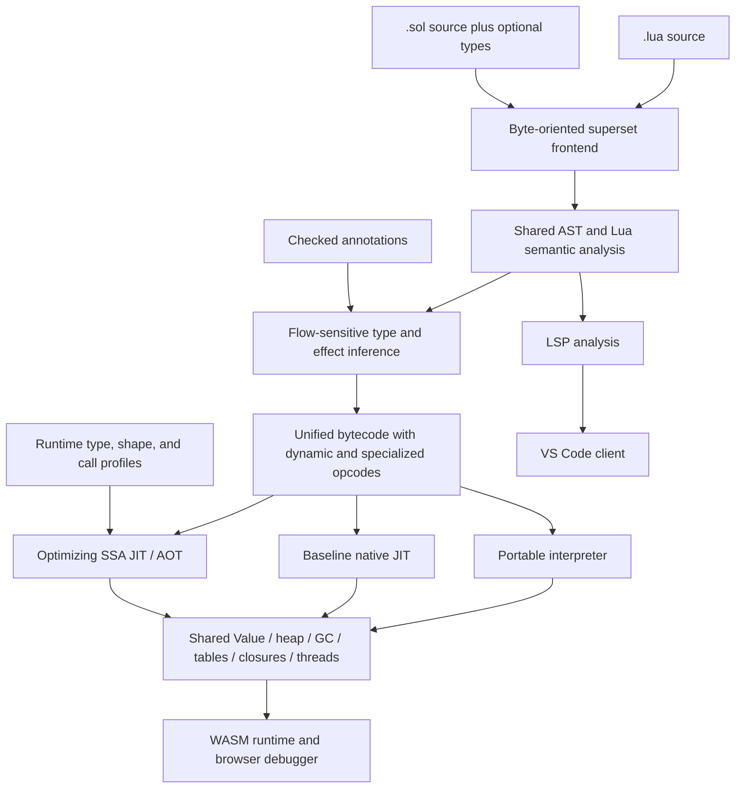
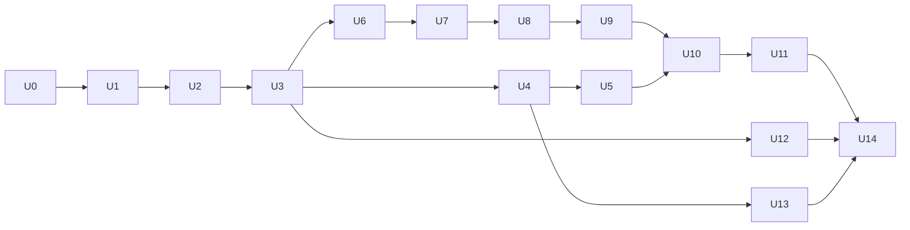

# Final-goal plan: one Lua-compatible Sol runtime, typed specialization, and integrated tooling

> Status: accepted convergence roadmap; U0 and U1 completed 2026-09-15; U3
> completed 2026-09-16; U2's production-object migration remains in progress. This document
> defines the intended end state and the order for future work. It does not change the current language
> contract by itself; `docs/spec/` and executable tests remain the description
> of released behavior until each milestone below lands.
>
> This roadmap supersedes the future architecture and performance direction in
> [the earlier Lua-superset execution plan](lua-superset-plan.md). Completed
> work recorded there remains valid baseline history.

## 1. Final goal

Sol will be a source-compatible superset of Lua 5.5 with optional, gradually
adopted types and Sol extensions. Untyped Lua, partially typed Sol, and fully
typed Sol will:

1. use the same Lua semantics, object model, heap, garbage collector, module
   graph, errors, coroutines, libraries, and callable ABI;
2. execute through a shared bytecode and optimization pipeline;
3. retain multiple internal representations so proven typed values stay unboxed
   and do not pay for dynamic dispatch;
4. use static inference, annotations, runtime profiles, guards, and
   deoptimization to progressively remove dynamic checks;
5. outperform the pinned LuaJIT baseline under the reproducible release gates in
   this document, while preserving compatibility;
6. power the native CLI, browser playground/debugger, LSP, and a first-party VS
   Code extension from the same frontend and semantic runtime.

The concise product promise is:

> Every supported Lua 5.5 program is a Sol program. Adding types improves
> diagnostics and makes performance more predictable; it does not move the
> program onto a different runtime or change its Lua behavior.

## 2. Terms and compatibility contract

### 2.1 “Same runtime”

“Same runtime” means one semantic implementation and one identity domain for
runtime objects. It does **not** mean that every value has the same physical
representation in every execution tier.

- Dynamic values use a compact tagged `Value` representation.
- Proven `i64`, `f64`, and boolean values may live unboxed in interpreter/JIT
  registers and native call frames.
- Typed records and arrays may use specialized layouts when escape and alias
  analysis prove that doing so is unobservable.
- A value crossing to dynamic Lua is boxed through a checked adapter that
  preserves object identity.
- A dynamic value crossing into typed code is checked once at the boundary; the
  typed body then relies on the checked contract.
- Tables, strings, closures, userdata, threads, errors, and all values visible
  through Lua APIs belong to the same managed heap regardless of the source file
  that created them.

There must not be a “typed GC” and “Lua GC” that can disagree about reachability
or identity, nor separate module instances for typed and untyped callers.

### 2.2 Language profiles

The compatibility claim is split into explicit profiles so sandbox restrictions
are not confused with semantic incompatibility.

| Profile                   | Required final behavior                                                                                                                                                                        |
| ------------------------- | ---------------------------------------------------------------------------------------------------------------------------------------------------------------------------------------------- |
| Core language             | Lua 5.5 lexical, parsing, numeric, control-flow, function, closure, vararg, multi-return, table, metatable, error, coroutine, and `_ENV` semantics                                             |
| Portable standard library | Base, coroutine, package, string, utf8, table, math, and capability-independent debug behavior                                                                                                 |
| Native host               | Lua-compatible CLI behavior, filesystem-backed loading, `io`, `os`, locales, binary chunks, native modules, and declared process capabilities                                                  |
| Embedding                 | Version-targeted Lua 5.5 C API/ABI or an explicitly documented source-compatible embedding boundary; Sol must not say “fully runtime-compatible” until this decision is implemented and tested |
| Browser sandbox           | The same language/runtime semantics with filesystem, process, native loading, and unrestricted debug access denied through explicit capabilities                                               |
| LuaJIT extensions         | FFI, `jit.*`, Lua 5.1 compatibility quirks, and LuaJIT-specific bytecode are a separate optional profile, not implied by Lua 5.5 compatibility                                                 |

The reference language revision, standard-library behavior, upstream corpus
revision, LuaJIT version, and benchmark builds must be pinned in checked-in
metadata. Changing a pin is a reviewed compatibility change.

### 2.3 Source forms

- `.lua` accepts standard Lua 5.5 and defaults to compatibility diagnostics.
- `.sol` accepts every valid `.lua` program plus optional Sol syntax.
- Sol-only words such as `fn`, `struct`, and `type` must be contextual rather
  than unconditional keywords wherever reserving them would reject valid Lua.
- Renaming a valid file from `.lua` to `.sol` must not change its behavior.
- The extension may enable additional syntax, editor defaults, or type-checking
  policy, but may not select a different runtime or different Lua semantics.
- Source and Lua strings remain byte-oriented; compatibility cannot depend on
  valid UTF-8.

### 2.4 Type-checking modes

Type policy is independent from execution semantics:

| Mode     | Behavior                                                                                                                                      |
| -------- | --------------------------------------------------------------------------------------------------------------------------------------------- |
| `off`    | Parse and execute Lua; collect optimization profiles but publish no optional type diagnostics                                                 |
| `infer`  | Infer types and publish non-blocking diagnostics; uncertainty remains dynamic                                                                 |
| `strict` | Enforce explicit contracts and requested strict regions; unannotated Lua constructs remain valid unless the program opts into a stronger rule |

An annotation is a checked contract, not an unchecked optimization hint. A
contract violation originating in dynamic Lua becomes a normal catchable Lua
error. A failed speculative optimization guard deoptimizes and is not a source
error. Native traps are reserved for compiler bugs and typed operations whose
specified contract is not catchable.

### 2.5 LuaJIT relationship and scope boundaries

Sol will not translate LuaJIT's implementation line by line. It will build a
Lua-compatible tiered VM in Rust and adopt measured techniques such as compact
tagged values, fast tables, inline caches, type feedback, trace/region
specialization, side exits, and low-overhead machine-code generation. Rust is an
implementation and safety choice, not a performance feature by itself.

The performance comparator and the compatibility oracle have different jobs: PUC
Lua 5.5 defines the targeted language behavior, while a pinned LuaJIT build
defines the performance baseline. LuaJIT-specific FFI, `jit.*`, bytecode, and
Lua 5.1 compatibility behavior enter scope only through the separate profile in
section 2.2. Sol must not copy a LuaJIT shortcut that changes the selected Lua
5.5 semantics merely to improve a benchmark.

Other boundaries for this roadmap:

- one semantic runtime does not require one physical representation;
- a native JIT is not required inside the browser sandbox;
- the final benchmark gate does not allow compatibility waivers;
- capability-denied host operations are supported sandbox behavior, not silent
  omissions from the native compatibility profile;
- existing Piccolo and legacy Sol runtimes remain test oracles during migration,
  not permanent production alternatives hidden behind file extensions.

## 3. Target architecture



### 3.1 Repository boundaries

The intended code ownership is:

- `crates/sol-core`: byte-oriented frontend, AST, semantic analysis, type
  inference, unified bytecode, portable interpreter, runtime object model,
  libraries, GC interfaces, debugger events, and capability model. This crate
  must build without Cranelift or native OS access.
- `crates/sol`: native CLI, Cranelift baseline/optimizing tiers, AOT, native
  capability providers, profiler, and debugger commands. During migration,
  existing `crates/sol` modules move behind `sol-core` APIs incrementally; do
  not begin with a big-bang directory move.
- `crates/sol-wasm`: `wasm-bindgen` wrapper around `sol-core`'s interpreter,
  virtual modules, budgets, debugger session, profiler events, and serialized
  inspection values.
- `crates/sol-lsp`: project analysis built exclusively on `sol-core`; it must
  not reimplement token, scope, or type logic.
- `packages/sol-runtime`: generated/browser package replacing
  `@lua-playground/runtime` after parity.
- `apps/web`: runtime-independent Monaco/debugger UI consuming
  `packages/sol-runtime`.
- `editors/vscode-sol`: first-party VS Code extension that launches or locates
  `sol-lsp` and registers `.lua` and `.sol` documents.

`crates/vm` and `crates/lua-vm` remain a temporary differential oracle and
browser fallback. They stop being a production runtime only after the new WASM
adapter passes the migration gate; vendored code is not rewritten merely to make
the directory tree look unified.

### 3.2 Runtime value and heap model

The shared runtime must provide:

- a measured compact `Value` representation; NaN boxing is a candidate, not a
  foregone conclusion, and must be compared against an explicit tag/payload
  layout on all supported architectures;
- canonical integer/float behavior, including overflow, conversion, equality,
  hashing, NaN, and negative-zero rules matching the target Lua revision;
- interned or otherwise allocation-efficient byte strings with content equality
  and stable GC ownership;
- one table implementation with array/hash parts, identity, weak modes,
  metatables, versioning, iteration invalidation rules, and shape metadata;
- closures with shared mutable upvalue cells and `_ENV` represented as a real
  upvalue rather than a parallel global map;
- heap-resident resumable frames for coroutines, tail calls, yields, protected
  calls, debugger suspension, and deoptimization;
- userdata and native closures with capability-aware host handles;
- errors and stack traces represented as runtime values and propagated without
  Rust panics crossing interpreter/JIT/FFI boundaries;
- a tracing collector with precise interpreter roots and generated native stack
  maps, generational barriers, weak tables, ephemeron processing, finalization,
  and safe coroutine scanning.

Rust safety is a boundary, not a claim that the JIT and GC contain no `unsafe`.
Unsafe code must be isolated behind reviewed value, heap, executable-memory, and
stack-map modules with invariant tests and Miri/sanitizer jobs where those tools
apply.

### 3.3 Calls and mixed execution

All functions have a common semantic calling convention supporting arbitrary
argument counts, varargs, multiple results, tail calls, errors, and yields.
Execution tiers may use faster internal ABIs when a call target and signature
are proven, but must generate adapters to the semantic ABI.

Required call combinations are:

| Caller              | Callee              | Required behavior                                                                  |
| ------------------- | ------------------- | ---------------------------------------------------------------------------------- |
| dynamic interpreted | dynamic interpreted | Full Lua calls, varargs, multi-return, tail calls, yields                          |
| dynamic interpreted | typed native        | Boundary guards once, catchable type error, then unboxed body                      |
| typed native        | dynamic interpreted | Box arguments, preserve identity, accept dynamic result or check a declared result |
| typed native        | typed native        | Direct specialized ABI when proven; semantic adapter when callable dynamically     |
| JIT                 | native/FFI          | Capability and GC-safe transition with stack maps and error translation            |
| coroutine           | any tier            | Resume through a trampoline or deopt to a resumable interpreter frame              |

Compiled frames require metadata sufficient to reconstruct bytecode state at
every guard, allocation safepoint, call, yield, and debugger-visible source
location.

### 3.4 Unified bytecode and SSA

The bytecode must represent both generic Lua operations and proven
specializations. For example, generic `ADD` retains coercion/metamethod
semantics, while `ADD_I64` is legal only with proof or a dominating guard.
Specialized bytecode is an optimization of the same function, not a different
language.

The optimizing SSA IR needs first-class operations for:

- tagged dynamic arithmetic, comparisons, truthiness, concatenation, indexing,
  field access, calls, and iteration;
- unboxed scalar and specialized aggregate operations;
- type, shape, metatable-version, global-version, and call-target guards;
- allocations, write barriers, safepoints, and precise roots;
- effect summaries for calls, metatables, globals, aliases, coroutines, debug
  hooks, and FFI;
- deoptimization snapshots mapping SSA values back to bytecode registers and
  inlined frames;
- OSR entry and side-exit blocks;
- source locations retained through optimization.

Cranelift remains the initial native backend. A custom assembler or trace
backend is considered only after profiles show Cranelift compile latency or
generated code is the limiting factor; it is not a prerequisite for the unified
architecture.

## 4. Type inference and specialization

### 4.1 Keep proof separate from observation

Every inferred fact carries one of these strengths:

1. **Proven:** derived from syntax, constants, dominance, checked annotations,
   escape/effect analysis, or a completed boundary check. No runtime guard is
   needed while its dependencies remain valid.
2. **Guarded:** derived from a versioned assumption such as a stable global,
   table shape, metatable, or call target. Generated code contains a guard and
   deoptimization snapshot.
3. **Observed:** runtime profile data used to choose a specialization. It is
   never consumed as proof until a generated guard validates it.
4. **Unknown:** execute the generic Lua operation.

This distinction must be visible in optimization diagnostics so a developer can
see why an operation stayed dynamic or why a guard exists.

### 4.2 Static analysis sequence

Run these analyses on a control-flow graph before native compilation:

1. lexical binding and upvalue resolution, including real `_ENV` handling;
2. SSA construction and definite-assignment facts;
3. literal and assignment propagation;
4. flow-sensitive union and nilability narrowing;
5. numeric-kind/range inference where it preserves Lua overflow semantics;
6. return and local call-signature inference;
7. closure escape, alias, mutation, and effect analysis;
8. table-literal shape and field-type inference;
9. loop induction and invariant analysis;
10. allocation escape/scalar-replacement eligibility;
11. guard planning and invalidation dependencies;
12. representation selection and lowering.

The initial type lattice should include `never`, `nil`, booleans and optional
literal facts, integer, float, number, byte string, function signatures, table
shapes, thread, userdata, small unions, and unknown/dynamic. Widen large or
unstable unions predictably instead of allowing compile-time explosion.

### 4.3 Flow-sensitive examples

Literal-derived locals require no tag checks while they remain unaliased:

```lua
local x = 10
local y = 20
return x + y
```

An explicit Lua check is also an optimization guard:

```lua
if math.type(x) == "integer" then
    return x + 1
end
```

Table shapes may be proven only while mutation and escape analysis make the
assumption unobservable:

```lua
local point = { x = 10.0, y = 20.0 }
return point.x + point.y
```

If `point` escapes, gains a metatable, or is reachable through an unknown alias,
the compiler must retain generic operations or install shape/metatable guards. A
typed/sealed record may opt into a stronger contract, but exposing it as an
ordinary Lua table requires a boxing/view strategy that preserves the specified
identity and mutation behavior.

### 4.4 Runtime profiling

Profiles are collected per bytecode site and must be bounded in memory. Track:

- operand and result tags;
- table shapes and metatable versions;
- global binding versions;
- call targets and argument/result signatures;
- branch direction and loop trip counts;
- allocation types, survival, and escape behavior;
- guard failures, deoptimizations, and polymorphism degree.

Use monomorphic specialization first, a small bounded polymorphic cache second,
and a stable megamorphic generic path after the site exceeds its shape/target
budget. Do not repeatedly compile an unbounded number of variants.

### 4.5 Annotation rules

- Missing annotations mean dynamic Lua, not a static error.
- Local annotations constrain assignments after a checked initialization.
- Parameter and return annotations are enforced at dynamic entry/exit.
- Inferred types may be more precise internally but are not public contracts.
- Explicit `any` denotes a dynamic `Value` and does not allocate a new box on
  every assignment when the value is already dynamic.
- `is`, `as`, and standard Lua tests feed the same narrowing engine.
- Metatable and debug APIs may invalidate guarded facts but may not invalidate
  proven facts without crossing a contract boundary.
- An optimizer must not use an annotation until type checking has established
  its soundness for all reachable entries.

## 5. Execution tiers

### Tier 0: portable interpreter

The interpreter is the semantic reference used by native and WASM builds. It
must be stackless/resumable, allocation-efficient, debugger-visible, and able to
execute specialized opcodes while falling back to generic Lua behavior.

### Tier 1: baseline native JIT

Compile hot functions quickly with minimal optimization. Inline monomorphic
caches and lower generic operations to small runtime stubs. This tier exists to
remove dispatch overhead and provide a fast bridge while Tier 2 compiles.

### Tier 2: optimizing JIT

Lift hot functions or regions to SSA, consume proven and observed types, inline
stable callees, scalar-replace allocations, specialize table access, hoist
guards, vectorize safe loops, and emit complete deoptimization metadata.

Start with method/function compilation because it reuses the current Cranelift
pipeline. Add region or trace formation for hot loops only when measurements
show function compilation cannot match LuaJIT on important dynamic workloads.

### AOT

AOT uses the same optimizing SSA and runtime ABI. Fully proven code can omit
guards; mixed/dynamic code retains runtime stubs and deoptimization or generic
fallback entries. AOT may use profile-guided specialization, but the executable
must remain correct when the deployment profile differs from the training run.

### Browser

The browser runs Tier 0 compiled to WebAssembly. Native executable-memory JIT is
not a browser requirement. A later WebAssembly code-generation tier may be
added, but browser semantic parity, debugging, and responsiveness take priority
over matching native LuaJIT throughput.

## 6. Compatibility and correctness strategy

### 6.1 Test layers

Every semantic change must have the narrowest applicable combination of:

- parser/AST unit tests in both `.lua` and `.sol` forms;
- type-inference tests that assert proven, guarded, observed, or unknown facts;
- bytecode snapshots or structural assertions;
- interpreter behavior tests;
- baseline-JIT and optimizing-JIT tier-agreement tests;
- OSR and deoptimization tests that deliberately fail guards after side effects;
- GC stress tests at every allocation/safepoint and mixed-tier boundary;
- differential tests against pinned Lua 5.5;
- differential fuzzing of parser, bytecode, runtime values, tables, functions,
  errors, and coroutine schedules;
- native/WASM parity tests for the portable capability profile;
- LSP fixtures using the same source and semantic facts.

Tests must distinguish “the process did not crash” from matching output, errors,
side effects, finalizer behavior, and exit status.

### 6.2 Compatibility gates

The current 34-file upstream manifest is a baseline inventory, not a pass
metric. Milestones promote unchanged upstream files only after comparison with
the pinned reference build.

Final native compatibility requires:

- zero unexplained `pending` or `diverges` entries in the targeted language and
  portable-library corpus;
- all capability-independent upstream cases passing unchanged;
- capability-dependent cases passing under the matching native profile;
- bytecode, debug, CLI, C API/embedding, locale, filesystem, and native-module
  cases either passing the declared full-runtime profile or explicitly keeping
  the public claim narrower than “fully compatible runtime”;
- no allowlist entry without an owner, reason, target milestone, and regression
  test;
- random differential suites completing with no untriaged mismatch.

The hand-written typed Sol conformance fixtures remain useful feature tests but
must be named and reported as typed capability regressions, never as evidence
that unmodified Lua is compatible.

### 6.3 Security and capabilities

Runtime providers expose filesystem, process, environment, time, locale, native
loading, stdin/stdout, and debug authority explicitly. The browser and library
default is deny; the native `sol` CLI can opt into a documented Lua-like host
profile. A capability failure must be deterministic and testable and must not
cause a semantic fork elsewhere in the runtime.

## 7. Performance strategy and release gates

### 7.1 Benchmark suites

Maintain three separately reported suites:

1. **Untyped compatibility:** unchanged Lua programs exercising numeric loops,
   calls, recursion, closures/upvalues, varargs, tables, polymorphic fields,
   metatables, strings, patterns, modules, errors, coroutines, and GC.
2. **Gradually typed:** the same programs with increasing annotation coverage,
   measuring each step rather than substituting unrelated typed rewrites.
3. **Typed/data-oriented:** arrays, records, numeric kernels, allocation,
   callbacks, modules, and real applications that can exploit unboxed layouts.

Include microbenchmarks for diagnosis and application-sized workloads for the
claim. A benchmark with no LuaJIT-equivalent behavior may inform Sol tuning but
cannot support the comparative headline.

### 7.2 Measurement protocol

- Pin source, inputs, Lua/LuaJIT commits or releases, build flags, CPU
  architecture, OS, power mode, and compiler toolchain.
- Report cold whole-process latency, warm steady-state throughput, compilation
  time, p50/p95/p99 latency, peak RSS, allocated bytes, GC time/pauses, code
  size, guard failures, and deoptimization counts.
- Use both x86-64 and AArch64 release machines.
- Preserve raw samples and machine-readable summaries.
- Compare identical source and inputs for untyped claims.
- Run correctness before timing and reject samples from semantically divergent
  executions.
- Require an A/B benchmark and profiler evidence before merging a representation
  or JIT optimization.

### 7.3 Progressive gates

| Gate                    | Required result                                                                                                                                                                                                                          |
| ----------------------- | ---------------------------------------------------------------------------------------------------------------------------------------------------------------------------------------------------------------------------------------- |
| Interpreter readiness   | Faster than the pinned reference Lua geometric mean on the untyped suite and no longer slower than the Piccolo-based sibling VM on any core category                                                                                     |
| Baseline-JIT readiness  | At least 0.75x LuaJIT throughput geometric mean on hot untyped workloads, with bounded compile latency and no correctness waiver                                                                                                         |
| Dynamic parity          | At least LuaJIT geometric-mean throughput, with no individual application workload more than 20% slower and no material memory/pause regression hidden from the report                                                                   |
| Final performance claim | At least 1.10x LuaJIT geometric-mean throughput on the published untyped application suite and no category geometric mean below parity; typed/annotated results are reported separately and must show monotonic or explained improvement |
| Typed advantage         | Fully typed/data-oriented suite exceeds LuaJIT by a separately published target while preserving mixed-call and compatibility behavior                                                                                                   |

These numbers are release criteria, not permission to overfit. If the final gate
is not met, the release says which gate it reached and does not claim to be
faster than LuaJIT. Startup-heavy and throughput-heavy claims remain separate.

## 8. Milestone sequence

Each milestone is independently reviewable. Its implementation, tests,
benchmarks, documentation, and migration notes land together. A later milestone
may prototype early, but may not declare an earlier exit gate complete.

### U0 — Charter, baselines, and decision records — **complete**

**Purpose:** stop architectural drift before more implementation work.

Deliverables:

- adopt this document as the authoritative future roadmap;
- update the product brief, architecture, specification introduction,
  `AGENTS.md`, and CLI documentation to the unified goal;
- record decisions for target Lua revision, C API scope, contextual extension
  syntax, common call ABI, runtime crate boundary, JIT strategy, and benchmark
  gates;
- rename/reclassify typed “conformance” reporting as typed capability tests;
- capture current compatibility, interpreter, JIT, web, and LSP baselines in
  machine-readable reports;
- add a cross-component CI summary that cannot present classified/pending tests
  as passing compatibility.

Exit gate: all top-level documents describe one product and link to the same
compatibility/performance definitions; baseline commands reproduce on a clean
checkout.

Delivered in U0:

- unified the product brief, architecture overview, repository guides, spec
  introduction, CLI overview, and historical-roadmap pointers;
- accepted ADRs 0001-0006 under `docs/decisions/`;
- captured `baselines/u0-2026-09-15.json`, explicitly distinguishing the last
  complete dynamic benchmark suite from later targeted remeasurements;
- added `scripts/project-status.sh` with text/JSON output, classification
  validation, and a strict full-compatibility gate;
- added `scripts/test-project-status.sh` to prevent typed capability ports from
  being counted as oracle-backed Lua compatibility;
- reclassified the legacy `sol-conformance` suite as typed capability
  regressions in documentation, test names, and script output;
- wired LSP checks and the unified status gate into `scripts/test.sh`.

Verification at completion: `scripts/test.sh` passed the native Sol suite,
browser runtime/conformance suite, strict Sol/LSP Clippy, manifest/status
checks, focused Lua fixtures, typed benchmark smoke, and web production build.
The honest baseline remains 0/34 oracle-backed upstream passes, 26 pending, and
8 host-required; U0 records that gap rather than changing runtime behavior.

### U1 — Superset frontend and semantic AST — **complete**

**Purpose:** make all Lua source valid input to the Sol frontend without yet
changing runtime implementation.

Deliverables:

- replace extension-driven parser forks with a common Lua grammar plus
  contextual Sol extensions;
- separate `Dialect`/extension flags, type-check policy, host capabilities, and
  execution tier instead of overloading `SourceMode`;
- preserve byte spans and original spelling through AST and diagnostics;
- implement a real lexical binder for locals, upvalues, labels, `_ENV`, and
  nested scopes;
- make `.lua` and annotation-free `.sol` produce semantically equivalent ASTs;
- expose parser/binder APIs to `sol-lsp`.

Exit gate: every parser fixture and unchanged upstream source accepted in `.lua`
is also accepted when treated as `.sol`; AST differential tests show no semantic
mode fork; invalid Sol annotations produce located diagnostics.

Completed 2026-09-15. `LanguageConfig` now separates the Lua 5.5 dialect, Sol
extension recognition, and type policy; compatibility `SourceMode` adapters no
longer select parser productions. The lossless parse result retains token
lexemes and byte spans, the shared binder models lexical scopes, upvalues,
labels, and `_ENV`, and `sol-lsp` consumes both APIs. The frontend differential
gate covers every parseable checked-in Lua fixture, benchmark, sibling-VM
script, and pinned Lua 5.5 upstream source in both profiles, as well as
contextual identifiers and located annotation errors.

The former Sol-only `{ ... }` statement block was removed because it is
syntactically indistinguishable from Lua's newline-insensitive `callee { ... }`
call sugar. Scoped statement blocks use Lua's equivalent `do ... end` form.

### U2 — Canonical runtime object model and GC foundation — **in progress**

**Purpose:** establish one identity/reachability domain before merging execution
tiers.

Deliverables:

- introduce the canonical runtime `Value`, object headers/handles, strings,
  tables, closures, upvalues, threads, userdata, errors, and capabilities;
- replace dedicated globals with `_ENV` table/upvalue semantics;
- define root registration and stack-map interfaces before optimizing layouts;
- migrate dynamic libraries and metatables onto the canonical objects;
- add precise tracing, barriers, weak/ephemeron rules, finalizer queues, and
  coroutine roots;
- provide temporary adapters for existing `LuaValue` and typed heap objects so
  migration can proceed without a flag day.

Exit gate: identity, weak reference, finalization, coroutine, and mixed-adapter
stress tests pass under forced collection; no production object is owned by two
independent collectors.

Started 2026-09-15. The portable `sol-core` crate now defines the canonical
tagged value, generation-checked object handles, all planned managed object
kinds, explicit host capabilities, `_ENV` closure upvalues, precise registered
roots/stack maps, generational metadata and barriers, weak tables, ephemerons,
finalizer queues, and coroutine tracing. Focused forced-collection tests cover
these invariants. A transitional adapter preserves legacy scalar, string,
table, closure, shared-upvalue, `_ENV`, standard-library native-callable,
registered native-bridge, stateful-iterator, userdata, coroutine,
coroutine-wrapper, raised-error, cycle, and repeated-reference identity when
importing old `LuaValue` graphs, and preserves unboxed typed scalars at the
typed boundary. Coroutine imports flatten all live frame values into traced
thread roots but intentionally remain non-resumable snapshots until U3 defines
the unified executable frame ABI. Canonical native callables carry portable
provider/function registry IDs and traced captures, never raw host pointers;
heap-issued provider namespaces prevent collisions across adapters.

The production Lua runtime now uses `sol_core::Capabilities` directly instead
of maintaining a second coarse `os`/`io` authority type. Clock, environment,
process, stdin, and stdout effects are independently gated, the native CLI opts
into the declared `NATIVE_CLI` profile, and library embedding remains
sandboxed by default.

U2 remains in progress because the production Lua interpreter and typed runtime
still own objects in their existing `Rc` and arena collectors. The adapter is a
migration seam, not a second production owner: imported canonical graphs are
snapshots and must not be mutated concurrently with legacy graphs. Dynamic
libraries, native callables, closures, userdata, coroutine frames, and the
production global environment still need to move onto canonical handles before
the exit gate can be claimed. See
[canonical-runtime-foundation.md](canonical-runtime-foundation.md).

### U3 — Unified bytecode, frames, and semantic call ABI — **completed 2026-09-16**

**Purpose:** execute typed and untyped functions in one resumable engine.

Deliverables:

- converge `lua_bytecode` and typed bytecode into one function/prototype model
  with generic and specialized opcodes;
- standardize varargs, multiple results, tail calls, errors, protected calls,
  yield/resume, and source maps;
- use heap-resident/trampolined frames that can suspend for coroutine, debugger,
  or deoptimization;
- implement all dynamic↔typed call combinations and identity-preserving
  boxing/unboxing adapters;
- route `sol run` through this engine for both extensions;
- retain an old/new differential switch until the unified path is stable.

Exit gate: annotation-free `.lua` and `.sol` run through the same runtime path;
mixed modules call, error, tail-call, yield, and collect correctly in every
direction; the legacy partition/fallback path is no longer the default.

Completed 2026-09-16. `sol-core` now defines the tier-independent function IDs,
prototype metadata, arity, value-count, call-site, call-kind, frame-state, and
call-outcome contracts, including tail redispatch, returned/yielded/raised
transitions, portable native-callable IDs, a shared function registry, checked
boundary values, and instruction source maps. Generic Lua and specialized Sol
bytecode both implement the same executable-prototype interface and project
their call instructions onto the same semantic ABI.
The generic compiler no longer stores Lua's open argument/result convention as
an untyped `-1` sentinel, and its resumable frames now carry stable function
IDs and canonical ready/running/suspended/returned state. The typed interpreter
publishes the same frame-state transitions to its existing zero-cost hooks.
Both compilers emit explicit semantic tail calls: generic Lua closure frames are
replaced in the trampoline, and specialized bytecode redispatches in a loop, so
deep proper tail recursion does not consume native or heap frame depth. U3
also routes annotation-free `.lua` and `.sol` through the same generic
runtime based on AST type surface rather than filename; an explicit annotation
selects specialization without changing the semantic object runtime. This exposed and fixed dynamic
integer-loop overflow, negative-divisor floor arithmetic, and minimum-integer
shift discrepancies.

The specialized dispatcher now hosts generic Lua functions as semantic slots,
so typed bytecode can call dynamic code and propagate normal results, catchable
errors, proper tail calls, and coroutine yield/resume outcomes without a second
calling convention. The dynamic dispatcher performs the reverse call through
registered pointer-free callable IDs; raw machine pointers remain only in its
host-side provider registry and never enter values, tables, frames, or canonical
snapshots. Scalar guards use the common boundary adapter, while canonical
handles cross unchanged to preserve identity. The CLI selects this mixed path
for an eligible typed caller of a dynamic function and retains
`SOL_RUNTIME_PATH=legacy-partition` only as the differential switch. Unsupported
non-scalar specialization and reentrant call graphs safely remain generic; U5
extends their optimized layouts rather than defining another runtime.

The exit gate is covered by annotation-free `.lua`/`.sol` routing tests,
dynamic-to-typed call and protected-error tests, typed-to-dynamic source and
error tests, deep cross-tier tail recursion, a real dynamic coroutine
yield/resume through a specialized slot, canonical callable collection tests,
and the legacy/unified differential test. The old raw-pointer value bridge is
no longer the installed production representation.

### U4 — Gradual type system and sound static inference

**Purpose:** remove checks from ordinary Lua using proof, without rejecting
dynamic programs.

Deliverables:

- implement the type lattice, small unions, widening rules, flow narrowing, nil
  elimination, return inference, and local call signatures;
- add CFG/SSA-based escape, alias, mutation, and effect analysis;
- infer local table shapes and nonescaping closure signatures;
- make annotations optional contracts and add `off`/`infer`/`strict` policies;
- emit optimization explanations for proven and remaining dynamic operations;
- replace heap-allocating `any` transitions with the canonical tagged value
  wherever possible.

Exit gate: inference fixtures show that literals, dominated type tests, loop
indices, local functions, and nonescaping table literals remove redundant
checks; all annotation-free compatibility fixtures still execute unchanged.

### U5 — Typed layouts and mixed-module specialization

**Purpose:** retain the current typed compiler’s strongest performance features
inside the unified runtime.

Deliverables:

- lower proven scalars, arrays, records, maps, and closure environments to
  specialized layouts;
- preserve identity when a specialized object becomes dynamically visible;
- scalar-replace nonescaping table/record literals where Lua observation cannot
  detect the allocation;
- generate semantic ABI adapters and direct typed ABIs;
- make imports/`require` share one module cache and support typed contracts over
  dynamic exports;
- generate precise GC layouts and barriers for specialized objects.

Exit gate: existing typed benchmark IR retains unboxed hot paths; mixed-module
fixtures pass without duplicate modules or collectors; adding unused dynamic
support causes no generated-code change to a fully proven function.

### U6 — Lua 5.5 compatibility completion

**Purpose:** complete semantics before making final performance claims.

Deliverables:

- close remaining grammar, coercion, `_ENV`, goto/scope, `<close>`, metamethod,
  iteration, coroutine, error, and GC-observable gaps;
- complete portable standard libraries and debug behavior;
- implement native filesystem/package/`io`/`os`/locale profiles;
- implement Lua 5.5 binary chunk load/dump compatibility where required;
- execute the embedding/C API decision from U0, including native module tests;
- promote manifest rows only through unchanged reference comparisons.

Exit gate: the compatibility gates in section 6.2 pass for the declared full
runtime profile. If the embedding profile remains incomplete, public wording
must remain source-compatible rather than fully runtime-compatible.

### U7 — Interpreter performance foundation

**Purpose:** make the semantic engine efficient before adding native tiers.

Deliverables, each benchmarked independently:

- packed/tagged `Value` representation prototype and measured selection;
- dense frame/register layout with no routine `Rc` clone or heap allocation per
  register operation/call;
- allocation-free common call, return, vararg, and iterator paths;
- optimized table array/hash layout, string interning/hashing, and shape IDs;
- direct-threaded/computed dispatch only if a maintainable Rust implementation
  measures better than dense `match` dispatch;
- generational allocation fast paths and measured barriers;
- fast metamethod-negative paths and tail-call frame reuse.

Exit gate: interpreter-readiness performance gate passes with compatibility, GC
stress, debugger, and WASM tests enabled.

### U8 — Inline caches and bounded profiling

**Purpose:** collect and exploit dynamic facts without native-code dependency.

Deliverables:

- table field/index, global, arithmetic/metamethod, iterator, and call-target
  inline caches;
- shape, metatable, global, and module version counters with invalidation;
- bounded mono/poly/megamorphic transitions;
- type/shape/call/allocation profiles serialized for benchmark inspection and
  optional profile-guided runs;
- cache correctness tests that mutate aliases, metatables, `_ENV`, modules, and
  debug-visible state.

Exit gate: cache-heavy benchmarks improve without semantic mismatch; forced
invalidation and megamorphic workloads remain bounded and correct.

### U9 — Baseline dynamic JIT

**Purpose:** remove dispatch overhead quickly for hot untyped functions.

Deliverables:

- fast bytecode-to-Cranelift lowering for generic and cached operations;
- semantic/runtime stubs for slow paths;
- safepoints, stack maps, exception/error transitions, and coroutine fallback;
- hot-function counters and background or bounded compilation policy;
- direct entry adapters for stable call targets;
- code cache lifecycle, invalidation, and executable-memory safety.

Exit gate: baseline-JIT readiness gate passes; compile latency and code memory
stay within published budgets; interpreter/JIT differential and GC tests pass.

### U10 — Optimizing SSA JIT, OSR, and deoptimization

**Purpose:** reach LuaJIT-class performance on untyped Lua using inference and
profiles.

Deliverables:

- lift bytecode to shared SSA with proof provenance;
- insert/hoist/fuse guards and record full deoptimization snapshots;
- specialize arithmetic, tables, calls, loops, allocation, and iteration;
- inline across stable dynamic and typed calls;
- enter optimized loops through OSR and leave through precise side exits;
- reconstruct inlined frames for errors, coroutines, profiler, and debugger;
- prevent recompilation storms with failure counters and widening.

Exit gate: dynamic parity gate passes first; final-performance work continues
until the final performance claim gate passes or the release explicitly states
that it has not yet achieved the goal.

### U11 — AOT and annotation-driven peak performance

**Purpose:** make optional types a predictable accelerator on the same engine.

Deliverables:

- feed checked annotations and static inference directly into shared SSA;
- remove guards and generic runtime calls proven unnecessary;
- specialize generics, records, arrays, maps, and callbacks across modules;
- retain dynamic adapters for exported/reflective entry points;
- support profile-guided AOT with safe fallback when profiles change;
- compare each gradually typed program against its unchanged Lua version.

Exit gate: typed advantage gate passes, annotation coverage yields monotonic or
explained results, and mixed dynamic behavior remains compatible.

### U12 — Canonical WASM playground and debugger

**Purpose:** make the web product a Sol playground rather than a separate VM.

Deliverables:

- create `sol-wasm` and `packages/sol-runtime` from the Tier-0 runtime;
- reproduce execution budgets, virtual modules, output capture, breakpoints,
  stepping, stack frames, locals/upvalues, evaluation, profiling, and timeline;
- accept `.lua` and `.sol` projects and use the shared parser/type diagnostics;
- keep execution in a worker and capabilities default-deny;
- switch the web adapter behind a feature flag, run old/new browser
  differentials, then remove the Piccolo production dependency;
- address bundle size, initialization latency, and long-running responsiveness.

Exit gate: existing web end-to-end debugger scenarios pass on the canonical
runtime; native/WASM portable-profile fixtures agree; the production worker no
longer imports `@lua-playground/runtime`.

### U13 — Semantic LSP and first-party VS Code client

**Purpose:** ship supported editor tooling, not only a generic-server binary.

Deliverables:

- commit and test `sol-lsp` as part of the supported repository;
- replace textual indexing with the U1 binder and U4 type facts;
- implement incremental documents, multi-file module graphs, complete diagnostic
  lists, semantic rename/references, completion, signature help, hover, symbols,
  semantic tokens, formatting policy, and cancellation;
- share the same analysis with Monaco directly or through a worker-safe LSP
  transport;
- create `editors/vscode-sol` with language configuration, syntax/semantic
  highlighting, server launch/download/path configuration, logs, restart,
  workspace discovery, and `.lua`/`.sol` activation;
- add protocol, golden fixture, headless VS Code integration, packaging, and
  clean-install tests.

Exit gate: a packaged extension installed into a clean VS Code profile starts
the bundled or configured server and passes diagnostics/navigation/completion/
rename tests across mixed `.lua`/`.sol` modules; LSP behavior agrees with CLI
analysis.

### U14 — Integrated release qualification

**Purpose:** prove the final product claim end to end.

Deliverables:

- run compatibility, fuzz, tier differential, GC stress, sanitizer, native,
  WASM, LSP, VS Code, and web E2E matrices from a clean checkout;
- publish raw benchmark data and summaries for both architectures;
- audit capabilities, native loading, executable memory, FFI, and browser
  isolation;
- remove obsolete fallback/partition paths and production Piccolo dependencies
  only after rollback tags and differential evidence exist;
- align all feature/spec/product documents and publish known limitations;
- package CLI/runtime libraries, web assets, LSP, and VS Code extension from one
  versioned release process.

Exit gate: every item in the definition of done below is satisfied. Otherwise
the release is labeled according to the highest completed gate rather than using
the final claim.

## 9. Migration strategy from the current repository

Use a strangler migration rather than rewriting all working code at once:

1. Freeze current typed, dynamic, and Piccolo behavior as differential tests.
2. Extract frontend/runtime interfaces while implementations remain in place.
3. Introduce canonical objects and adapters next to `LuaValue` and typed heap
   objects.
4. Move one object family at a time: strings, tables, closures/upvalues,
   threads, userdata, then typed aggregates.
5. Move calls to the semantic ABI before merging bytecode instruction sets.
6. Compile selected functions through the unified engine behind a diagnostic
   flag and compare results with both legacy paths.
7. Switch native `sol run`, then WASM/web, then delete unreachable legacy code.

During migration:

- no adapter may copy a table or closure in a way that changes identity;
- no object may be considered collectible by one heap while referenced by
  another;
- no benchmark win can waive a compatibility failure;
- no source-mode branch may be added without documenting whether it controls
  syntax, diagnostics, capabilities, or execution;
- old and new performance numbers must name the exact runtime path;
- each deletion requires repository-wide `rg` evidence and full relevant tests,
  not merely a successful build.

## 10. Dependency graph and critical path



Compatibility and runtime identity (`U1`–`U6`) are the critical correctness
path. Interpreter/JIT work must use that path rather than optimizing a runtime
scheduled for removal. Web work begins once the portable runtime and semantic
ABI are stable. LSP work can proceed after the binder/type APIs stabilize and
does not need to wait for JIT work.

## 11. Definition of done

The final goal is complete only when all of the following are true.

### Language and runtime

- Valid target-version Lua executes unchanged as Sol.
- `.lua` and annotation-free `.sol` have identical observable semantics.
- Types are optional, sound contracts and do not create a second runtime.
- Typed/untyped modules, calls, errors, coroutines, tables, and GC objects
  interoperate with shared identity.
- The declared native compatibility profile, including the decided embedding
  boundary, passes its upstream and differential suites.

### Performance

- The final performance claim gate in section 7.3 passes on published,
  reproducible untyped application workloads.
- Typed/annotated workloads retain a separately measured advantage.
- Startup, compilation, memory, and GC behavior are published and not hidden by
  throughput-only reporting.
- No compatibility mode or fallback runtime is excluded from the headline.

### Products

- Native CLI, AOT/JIT, and embedding interfaces use the canonical runtime.
- The web playground runs the canonical interpreter in WebAssembly and supports
  `.lua` and `.sol` editing/debugging.
- `sol-lsp` provides semantic multi-file analysis from the shared frontend.
- A packaged first-party VS Code extension launches and supports `sol-lsp`.
- Monaco, VS Code, and the CLI agree on parsing, binding, and diagnostics.

### Engineering quality

- Compatibility, fuzz, tier differential, GC stress, sanitizer, native/WASM, web
  E2E, LSP, and extension tests run in CI at appropriate frequencies.
- Benchmarks retain raw results and environment metadata.
- Unsafe runtime/JIT boundaries have explicit invariants and targeted tests.
- Product, feature, specification, and status documents agree with executable
  behavior.

Until every category is complete, progress should be reported by the completed
compatibility and performance gates, not by the final “fully compatible and
faster than LuaJIT” wording.
