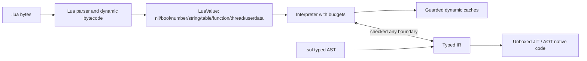

# M13 — Lua 5.5 compatibility without regressing typed Sol

**Goal:** make a useful, measured subset of Lua 5.5 programs run unchanged as
`.lua` while retaining Sol's actual end goal: `.sol` code has static types,
unboxed data, a shared SSA optimizer, and native AOT/JIT execution. Lua
compatibility is a runtime and migration boundary, not a reason to lower every
Sol program to a boxed Lua VM.

This document refines M13 in [m9.md](m9.md) into an implementation and test
plan. It follows the intent in [faster_lua.md](../../faster_lua.md): build a
typed, specialized compiler with one optimization IR for AOT and JIT, and make
performance claims only for named workloads on named hardware.

## Current evidence and scope

`scripts/test-lua55-suite.sh lua-5.5.1-tests` currently runs all 34 top-level
Lua 5.5.1 test files through Sol and reports **0 passed, 34 failed**. The first
failure (`all.lua`) is meaningful: the upstream test suite uses Lua 5.5's
`global` declarations, which Sol does not parse. The result is a baseline, not a
claim that the test suite is a single ready-made Sol acceptance test.

The upstream suite also exercises a Lua executable, its C API, dynamically
loaded C modules, a terminal/readline fallback, host files such as `/dev/full`,
and locale-dependent collation and decimal parsing. Those are valid Lua
distribution tests, but are separate from language semantics. Sol must classify
them explicitly instead of hiding failures or declaring parser acceptance to be
compatibility.

### Compatibility contract

| Area                  | Contract                                                                                                                                                                                                                                                                             |
| --------------------- | ------------------------------------------------------------------------------------------------------------------------------------------------------------------------------------------------------------------------------------------------------------------------------------ |
| `.sol`                | Statically checked. Typed scalars, records, arrays, maps, and typed functions remain direct SSA values where their types permit it. Dynamic operations are explicit through `any` or an imported `.lua` module.                                                                      |
| `.lua`                | Dynamic compatibility mode. Values, globals, tables, closures, varargs, and metatables use the Lua runtime representation. It begins in the interpreter/bytecode VM.                                                                                                                 |
| Boundary              | Importing `.lua` from `.sol` exposes `any`/a runtime handle. Converting it to a typed record, map, array, scalar, or function requires an explicit checked operation. No implicit table shape conversion or speculative unboxing crosses the boundary.                               |
| Optimization          | The dynamic VM may gain guarded inline caches and profile-guided specializations. A failed guard resumes compatible bytecode/interpreter state. `.lua` is not AOT-native by default; a future frozen-module profile may opt in only after deoptimization and GC root maps are sound. |
| Unsupported host APIs | Capability-gated and reported as such. `io`, `os`, native module loading, debug hooks, and C API embedding never become silently available just because the compiler process has those privileges.                                                                                   |

`global` is an upstream Lua 5.5 extension and therefore belongs only to `.lua`
grammar. Support `global <const> name = value`, `global function name`,
`global none`, and the documented wildcard form with their Lua 5.5 scope and
const rules. Do not admit `global` into typed `.sol` source.

## Test inventory and reporting model

Create a checked-in manifest at `tests/lua55/manifest.toml` that has one entry
per upstream case and records: upstream path and revision, category, required
host capabilities, expected output/error oracle, Sol status, and a link to the
adapted Sol fixture where one exists. Valid statuses are:

- `pass`: runs unchanged with Sol's supported capability profile and matches the
  oracle.
- `adapted`: the language assertion runs in a small Sol fixture because the
  upstream driver is testing the Lua executable or C API. The manifest names the
  removed host assumption and preserves the assertion.
- `host-required`: requires an intentionally unavailable capability; the runner
  checks that it is skipped with that reason.
- `pending`: a known semantic feature is missing. The entry names its owning
  milestone and issue/fixture.
- `diverges`: an intentional, documented difference with a migration path.

`fail` is never an accepted release status. A case that cannot yet run must be
`pending`, rather than being lost in a pile of command failures.

| Corpus group           | Representative upstream files                                                                             | What it establishes                                                       | First target                     |
| ---------------------- | --------------------------------------------------------------------------------------------------------- | ------------------------------------------------------------------------- | -------------------------------- |
| Grammar and values     | `literals.lua`, `constructs.lua`, `locals.lua`, `goto.lua`, `attrib.lua`, `bitwise.lua`, `bwcoercion.lua` | Raw lexical input, declarations, scope, literals, operators, control flow | L1–L3                            |
| Calls and environments | `calls.lua`, `closure.lua`, `vararg.lua`, `nextvar.lua`, `errors.lua`                                     | Globals, closures, varargs, multi-results, protected errors               | L3–L4                            |
| Object protocol        | `events.lua`, `tpack.lua`, `sort.lua`                                                                     | Tables, iteration, metamethod dispatch and order                          | L3–L5                            |
| Library semantics      | `strings.lua`, `math.lua`, `utf8.lua`, `coroutine.lua`, `pm.lua`                                          | Base/table/string/math/utf8/package/coroutine behavior                    | L5–L7                            |
| GC and stress          | `gc.lua`, `gengc.lua`, `tracegc.lua`, `big.lua`, `heavy.lua`, `verybig.lua`                               | Reachability, finalization rules, memory pressure and limits              | L6–L8                            |
| Lua distribution/host  | `main.lua`, `api.lua`, `files.lua`, `memerr.lua`, `cstack.lua`, `code.lua`, `db.lua`                      | CLI, C API, loadable modules, OS/terminal/filesystem/debugger behavior    | L0 then separate capability work |

## L0 — Reproducible oracle and corpus triage

**Purpose:** distinguish an upstream environment problem from a Sol semantic
failure before implementing runtime features.

- [x] Pin the Lua 5.5.1 source tarball checksum and build a reference runner in
      a Linux container. Use its own `src/lua`, matching C headers, and the
      suite's `libs` build targets; do not compare against an unrelated system
      Lua package.
- [x] Provision the reference profile with dynamic module loading, the expected
      readline fallback, `/dev/full`, and an ISO-8859-1 Portuguese locale. Log
      the OS image, compiler, Lua configure flags, locale, and module search
      paths next to the result.
- [x] Add `scripts/test-lua55-reference.sh`, which builds or validates the
      reference prerequisites and writes per-case stdout, stderr, exit code,
      duration, and environment metadata under a caller-selected results
      directory.
- [x] Evolve `scripts/test-lua55-suite.sh` from a raw loop into a manifest-aware
      Sol runner. It must retain the existing ability to execute every top-level
      test, but summarize `pass`, `adapted`, `host-required`, `pending`, and
      unexpected failures separately.
- [x] Check in normalized text or structured snapshots for deterministic oracle
      cases. Normalize paths, executable names, and platform line endings only;
      do not normalize semantic output, errors, or ordering.
- [x] Triage all 34 files and record why every host-dependent file is adapted or
      capability-gated. Add a regression test for the manifest parser so an
      unclassified upstream file fails CI.

**Exit gate:** the reference profile completes its upstream suite subject only
to recorded platform differences, all 34 cases have a manifest row, and a CI
report can tell a missing Sol feature from an unavailable host facility.

## L1 — Byte-accurate Lua source and complete syntax front end

**Purpose:** parse the Lua 5.5 surface before attempting to execute it.

- [x] Make source loading byte-oriented. Preserve arbitrary bytes in string
      literals, comments, long brackets, and diagnostics; source positions are
      byte offsets plus line/column, not UTF-8 `String` indexes.
- [ ] Add Lua lexical forms: decimal/hex/hex-float numerals, escapes and long
      strings/comments, Unicode escape handling where Lua specifies it, and all
      punctuation/operator tokens. Retain the stricter typed lexer rules for
      `.sol` where they intentionally differ.
- [ ] Parse all Lua statement and expression forms: `local`, global assignment,
      `do`/`end`, labels and `goto`, numeric and generic `for`, `repeat`, table
      constructors, indexing/field access, method definitions and calls,
      anonymous/local/nested functions, vararg expressions, call-statement
      sugar, and expression-list assignment/return rules.
- [x] Parse table constructors (array, named, and computed fields), function
      call shorthand, method declarations/calls, and indirect-call syntax into
      Lua-specific AST nodes.
- [x] Parse local, nested, anonymous, and named-vararg (`...name`) functions;
      reject a vararg expression outside its enclosing vararg function.
- [x] Parse Lua labels/gotos, generic `for` loops, and multi-value returns.
      These nodes remain execution-gated until bytecode scope validation and
      dynamic call frames arrive in L2–L4.
- [x] Parse Lua 5.5 `global` declarations in `.lua` only, including attributes
      and const diagnostics. Reject the same spelling in `.sol` with a useful
      source span and migration suggestion.
- [~] Establish parser fixtures for each construct plus negative syntax tests
      for ambiguous long brackets, bad numerals, invalid labels, forbidden
      varargs, const global writes, and `.sol`/`.lua` mode boundaries. The
      construct, long-bracket/numeral, vararg, and source-mode coverage is in
      `lua55_parser_surface.lua`/`lua55.rs`; label scope and global-const write
      validation require L2's `_ENV` declaration metadata.

**Exit gate:** all syntax-oriented corpus cases parse to an inspectable Lua AST
or fail at the same source location as reference Lua. This gate has no claim
about runtime behavior.

## L2 — Dynamic bytecode and value model

**Purpose:** provide a correct foundation for Lua semantics that cannot be
represented by the current scalar-only `any` box.

- [~] Introduce a dedicated `LuaValue` tagged representation: `nil`, boolean,
      integer, float, interned/owned string, table, closure, native function,
      thread, and opaque userdata. Keep it distinct from typed SSA values and
      make every reference variant traceable by the collector.
- [~] Define Lua truthiness, number equality/comparison/coercion, string
      identity/content rules, number formatting, and key canonicalization with
      differential fixtures. Specify NaN and integer/float table-key behavior.
- [ ] Add Lua bytecode registers, constants, upvalue descriptors, and source
      spans. Interpret dynamic code through this VM; do not force it through
      typed Cranelift lowering.
- [~] Give every Lua module its own `_ENV` table and resolve reads/writes via
      that environment. Implement `global` declarations through explicit
      environment slots/metadata, including their const constraints.
- [~] Add a host-independent error object and stack trace shape. Errors must
      cross dynamic call boundaries without Rust panics or process aborts.

**Exit gate:** direct fixtures cover all value tags, globals/\_ENV isolation,
numeric corner cases, and error propagation; bytecode execution agrees with
reference Lua for the non-library portions of the L1 corpus group.

## L3 — Tables, assignment, and iteration

**Purpose:** implement the dynamic object model that most Lua code depends on.

- [~] Implement heap tables with Lua array and hash parts, `nil` deletion,
      stable object identity, length behavior, resize policy, and mutation write
      barriers.
- [ ] Implement table constructors with keyed, array, and computed-key fields;
      expand the final expression according to Lua multi-result rules.
- [~] Implement assignment targets and expression lists left-to-right with Lua
      adjustment rules: only the final call/vararg expands; surplus values are
      discarded and missing values become `nil`.
- [~] Implement `next`, `pairs`, `ipairs`, raw get/set/equality/length, and the
      base/table APIs needed by the core corpus. Define invalidation behavior
      for table mutation during iteration and test it against reference Lua.
- [ ] Keep typed `Map<K,V>`, records, and arrays from M10 separate. A dynamic
      table becomes one only through checked conversion that validates keys,
      fields, values, and absence/presence rules.

**Exit gate:** adapted fixtures extracted from `constructs`, `nextvar`, `tpack`,
and `sort` pass, including table identity, deletion, iteration, and multiple
assignment/return cases.

## L4 — Functions, closures, varargs, and protected execution

**Purpose:** make normal dynamic Lua programs executable without weakening typed
top-level function values from M9.

- [~] Compile Lua closures with heap environment cells for captured locals.
      Closing an upvalue at scope exit must preserve a single shared cell across
      all closures that captured it.
- [~] Implement Lua call frames, recursive calls, proper vararg packs, and
      multi-result propagation through call, return, assignment, table
      construction, and parenthesized-expression truncation sites.
- [~] Implement `pcall`, `xpcall`, `error`, `assert`, and `select`, preserving
      error values and a bounded, useful stack trace. Add recursion/instruction
      budgets before host-exposed sandbox use.
- [ ] Specify tail-call behavior. Begin with semantically correct frames; only
      elide them after stack traces and protected calls retain Lua-visible
      behavior.
- [ ] Implement the `.sol` bridge for calling dynamic functions as `any` and
      checked conversion to a typed function signature. Enforce arity/result
      checks at the bridge; do not let `LuaValue` appear in typed IR absent an
      explicit dynamic operation.

**Exit gate:** `calls`, `closure`, `vararg`, and relevant `errors` assertions
pass unchanged or as manifest-linked semantic fixtures, including shared
upvalues and final-expression result expansion.

## L5 — Metatables and essential libraries

**Purpose:** provide the Lua object protocol and the portable library subset.

- [ ] Implement per-value/type metatables and table metatables. Start with
      `__index`, `__newindex`, `__call`, `__tostring`, `__len`, and `__pairs`;
      then arithmetic, concatenation, comparison, and equality lookup in Lua's
      documented order.
- [ ] Use metatable/table version counters for dynamic inline caches. Each cache
      guards receiver kind, table shape, metatable identity, and version; any
      miss or mutation takes the generic bytecode path.
- [ ] Implement deterministic base, table, string, math, and utf8 slices with
      per-function tests. Match Lua's errors and edge cases before adding a
      faster implementation.
- [ ] Implement a sandboxed `package`/`require`: deterministic search paths,
      module cache, cyclic-load behavior, and an explicit host-provided loader
      interface. Native loaders remain off by default.
- [ ] Split `io`, `os`, `debug`, native module loading, and locale APIs into
      declared capability profiles. Test both denial and allowed behavior.

**Exit gate:** the object-protocol assertions from `events`, `sort`, and table
tests pass; portable portions of `strings`, `math`, and `utf8` pass against the
oracle; every omitted library entry has a documented capability status.

## L6 — Precise roots, GC semantics, and finalization

**Purpose:** make the new reference-heavy runtime safe before optimizing it.

- [ ] Advance the M14 work required for dynamic values: layout descriptors for
      tables, strings, closures, upvalue cells, iterator state, errors, and
      coroutine frames; compiler/VM root stacks; and write barriers on every
      reference store.
- [ ] Define reachability, weak table behavior, finalizer registration and
      scheduling, and `collectgarbage` modes. Lua-visible finalizer timing must
      be tested as permitted ranges, never as an accidental exact schedule.
- [ ] Add stress modes that collect at allocation points and after every dynamic
      bytecode instruction. Run them under memory checking where available.
- [ ] Run `gc`, `gengc`, and `tracegc` in their own capability category; map
      their implementation-dependent expectations to semantic invariants and
      retain exact upstream assertions where Sol claims identical behavior.

**Exit gate:** dynamic stress fixtures have no dangling references or missed
roots, collector statistics are exposed to the benchmark harness, and every
supported GC observable has a reference-backed test.

## L7 — Coroutines and resumable execution

**Purpose:** add Lua cooperative concurrency only after stack and GC ownership
are explicit.

- [ ] Represent each coroutine as heap-owned VM frames, registers, upvalues,
      status, and resume/yield values. Implement `create`, `resume`, `yield`,
      `running`, `status`, `wrap`, and error propagation.
- [ ] Define yieldability across `pcall`, metamethods, native builtins, and
      module loaders. A non-yieldable boundary must raise the Lua-compatible
      error rather than corrupting a native stack.
- [ ] Keep coroutines on bytecode initially. A future dynamic JIT call either
      resumes through a compatible trampoline with complete root maps or
      deoptimizes to the saved interpreter frame before yielding.
- [ ] Add deterministic scheduling fixtures, repeated resume/yield stress, and
      GC-during-suspension tests before enabling performance work.

**Exit gate:** portable assertions from `coroutine.lua` pass and a suspended
coroutine remains valid across full collections, protected errors, and module
calls.

## L8 — Optimization, differential testing, and release gates

**Purpose:** improve dynamic execution only after correctness is measurable,
while proving the typed path retains its defining advantage.

- [ ] Add a differential runner that executes each manifest fixture on reference
      Lua and Sol, compares normalized stdout/stderr/exit status, and emits a
      minimized failure report with source, seed, and capability profile.
- [ ] Add property tests and fuzzing for lexer/parser round trips, table
      operations, multi-result adjustment, metamethod recursion, and GC root
      handling. Differential fuzz failures become permanent fixtures.
- [ ] Benchmark dynamic table array/hash reads, polymorphic field access,
      closure allocation/calls, vararg/multi-result calls, metatable dispatch,
      GC pressure, and coroutine resume. Report interpreter cold start and
      steady-state cache/JIT results separately against the pinned Lua 5.5
      reference and any additional named runtimes.
- [ ] Before and after every dynamic optimization, run the existing typed Sol
      numeric, allocation, callback, table/array, JIT, and AOT benchmarks.
      Reject a material typed-path regression (initial budget: 5% outside
      measurement noise) and inspect typed IR/assembly to confirm no `LuaValue`
      boxing or dynamic dispatch was introduced into strict kernels.
- [ ] Add a release dashboard with corpus counts by manifest status, capability
      profile, benchmark environment, and typed regression status. Only move a
      case from `pending` to `pass` with an oracle-backed test.

**Exit gate:** all release-supported entries pass under the documented profile,
no unclassified corpus failures remain, and published performance claims state
the workload, machine, compiler revision, warm-up policy, and comparison.

## Delivery order and dependencies

1. Complete L0 before interpreting the headline “34 tests” number; it is the
   source of trustworthy oracles and honest exclusions.
2. Deliver L1–L4 in order. Tables depend on dynamic values; closures and
   multiple returns depend on bytecode frames and table construction semantics.
3. Deliver L5 and the M14 subset in L6 before coroutines. Metatables add runtime
   indirection and GC adds reference density, both of which coroutine suspension
   must preserve.
4. Treat L7 and L8 as separate releases. No dynamic JIT cache, native code, or
   broader capability profile is a prerequisite for claiming a correct
   interpreter compatibility tier.

The first implementation change after this plan should be L0's manifest and
reproducible reference runner, followed by the L1 fixture that parses Lua 5.5
`global` declarations. That order makes subsequent feature work measurable and
keeps `.sol`'s typed compiler independent throughout.
