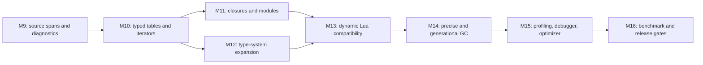

# M9+ — Language, runtime, and tooling expansion

**Goal**: make Sol useful for multi-file, data-oriented applications while
preserving its defining property: fully typed hot paths use unboxed values and
specialized native code. Lua compatibility belongs at explicit dynamic
boundaries; it must not turn ordinary `.sol` code into a boxed Lua VM.

This plan continues after M8. The numbered phases below are implementation
order, not a promise that every phase ships in one release. A phase may be
split into reviewable changes, but its acceptance criteria must be complete
before the next dependent phase begins.

## Design rules

1. **Typed and dynamic representations stay separate.** `i64`, `f64`, bool,
   fixed-layout records, typed arrays, and monomorphized generic instances are
   represented directly in SSA. `any` and untyped Lua values use tagged,
   garbage-collected runtime values only at boundaries.
2. **`.lua` is compatibility mode; `.sol` is optimization mode.** A `.lua`
   module may omit types and use dynamic facilities. A `.sol` module may use
   `any`, but every operation that needs dynamic dispatch must be visible in
   the typed IR and profiler.
3. **Every semantic feature gets an oracle fixture.** Add a reference-Lua
   fixture where Lua has matching behavior, a typed Sol fixture, bytecode/JIT/
   OSR/AOT coverage where the feature applies, and a negative fixture for each
   rejected static rule.
4. **Benchmark before optimizing.** Establish a correctness baseline first;
   add a named benchmark before implementing a tiering, allocation, or codegen
   optimization. Keep whole-process results and steady-state results separate.
5. **Compatibility is documented, never implied.** Each added Lua feature is
   marked supported, partial, or unsupported in `docs/sol.md`; dynamic
   deviations must explain the reason and the migration path.

## Shared delivery checklist

- [x] Add source spans to lexer tokens, including byte offsets and columns.
- [ ] Propagate spans to AST nodes, typed AST nodes, bytecode instructions, and
      generated-function metadata. Optimizations must retain an origin span or
      intentionally mark synthesized code.
- [x] Define a typed-IR verification pass before lowering. It runs after type
      checking and each AST transform, validates local bounds, call targets,
      callback signatures, branch-condition types, loop-bound types, and return
      types. Bytecode branch/layout and GC-layout checks remain follow-up work.
- [x] Add a feature matrix to `docs/sol.md` with columns for parser,
      interpreter, JIT, OSR, AOT, gradual mode, and Lua compatibility.
- [x] Run `cargo test`, `cargo clippy --all-targets -- -D warnings`, fixture
      oracle tests, and the relevant benchmark smoke test in CI.
- [x] Preserve the existing zero-overhead rule: code built for `sol run` with
      no debugging/profiling flags contains no hooks or runtime flag branches.

## M9 — Diagnostics, source maps, and compiler invariants

**Why first**: tables, closures, generics, and modules multiply the number of
places a type error can arise. Good spans and IR validation keep later work
debuggable rather than relying on compiler crashes or raw register numbers.

### Implementation

- [ ] Replace line-only locations with `Span { file, start, end, line, column
      }`; preserve UTF-8 byte offsets while reporting human-readable columns.
- [ ] Attach spans to declarations, expressions, calls, fields, and branches.
      Store function/file mappings in bytecode and native compilation metadata.
- [x] Define `Diagnostic { severity, code, primary_span, labels, notes }` and
      render source excerpts for CLI errors. `--diagnostic-format json`
      exposes the machine-readable form, including source file and span.
- [x] Add a typed-IR verifier and run it after type checking and each AST
      optimizer pass, before bytecode generation or Cranelift lowering.
- [x] Make `sol debug` show source locations at call boundaries. Preserve the
      M8 call-boundary debugger until per-line execution metadata is complete.

### Acceptance criteria

- [ ] A type mismatch reports the declaration and conflicting expression with
      file, line, column, and a concise coercion explanation.
- [ ] An error originating in an imported module identifies that module rather
      than the importing call site alone.
- [x] Deliberately malformed typed IR is rejected by a unit test before it
      reaches Cranelift.
- [~] Existing diagnostics retain stable error codes where tests or tools rely
      on them. Lexer and parser failures now expose tested `ELEX001` and
      `EPARSE001` codes; type-checker codes remain open.

## M10 — Typed tables, records, maps, and generic iteration

**Goal**: add the data model needed for real programs without giving up
fixed-layout field access or contiguous typed arrays.

### Language design

- [x] Keep `struct` as a fixed-layout, nominal record. Add structural record
      literals and annotations for ergonomic data:
      `local p: { x: f64, y: f64 } = { x = 1.0, y = 2.0 }`.
- [~] Add `Map<K, V>` for hash maps. The first monomorphic specialization is
      `Map<i64, i64>`. Other scalar variants, strings, and interned-symbol
      keys remain open; mutable/identity-dependent keys stay rejected until
      their equality semantics are explicit.
- [x] Add typed table literals only when an expected type is available. Empty
      `{}` without an expected `Map`/record/array type is an error in `.sol`;
      it creates a dynamic table in `.lua` or `any` mode.
- [~] Add iterator types and generic `for` lowering. `pairs(Map<i64, i64>)`
      and `ipairs(Array<T>)` are lowered without dynamic allocation; standalone
      first-class iterator values remain open. Built-ins include
      `pairs(map)`, `ipairs(array)`, and record/map iteration with documented
      ordering rules. Map traversal order is unspecified.

### Compiler and runtime work

- [x] Add record and scalar map types to AST/type checking, type equality, type
      formatting, bytecode signatures, and native ABI lowering.
- [~] Implement a monomorphic `Map<K,V>` layout: the open-addressing scalar
      `Map<i64, i64>` specialization has capacity, length, occupancy bytes,
      key storage, and value storage. Other specializations remain open.
      Hash/equality specialization for additional key types remains open.
- [~] Add write barriers and precise layout descriptors for map entries before
      allowing pointer-containing keys or values. Pointer-bearing maps remain
      rejected, so the current atomic scalar storage is safe without barriers.
- [x] Lower record field reads/writes to known offsets. Lower typed map access
      to specialized probes; emit bounds/missing-key behavior explicitly.
- [x] Add iterator bytecode operations and native lowering that avoid dynamic
      allocation for array iteration and use a compact cursor for maps.

### Fixtures and benchmarks

- [~] Fixtures cover nested records, record field errors, map collision/resize,
      missing keys, map iteration, value mutation during iteration, and the
      typed-vs-dynamic table boundary. String-key maps remain gated on GC work.
- [~] Benchmarks: `hashmap_lookup` and an array-iteration baseline are present;
      `04_objects`, `06_json_like`, and broader map specializations remain.
      Record allocation/scalar replacement must stay no slower than the
      current struct benchmark within measurement noise.

## M11 — Closures, captured state, and modules

**Goal**: make functions composable across files while retaining direct calls
and stack allocation whenever captures do not escape.

### Closures

- [~] Parse nested functions and capture analysis. Immutable scalar/string
      captures are lambda-lifted by value. Mutable captures and types that
      cannot cross the typed closure boundary are classified and rejected with
      targeted diagnostics until shared cells land.
- [~] Introduce typed function values and closure values. `fn(Args) -> Return`
      is implemented, including stateless nested functions (which lower to an
      ordinary code pointer). Capturing escaping values still need the second,
      environment-pointer word; stateless closures use a canonical zero-sized
      environment.
- [~] Extend escape analysis: direct-call nonescaping closures are
      lambda-lifted, so their environment is represented by ordinary unboxed
      arguments and generates no allocation. Stack/heap environment objects
      remain open.
- [~] Specify loop capture semantics and test them against Lua behavior in
      `.lua`. Typed nonescaping closures receive the current iteration value as
      an explicit lifted argument; escaping typed loop closures remain gated on
      heap environments.

### Modules

- [x] Define `import module.path` and `export` syntax, module names, relative
      resolution, and extension precedence (`.sol`, then `.lua`).
- [~] Build a module graph before type checking. Missing modules, duplicate
      exports, private references, indirect imports, and import cycles report
      source files/lines. Nominal struct references can be qualified across
      modules; general alias/type-cycle analysis depends on M12 aliases.
- [~] Cache each canonical module's parsed interface in the in-memory graph so
      diamond imports parse and compile once. A reusable type-checked interface
      cache remains open. Add a stable interface file
      format only after the in-memory graph is correct.
- [~] Compile typed module top-level initializers in dependency order and invoke
      each once before root `main`. Importing a dynamic `.lua` interface from
      typed Sol and cyclic dynamic Lua partial initialization remain M12/M13
      boundary work.

### Acceptance criteria

- [x] A nonescaping closure capturing an `i64` generates no heap allocation.
- [ ] An escaping mutable capture remains correct through GC collections.
- [x] A three-module typed program runs identically through bytecode, JIT, and
      AOT. A module error points to both importer and imported declaration.
- [x] The benchmark suite reports `function_calls` (direct call) and
      `function_calls_closure` (escaping Lua closure) separately. A typed Sol
      escaping-closure counterpart remains gated on heap environments.

## M12 — Type-system expansion and explicit dynamic narrowing

**Goal**: express useful program structure statically and make `.lua` migration
predictable.

### Type features, in order

- [x] Type aliases and qualified names. Aliases expand before capture analysis
      and type checking, may be exported/imported, and cycles are diagnosed.
- [ ] `Option<T>` and tagged `enum` values with exhaustive `match`.
- [~] Generic functions, `Array<T>`, `Map<K,V>`, records, and iterator types.
      The first ahead-of-time monomorphized algorithm is
      `map(Array<i64>, fn(i64) -> i64)`, with a dedicated unboxed bytecode and
      native runtime path. User-declared generic functions and broader
      collection specializations remain open.
- [x] Function types and typed callbacks for top-level Sol functions. Both
      `fn(Args) -> Return` and `fn(Args): Return` annotations work through
      bytecode, the JIT, and AOT; closures and collection APIs remain M10/M11.
- [ ] Union types only when the exhaustiveness and representation rules are
      clear. Do not make arbitrary unions silently become `any`.

### Gradual typing

- [~] Extend boxed `any` values to nil, strings, arrays, records, maps, and
      stateless function values while preserving reference identity. Capturing
      closures and dynamic Lua tables remain in their separate runtime layer.
- [~] Add type tests and narrowing: `if x is Point then ... end` refines a
      directly-tested local on the true edge, and `x as Point` performs an
      explicit checked cast. Compound-condition and else-edge refinement remain
      open.
- [~] Define dynamic operation dispatch tables for `any`: arithmetic,
      comparison, indexing, call, field access, and concatenation. Each slow
      operation has an observable type error, never undefined behavior.
      Arithmetic, comparison, truth, negation, and concatenation are present;
      indexing, calls, and fields require narrowing first.
- [~] Record scalar type distributions at dynamic function-call boundaries.
      Existing M6 guards select monomorphic native variants and fall back to
      generic execution on a failed guard; aggregate and per-operation profiles
      remain open.

### Acceptance criteria

- [ ] Exhaustive enum matches compile; incomplete matches identify missing
      variants.
- [x] Generic `map` over `Array<i64>` produces specialized unboxed code.
- [ ] A `.lua` module imported from `.sol` exposes `any` values and requires a
      guard before typed use.
- [x] Type-narrowing fixtures agree across bytecode, JIT, OSR, and AOT.

## M13 — Dynamic Lua compatibility layer

**Goal**: support the highest-value Lua runtime features behind `any` and
untyped `.lua` boundaries, without weakening typed semantics.

The implementation order, upstream Lua 5.5.1 corpus triage, capability
profiles, and typed-performance gates are defined in
[m13-lua-compat.md](m13-lua-compat.md).

### Ordered scope

- [ ] Dynamic tables with array and hash parts, `nil` deletion, `#`, `next`,
      `pairs`, `ipairs`, and multiple assignment/return behavior.
- [ ] Lua function calls with varargs, multi-return propagation, `pcall`,
      `xpcall`, `error`, and stack traces.
- [ ] Metatables: implement `__index`, `__newindex`, `__call`, `__tostring`
      first; then arithmetic/comparison metamethods with a documented lookup
      order and cache invalidation model.
- [ ] Standard-library slices: base, `table`, `string`, `math`, `utf8`, and a
      sandboxed `package`/`require`. Keep OS/IO capability-gated and absent
      from deterministic builds unless explicitly enabled.
- [ ] Coroutines last: define heap-owned stacks/frames, yielding through the
      bytecode interpreter before attempting JIT resume support. A coroutine
      must either resume through a compatible native trampoline or deopt to a
      resumable interpreter frame.

### Boundaries and safeguards

- [ ] Disallow implicit conversion from dynamic table to typed record/map.
      Provide checked conversion APIs that validate every required field/key.
- [ ] Track metatable version counters. Invalidate inline caches on mutation;
      guard cache entries in native code.
- [ ] Add recursion, allocation, and instruction budgets for sandboxed Lua
      execution. Expose host capabilities explicitly instead of inheriting OS
      access from the compiler process.
- [ ] Add an oracle harness that runs each compatibility fixture on installed
      Lua and Sol, with an allowlisted deviations ledger.

## M14 — Precise and generational memory management

**Goal**: make object-heavy programs predictable and safe as tables, closures,
and coroutines increase pointer density.

**Green Tea evaluation**: do not integrate Go's Green Tea collector directly.
It is part of Go's runtime and depends on Go's object metadata, safepoints, and
write-barrier protocol; Sol cannot link it into Rust-generated JIT/AOT code.
After precise roots and layout descriptors land, evaluate a Sol-native,
page-grouped marking prototype inspired by its locality strategy. The prototype
must remain non-moving until every native/FFI pointer is represented by an
updatable handle or a pinned allocation.

- [ ] Replace conservative stack scanning for managed native frames with
      compiler-produced stack maps and typed root slots. Keep conservative
      fallback only for host/FFI boundaries while migrating.
- [ ] Generate layout descriptors for records, maps, closure environments,
      tagged values, iterators, and coroutine frames. Verify each allocation
      site supplies the correct descriptor.
- [ ] Add nursery allocation, survivor promotion, remembered sets, and write
      barriers. Barrier insertion belongs in typed IR so bytecode, JIT, and AOT
      share the rule.
- [ ] Add finalization/weak-reference semantics only after reachability is
      precise; do not expose Lua `__gc` timing as deterministic behavior.
- [ ] Measure allocation throughput, pause distribution, retention, and memory
      use on scalar arrays, maps, closures, and coroutine workloads.
- [ ] Add collector selection only for benchmark builds:
      `SOL_GC_MODE=chunked` (current baseline) and `SOL_GC_MODE=page_grouped`
      (experimental candidate). Production builds use the established collector
      until the candidate clears every correctness and performance gate.
- [ ] Run A/B workloads with the same allocation count and live-set shape:
      short-lived records, pointer-rich maps/closures, large atomic arrays,
      mixed young/old survivors, and coroutine frames. Measure whole-process
      time, collector CPU time, allocated/reclaimed bytes, peak RSS, collection
      count, and p50/p95/p99 pause time.
- [ ] Require bytecode/JIT/OSR/AOT agreement, repeated forced-collection tests,
      and no pointer invalidation across FFI before comparing throughput. A
      page-grouped design is adopted only if it improves a documented workload
      without regressing existing typed numeric and allocation benchmarks beyond
      measurement noise.

## M15 — Debugger, profiler, and optimizer upgrades

- [ ] Extend source maps through bytecode and optimized native code; support
      line breakpoints, stepping, typed local inspection, and DAP integration.
- [ ] Add allocation, GC, inline-cache, guard-failure, and deoptimization
      profiles. Native instrumentation remains opt-in so plain `sol run` stays
      hook-free.
- [ ] Feed profile data into inlining, monomorphization, map specialization,
      closure escape decisions, and dynamic-call polymorphism limits.
- [ ] Add optimization reports that explain why a value was boxed, why a map
      did not specialize, or why an allocation did not scalar-replace.

## M16 — Benchmark and release gates

- [ ] Extend `scripts/benchmark.sh` with named workloads for maps, closures,
      modules, dynamic tables, JSON-like data, string processing, coroutines,
      GC churn, and mixed `any` workloads. Compare Sol with reference Lua,
      LuaJIT, versioned Lua runtimes, and Luau when installed.
- [ ] Record correctness, throughput, peak RSS, allocation rate, GC pause
      percentiles, compile latency, and warm-up time. AOT and JIT numbers are
      separate columns.
- [ ] Require no regression beyond agreed measurement noise for existing typed
      numeric/array benchmarks. A feature may be slower in dynamic mode, but
      the report must name the cause and compare against Lua/LuaJIT.
- [ ] Add reproducible benchmark configuration: CPU/OS details, runtime
      versions, input size, warmup/run count, and raw `hyperfine` output.
- [ ] Before a feature is declared supported, require oracle fixtures, tier
      agreement, AOT coverage where applicable, benchmark baselines, updated
      docs, and a migration example from `.lua` to typed `.sol`.

## Explicit deferrals

- Full byte-for-byte Lua standard-library and C API compatibility.
- Transparent optimization of arbitrary `any` polymorphism.
- Native coroutine continuation capture before interpreter semantics are solid.
- Weak-table and finalizer timing guarantees before precise GC lands.
- Classes/inheritance syntax; records, enums, traits/interfaces, and functions
  should prove insufficient before adding another object model.
